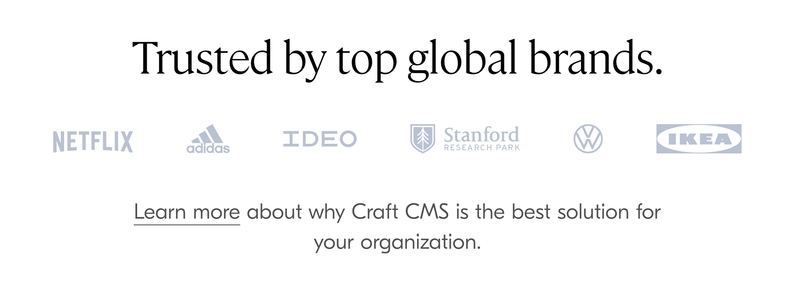

# Contributing to Craft CMS

Thanks for taking the time to contribute! We really appreciate it.

The following is a set of guidelines for contributing to Craft CMS and its first party plugins, which are hosted in the [Craft CMS organization](https://github.com/craftcms) on GitHub. These are just guidelines, not rules. Use your best judgment, and feel free to propose changes to this document in an issue or pull request.

#### Table of Contents

- [What to Know Before You Contribute](#what-to-know-before-you-contribute)
- [Security Disclosures](#security-disclosures)
- [Bug Reports & Feature Requests](#bug-reports--feature-requests)
- [Documentation Edits](#documentation-edits)
- [Control Panel Translations](#control-panel-translations)
- [Core Enhancements](#core-enhancements)
- [Pull Requests](#pull-requests)
- [Packaging](#packaging)
- [Manual Accessibility Checks](#manual-accessibility-checks)

## What to Know Before You Contribute

### Craft isn’t FOSS

Let’s get one thing out of the way: Craft CMS is :smiling_imp:**proprietary software**:smiling_imp:. Everything in this repo, including community-contributed code, is the property of Pixel & Tonic.

That comes with some limitations on what you can do with the code:

- You can’t change anything related to licensing, purchasing, edition/feature-targeting, or anything else that could mess with our alcohol budget.
- You can’t publicly maintain a long-term fork of Craft. There is only One True Craft.

### Code of Conduct

Please take a couple minutes to read through Craft’s [code of conduct](https://craftcms.com/docs/3.x/coc.html). By participating here, you are expected to uphold this code. Please report unacceptable behavior to us from [craftcms.com/contact](https://craftcms.com/contact).

## Security Disclosures

If you discover a security vulnerability, please review our [Security Policy](https://github.com/craftcms/.github/blob/master/SECURITY.md), then report the issue directly to us from [craftcms.com/contact](https://craftcms.com/contact). We will review and respond privately via email.

## Bug Reports & Feature Requests

Before submitting bug reports and feature requests, please search through [open issues](https://github.com/craftcms/cms/issues) to see if yours has already been filed.

If you do find a similar issue, upvote it by adding a :thumbsup: [reaction](https://github.com/blog/2119-add-reactions-to-pull-requests-issues-and-comments). Only leave a comment if you have relevant information to add.

If no one has filed the issue yet, [submit a new one](https://github.com/craftcms/cms/issues/new). Please include a clear description of the issue, and as much relevant information as possible, including a code sample demonstrating the issue.

## Documentation Edits

Craft’s documentation lives in the [https://github.com/craftcms/docs](https://github.com/craftcms/docs) repository. Improvements or corrections to them can be submitted as a pull request.

The documentation is powered by [VuePress](https://vuepress.vuejs.org/). To preview documentation changes before committing them, clone the docs repo and from your terminal, run these commands:

```bash
# Install npm dependencies
npm install

# Build + run the VuePress dev server
npm run docs:dev
```

Once the VuePress dev server is up and running, you’ll be able to view the docs at `http://localhost:8080/`. Changes you make to the `.md` files will automatically trigger a live reload of the pages in the browser.

## Control Panel Translations

We manage Craft’s Control Panel translations with [Crowdin](https://crowdin.com/project/craft-cms).

If you want to help improve Craft’s translations, [sign up to be a translator](https://crwd.in/craft-cms), or you can submit a pull request directly to the [src/translations/](https://github.com/craftcms/cms/tree/develop/src/translations) folder if you prefer. 

### Ensure source translations are up to date

### Ensure translations are registered properly for JavaScript

## Core Enhancements

If you would like to work on a new core feature or improvement, first create a [GitHub issue](https://github.com/craftcms/cms/issues) for it if there’s not one already. As much as we appreciate community contributions, we are pretty selective about which sorts of features should make it into Craft itself rather than a plugin, so don’t take it the wrong way if we advise you to pursue the idea as a plugin instead.

## Pull Requests

Pull requests should clearly describe the problem and solution. Include the relevant issue number if there is one. If the pull request fixes a bug, it should include a new test case that demonstrates the issue, if possible.

## Packaging

### Build front-end resources

Front-end JavaScript and CSS should be built and included with the PR. Make sure you’ve got `nvm` installed and then...

1. Run `nvm use` to use the node version specified in `.nvmrc`.
2. Run `npm run build` to build assets for production.
3. Commit the resulting changes to be included with your PR.

### Draft changelog line(s)

Summarize any noteworthy changes from your PR in Craft’s [changelog](https://github.com/craftcms/cms/blob/main/CHANGELOG.md) under a dateless “Unreleased” heading. (You may need to create the heading at the top of the release notes.) Keep your description concise and link to any relevant issues, following the format of the rest of the changelog.

## Manual Accessibility Checks

Any UI updates will need to meet Craft’s targeted accessibility requirements. While some checks are automated, the following broad guidelines are important. Each one is represented by a checkbox in our PR template.

> 💡 These are not exhaustive. For thorough manual testing, we recommend using a combination of Deque’s Intelligent Guided Tests and [Advanced Test Coverage](https://axe.deque.com/coverage-site) methodology.

### Headings and landmarks benefit users

These tests benefit from using [Accessibility Insights for Web](https://accessibilityinsights.io/downloads/) and [headingsMap](https://chrome.google.com/webstore/detail/headingsmap/flbjommegcjonpdmenkdiocclhjacmbi?hl=en).

#### Headings: good usage

First, open **Accessibility Insights for Web** and toggle on the Headings check. You should see something like this:


Now examine the highlighted headings. **The following should be true:**

- [ ] Everything that looks like a heading should be highlighted
- [ ] The heading describes the content that follows it

#### Headings: good structure

Use **headingsMap** to pull up the document outline. You should see something like this:


**The following should be true:**

- [ ] There should be a single `h1` on the page
- [ ] Headings shouldn’t skip levels. (You should never see a `h2` jump to an `h4`.)
- [ ] Nested headings should support the parent heading

> 💡 If the page doesn’t already have additional headings, consider adding some. Even visually-hidden headings can help screen reader users navigate the page easier.

In fact, most of the time [screen reader users will use heading navigation to get familiar with a page](https://webaim.org/projects/screenreadersurvey8/#finding).

#### Landmarks

First, be sure you [understand the different types of regions](https://www.w3.org/WAI/tutorials/page-structure/regions/).

Open **Accessibility Insights for Web** and toggle on the **Landmarks** checks.

- [ ] All page content should be contained inside landmark regions
- [ ] Landmark regions should be meaningful and correctly identify the purpose of the content they contain
- [ ] If multiple of the same landmark exist, add a label to differentiate them\
  Example: you can differentiate two different `nav` elements by giving them unique names. A breadcrumb nav can have `aria-label="Breadcrumb"` while the primary navigation can have `aria-label="Primary"`.

### Forms have sufficient instruction

Users need to be given enough instruction to complete forms successfully.

#### Before submitting

Check that labels and instructions are:

- [ ] Sufficient to help the user fill in the field successfully
- [ ] Programmatically associated with the fields they describe.(More detail [below](#checking-for-programmatic-association).)

#### After submitting

The following should be true:

- [ ] Error messages are near the fields they relate to
- [ ] Error messages are programmatically associated with the fields they describe

#### Checking for programmatic association

Examine the field using the [Chrome Accessibility pane](https://developer.chrome.com/docs/devtools/accessibility/reference/#pane). Look at the **Name** and **Description** text and make sure it lines up with what you’re seeing visually.

The following screenshot shows the title field for a blog post entry. Notice the accessible name includes the “Required” text. The accessible description includes the field instructions.

*One issue here is that the t9n indicator isn’t also included in the name or description.*


A side by side view of the visual field and how it’s presented to users of assistive technology.

> 💡 The `describedBy` property has been implemented for most input types in Craft CMS. See this [describedBy pull request](https://github.com/craftcms/cms/pull/10183) for more information about the changes, and how to implement it on new field types.

> 💡 Learn more about inclusive form instructions by reading the [W3C Form Instructions tutorial](https://www.w3.org/WAI/tutorials/forms/instructions/).

### Automatic behavior can be paused, stopped, or hidden

- Is there is any **moving, blinking, or scrolling information** that starts automatically and lasts more than five seconds?
  - Make sure there’s a way for the user to pause, stop, or hide the movement.
- Is there any **auto-updated information** (such as orders placed)?
  - Make sure there is a way for the user to pause, stop, or hide the updated information, or for the user to control the frequency of the update.
- Is there any content that **flashes or blinks more than three times in one second**?
  - If it does, further evaluation is needed as explained in [Three Flashes or Below Threshold](https://www.w3.org/WAI/WCAG21/Understanding/three-flashes-or-below-threshold).

> 💡 Having these safeguards allows users to control content that may become a distraction, or ensure content doesn’t disappear before a user has a chance to read it.

### Color is not the only means of conveying information

Open **Accessibility Insights for Web** and toggle on the **Color** test.

**The following should be true:**

- [ ] When color is used to convey information, it’s **combined with another visual aspect** (e.g. shape, text, etc.).\
  Example: links inside paragraphs should also have an underline to differentiate them from the surrounding text.
- [ ] Instructions **don’t rely on sensory information**.\
  Example: a paragraph that reads “Press the green button to proceed” should be updated to say “Press the Go button to proceed.”

### Images have meaningful alternative text

Ensure the following are true:

- [ ] Any image conveying information for interacting with or understanding page content includes alternative text.
- [ ] Any decorative image the visitor doesn’t need to know about has null alt (`alt=""`).

> 💡 Still not sure? Check out the [alt Decision Tree](https://www.w3.org/WAI/tutorials/images/decision-tree/) to understand whether you’re assigning the right `alt` text for an image.

### Minimum contrast ratios are met

Automated tools can’t catch all minimum contrast violations, so it’s important to manually check any UI changes or additions in your PR.

To grab colors from a page, use a tool like [ColorZilla](https://chrome.google.com/webstore/detail/colorzilla/bhlhnicpbhignbdhedgjhgdocnmhomnp). To find the contrast ratio between two colors, use a tool like the [WebAIM contrast checker](https://webaim.org/resources/contrastchecker/).

#### Text

Examine all text on the page, including text found in images. **The following should be true:**

- [ ]  Text has a contrast ratio of 4.5:1 or above

**There are some exceptions:**

- **Large text:** 24px and above should have a contrast ratio of at least 3:1
- **Logotypes:** text that’s part of a logo or branding
- **Incidental:** text in inactive UI components, text that’s purely decorative, text that isn’t visible to anyone, text that’s part of an image with significant other content

#### Graphical objects and UI components

All meaningful graphical objects and UI components must have a **3:1 minimum contrast ratio**.

Ensure the following items meet that requirement:

- [ ] When the visual indicator of a control (like an input border) is the only way to identify the control, the indicator meets the requirement
- [ ] Visual information needed to understand the state of a component\
  *Think things like checkbox fill color, active tabs, navigation indicators for “current page”*
- [ ] Informational graphics

#### Interactive states

Now go through and test focus and hover states for all interactive components.

For each component, be sure that:

- [ ] Text still meets the 4.5:1 minimum contrast ratio
- [ ] Graphical objects meet the 3:1 minimum contrast ratio

> 💡 Disabled UI components don’t have to meet contrast requirements.

#### Example test decisions

**Example 1: Fail**



The above image shows a grid of logotypes. While there’s an exception for minimum contrast when the text is part of a logo, we’re overriding each company’s brand colors with our own color. The calculated contrast ratio is below 3:1.

The logo graphics communicate meaningful information, so should have a contrast ratio of at least 3:1.

**Example 2: A mixed bag**


The image above shows several fields. In the headline field, the only way to distinguish the input is the visual boundary created by the light gray border and a slightly darker background color.

❌ The input field fails. Either the outline or the background color should be darkened to meet a 3:1 contrast ratio against the dark background.

✅ While the buttons for adding matrix blocks and assets have the same light gray outline, the outline **isn’t the only thing** that distinguishes them. They *also* have a dark inner text that meets the minimum text contrast ratio.

> 💡 Read the [documentation for 1.4.11: Non-Text Contrast](https://www.w3.org/WAI/WCAG21/Understanding/non-text-contrast.html) to see more passing/failing examples.

### User interface components have been crafted for maximum accessibility

First, be sure you understand [what semantic HTML is](https://developer.mozilla.org/en-US/docs/Glossary/Semantics#semantics_in_html) and some of [the benefits of using semantic HTML](https://ux.shopify.com/semantic-html-the-unbearable-rightness-of-being-9b3c493e1791).

When you build using semantic HTML, you’re getting a lot of built-in assistive technology support:

- Roles are communicated to screen reader users
- States are managed by the browser and communicated to assistive tech
- Common keyboard interactions are supported out-of-the box

Pull up the page you’re testing. **The following should be true:**

- [ ] Semantic HTML is used wherever possible
- [ ] In the unlikely event that a custom component is used, an accessible pattern has been used

> 💡 Looking for an accessible pattern for your complex and/or custom component?

There are lots of nifty guides out there, including [Inclusive Components](https://inclusive-components.design/) (Heydon Pickering), [Accessible Components](https://github.com/scottaohara/accessible_components) (Scott O’Hara), and [APG Patterns](https://www.w3.org/WAI/ARIA/apg/patterns/) (although these tend to get called-out for not being highly tested).

Aim for patterns that are highly tested and score well for both usability and accessibility.

### All functionality is keyboard-operable

#### Enable keyboard navigation on a Mac

- In newer browsers: Select System Preferences > Keyboard > Shortcuts. Select the "All controls" option button.
- In older browsers: Select System Preferences > Keyboard > Keyboard Shortcuts. In the "Full Keyboard Access" section, check "All Controls".

#### A quick keyboard testing tutorial

- Click in the address bar, then put your mouse aside and **do not use it**.
- Press <kbd>Tab</kbd> to move through the elements on the page. You can press <kbd>Shift</kbd>+<kbd>Tab</kbd> to go backwards.
- To move within elements such as dropdown lists and menu bars, press the arrow keys.
- To select a specific item within a dropdown list:
  - <kbd>Tab</kbd> to the list box,
  - use the arrow keys to move the focus to items,
  - when an item has focus, press the Enter key or Space bar to select that item.

> 💡 Not everything on a page should get keyboard focus. Just things like buttons, links, form inputs, and tab panels.

Now test the following:

- [ ] **Tab to all:** Check that you can tab to all the elements, including links, form fields, buttons, and media player controls. (A common problem is that you cannot tab to media player controls.)
- [ ] **Tab away:** Check that you can tab away from all elements that you can tab into. (A common problem is the keyboard focus gets caught in media controls and you cannot get out; it's called the "keyboard trap".)
- [ ] **Tab order:** Check that the tab order follows the logical reading order (e.g., for left-to-right languages: top to bottom, left to right) in sequence.
- [ ] **Visual focus:** Check that the focus is clearly visible as you tab through the elements, that is, you can tell which element has focus, e.g., links have a gray outline around them or are highlighted.
- [ ] **All functionality by keyboard:** Check that you can do everything with the keyboard; that is, you don't need the mouse to activate actions, options, visible changes, and other functionality. (A common problem is that some functionality is available only with mouse hover, and is not available with keyboard focus.)
- [ ] **Drop-down lists:** Check that after you tab into a drop-down list, you can use the arrow keys to move through all the options without triggering an action. (A common problem for drop-downs used for navigation is that as soon as you arrow down, it automatically selects the first item in the list and goes to a new page — you cannot get to other items in the list.)
- [ ] **Image links:** Check that when images are links, they have clear visual focus and can be activated using the keyboard (usually by pressing the <kbd>Return</kbd> or <kbd>Enter</kbd> key).

### Resize and zoom are supported

Text resize and zoom tests can catch issues that might arise for low vision users.

#### Background

Some users might use text resizing tools to enlarge text for easier reading. In these scenarios, issues may be introduced when text overflows containers of fixed size.


Other users might zoom a page to up to 400% in order to more easily see content.

In the following example from the BBC, the document reflows at different screen sizes so that content is stacked to prevent horizontal scrolling, and navigation items are progressively hidden behind menu toggles.


### Text resize

Let’s get ready to test:

1. Open Firefox and click **View** → **Zoom** → **Zoom Text Only**
2. Zoom to 200%

**Check that:**

- [ ] All text gets larger. (A common problem is that text is not provided as actual text format but instead the text is in an image. Text in images does not get larger when users increase text size.)
- [ ] Text doesn’t disappear or get cut off.
- [ ] Text, images, and other content do not overlap.
- [ ] All buttons, form fields, and other controls are visible and usable.
- [ ] Horizontal scrolling is not required to read sentences or “blocks of text”. It’s best practice that when text size is increased, all the text in a sentence is visible. It’s acceptable to have to scroll horizontally to get to different sections of a page. (For top-to-bottom languages, change "horizontal scrolling" to "vertical scrolling".)

### Zoom

This test seeks to emulate what a user might experience when they zoom the page to 400% magnification.

<aside>
💡 320 CSS pixels is equivalent to a starting viewport width of 1280 CSS pixels wide at 400% zoom

</aside>

First, get ready to test:

1. Go to Firefox and select Tools > Browser Tools > Responsive Design Mode
2. In the device selection list, choose **Edit List…**
3. Choose **Add Custom Device…** and enter dimensions of **320x480.** Make sure **Touch Screen** is checked; this makes it easier to identify and interact with scrolling regions.

Now enable your new custom device and check for the following:

- [ ]  All content and functionality are still visible — either directly, or revealed via accessible controls, or accessible via direct links
- [ ]  Horizontal scrolling should not be required
  Exceptions include thing that require a two-dimensional layout for understanding, like *data tables*.

### Dynamic updates are communicated to users of assistive technology

For this test you’ll need a screen reader.

### Getting started with screen reader software

You don’t need a lot to get up and running.

There’s free screen reader software for both Windows and Mac computers.

1. Windows: download NVDA and test in Firefox. Follow these [instructions for using NVDA](https://dequeuniversity.com/screenreaders/nvda-keyboard-shortcuts).
2. Mac: use the built-in VoiceOver screen reader on Safari. Follow these [instructions for using VoiceOver](https://dequeuniversity.com/screenreaders/voiceover-keyboard-shortcuts).

Check that the following is true:

- [ ] Any visual message that is dynamically loaded onto the page is also read out by the screen reader. This may include loading spinners, error messages, and status messages.

If not, [use live regions to announce those messages](https://developer.mozilla.org/en-US/docs/Web/Accessibility/ARIA/ARIA_Live_Regions) to screen reader users.

> 💡 **Not all updates need live regions.**
>
> For example, when new content is toggled by a new input value or tab, it may be enough that the revealed content is easily discovered in the focus order.
> 
> **If you’re unsure** about whether a live region is necessary, feel free to ping @gcamacho079 in a draft PR or in Discord.

---

<br>
Thanks for being awesome.

:cocktail:

