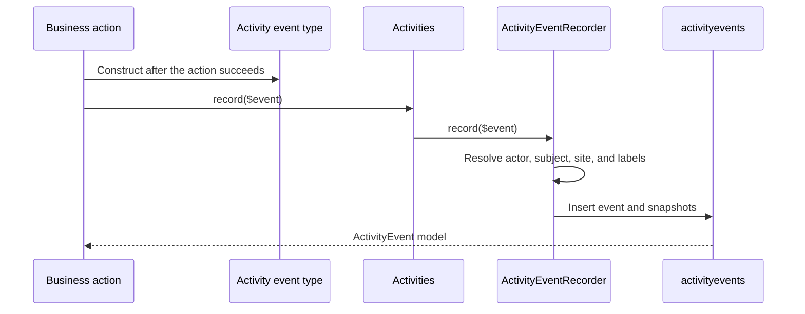
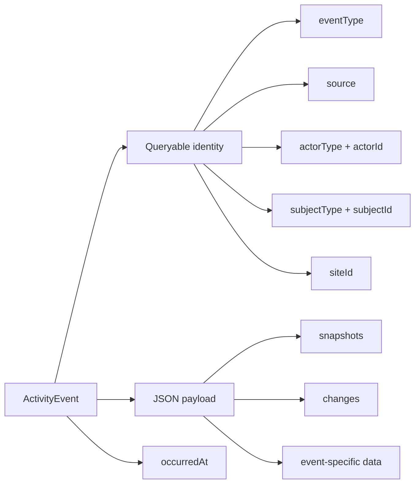

# Activity logging

Craft records durable activity events for actions that users may need to inspect later, such as creating an entry, applying a draft, moving an element, or replacing an asset file. Each event records what happened, who caused it, what it affected, and when it occurred.

Activity events are application data stored in the `activityevents` database table. They are not application log messages, so do not write them with Laravel's `Log` facade.

## How an event is recorded

Core and plugin code describe an action with an activity event type, then pass an instance to the `Activities` facade. Recording is synchronous.



The recorder performs these steps:

1. Reads the event type's source, subject, actor, site, data, and changes.
2. Resolves the actor when the event type did not supply one.
3. Captures labels for the source, event, actor, subject, and site.
4. Inserts an `ActivityEvent` with the current time.

The insert uses the caller's database transaction. If the action and activity event run in one transaction, rolling back the action also removes the event. Record an event only after the corresponding action has succeeded, but before committing its transaction.

Craft records its built-in events at the shared write and lifecycle boundaries. For example, entry writes compare the saved entry with its previous state, omit no-op saves, and record only JSON-safe field values. Draft, element lifecycle, structural, and asset replacement operations record their events at their own successful completion points.

## What an event stores

An event separates identifiers that support queries from descriptive data that preserves history.



| Value                      | Purpose                                               |
| -------------------------- | ----------------------------------------------------- |
| `eventType`                | Fully qualified event type class name                 |
| `source`                   | Stable source ID, normally `craft` or a plugin handle |
| `actorType`, `actorId`     | User, system, or anonymous actor identity             |
| `subjectType`, `subjectId` | Stable identity of the affected object                |
| `siteId`                   | Site context, or `null` for a site-neutral event      |
| `payload.snapshots`        | Labels captured when the event occurred               |
| `payload.changes`          | Structured old and new values                         |
| `payload.data`             | Data defined by the event type                        |
| `occurredAt`               | Time the action occurred                              |

Snapshots keep an event readable after a user, subject, site, or plugin has been removed. If the event type class is no longer available, Craft displays the captured event label and the default activity icon.

### Actors

When an event does not provide an actor, Craft resolves one from the current execution context:

| Context                         | Actor                  |
| ------------------------------- | ---------------------- |
| Authenticated request           | Current user           |
| Unauthenticated HTTP request    | Anonymous              |
| Console command or queue worker | Craft CMS system actor |

Pass an actor explicitly when the execution context does not identify the person responsible. A queued job started by a user is a common case. Event types may accept either a saved `User` element or an `ActivityActor`.

### Subjects

An element subject is normalized to its canonical element. Craft stores the element class and UID, not its numeric database ID. Draft activity therefore remains attached to the canonical element.

Plugins can describe a non-element subject with a stable type, ID, and label:

```php
use CraftCms\Cms\Activity\Data\ActivitySubject;

$subject = new ActivitySubject(
    type: Campaign::class,
    id: (string) $campaign->id,
    label: $campaign->name,
);
```

Do not use a translated label, mutable handle, or array index as the subject ID. The ID must continue to identify the same object after its label changes.

### Data and changes

`data()` returns event-specific values used to describe or inspect the action. It must return a JSON object represented by an associative PHP array. Event type constructors should use specific parameter types; validate untrusted values before constructing the event.

Use `ActivityChange` when consumers need a consistent old-versus-new representation:

```php
use CraftCms\Cms\Activity\Data\ActivityChange;

new ActivityChange(
    type: 'field',
    id: $field->layoutElement->uid,
    label: $field->name,
    old: 'Draft',
    new: 'Approved',
);
```

The change type groups similar values. The change ID must be stable, and the label is captured for display. Old and new values must be JSON-encodable. Laravel throws while applying the payload cast if encoding fails. Avoid secrets, access tokens, full request bodies, and other data that should not remain in an audit history.

## Logging activity from a plugin

A plugin owns its activity event classes. The stored class name identifies the event type, while the plugin handle identifies its source.

The following example comes from a campaign plugin that sends an entry through an email provider. It records the campaign entry, site, provider response, recipient count, and responsible user.

### Define the plugin source once

Create a base event type so each plugin event reports the same source and translation category:

```php
<?php

declare(strict_types=1);

namespace Acme\Campaigns\Activity;

use Acme\Campaigns\Campaigns;
use CraftCms\Cms\Activity\ActivityEventType;
use CraftCms\Cms\Activity\Data\ActivitySource;

abstract class CampaignActivityEventType extends ActivityEventType
{
    public static function source(): ActivitySource
    {
        return ActivitySource::fromPlugin(Campaigns::getInstance());
    }
}
```

`ActivitySource::fromPlugin()` uses the plugin handle, name, and translation category. The recorder snapshots the source label, so old events remain identifiable after the plugin is uninstalled.

### Define an event type

```php
<?php

declare(strict_types=1);

namespace Acme\Campaigns\Activity;

use CraftCms\Cms\Activity\Data\ActivityActor;
use CraftCms\Cms\Activity\Models\ActivityEvent;
use CraftCms\Cms\Entry\Elements\Entry;
use CraftCms\Cms\Site\Data\Site;
use CraftCms\Cms\User\Elements\User;

use function CraftCms\Cms\t;

class CampaignSent extends CampaignActivityEventType
{
    protected const string LABEL = 'Campaign sent';

    protected const string ICON = 'paper-plane';

    public function __construct(
        Entry $subject,
        ?Site $site,
        private readonly string $provider,
        private readonly string $deliveryId,
        private readonly int $recipientCount,
        User|ActivityActor|null $actor = null,
    ) {
        parent::__construct(subject: $subject, actor: $actor, site: $site);
    }

    public function data(): array
    {
        return [
            'provider' => $this->provider,
            'deliveryId' => $this->deliveryId,
            'recipientCount' => $this->recipientCount,
        ];
    }

    public static function format(ActivityEvent $event): string
    {
        return t(
            'Sent with {provider} to {count} recipients.',
            [
                'provider' => $event->data['provider'],
                'count' => $event->data['recipientCount'],
            ],
            category: self::source()->translationCategory,
        );
    }
}
```

`LABEL` is the short fallback description. Craft translates it using the source's translation category. `format()` may return a string, an `Htmlable`, or `null`. Returning `null` tells Craft to use the translated label. Craft sanitizes strings and HTML before returning them from `Activities::format()`.

### Record the event at the action boundary

Record the event where the plugin knows that the operation succeeded:

```php
use Acme\Campaigns\Activity\CampaignSent;
use CraftCms\Cms\Support\Facades\Activities;
use CraftCms\Cms\Support\Facades\Sites;

$delivery = $campaignClient->send($entry);

Activities::record(new CampaignSent(
    subject: $entry,
    site: Sites::getSiteById($entry->siteId),
    provider: $delivery->provider,
    deliveryId: $delivery->id,
    recipientCount: $delivery->recipientCount,
));
```

An authenticated request supplies the actor automatically. A queued job should pass the user who requested the send when that attribution is available:

```php
Activities::record(new CampaignSent(
    subject: $entry,
    site: Sites::getSiteById($entry->siteId),
    provider: $delivery->provider,
    deliveryId: $delivery->id,
    recipientCount: $delivery->recipientCount,
    actor: $requestedBy,
));
```

Do not insert an `ActivityEvent` model directly. The facade supplies actor resolution, validation, snapshots, translation metadata, and a consistent occurrence time.

## Querying activity

`Activities::query()` returns an Eloquent builder ordered by `occurredAt` and then `id`, both newest first. The ID tie-breaker makes cursor pagination stable when events share a timestamp.

```php
use Acme\Campaigns\Activity\CampaignSent;
use CraftCms\Cms\Activity\Data\ActivitySubject;
use CraftCms\Cms\Support\Facades\Activities;

$events = Activities::query()
    ->subject(ActivitySubject::fromElement($entry))
    ->site($site)
    ->source('campaigns')
    ->eventTypes(CampaignSent::class)
    ->occurredFrom(now()->subMonth())
    ->cursorPaginate(50);

foreach ($events as $event) {
    $label = Activities::format($event);
    $icon = Activities::icon($event);
}
```

Available query scopes are:

| Scope                                    | Matches                                         |
| ---------------------------------------- | ----------------------------------------------- |
| `subject(ActivitySubject $subject)`      | One subject type and ID                         |
| `site($site)`                            | One `Site` or site ID, plus site-neutral events |
| `eventTypes($eventTypes)`                | One event type class name or an array of names  |
| `actor(ActivityActor $actor)`            | One actor type and ID                           |
| `source(string $source)`                 | One source ID                                   |
| `occurredFrom(DateTimeInterface $date)`  | Events on or after the date                     |
| `occurredUntil(DateTimeInterface $date)` | Events on or before the date                    |
| `newestFirst()`                          | Newest timestamp and ID first                   |

Use the formatter instead of calling an event type's `format()` method yourself. `Activities::format()` handles translation, sanitization, missing event classes, and formatter failures. `Activities::icon()` provides the same fallback behavior for icons.

## Retention

Craft keeps activity indefinitely by default. Set `activityRetentionDuration` to let garbage collection delete older events:

```php
// config/general.php

use CraftCms\Cms\Cms;

return Cms::config()
    ->activityRetentionDuration('P90D');
```

The `CRAFT_ACTIVITY_RETENTION_DURATION` environment variable accepts the same duration values. Set the value to `0` for unlimited retention. Garbage collection deletes events older than the configured cutoff in chunks.

Choose a retention period based on the history users need and the data included in plugin payloads. Changing the period affects future garbage collection; it does not archive events before deleting them.
