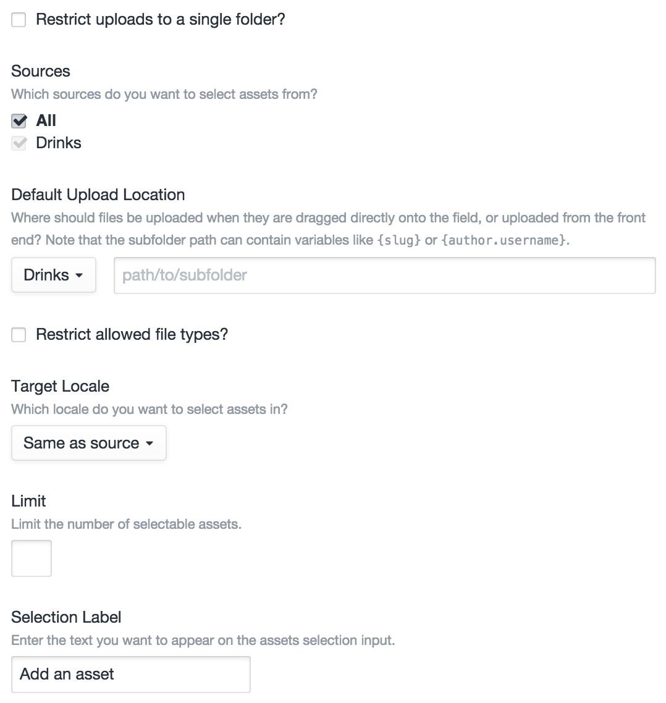
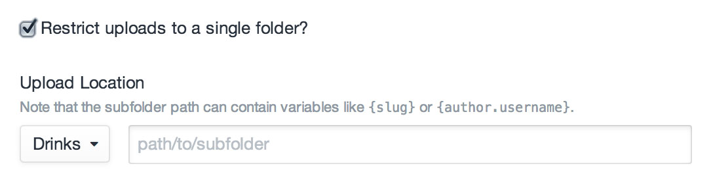
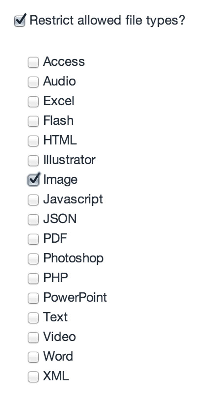
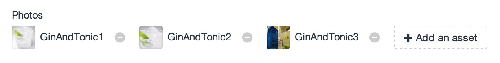
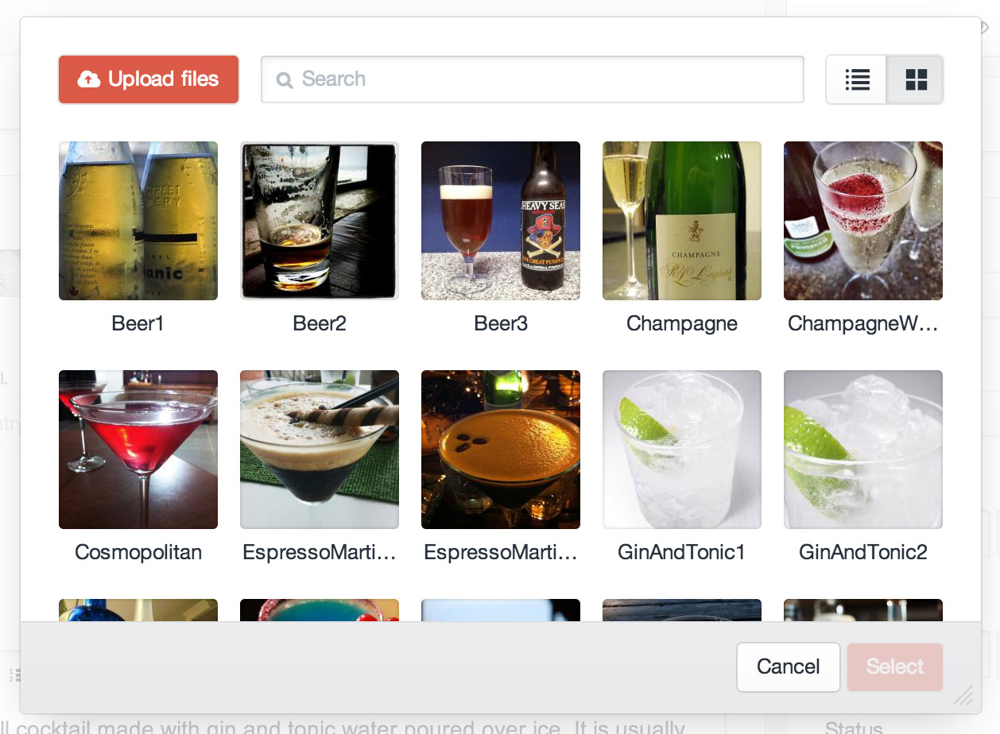
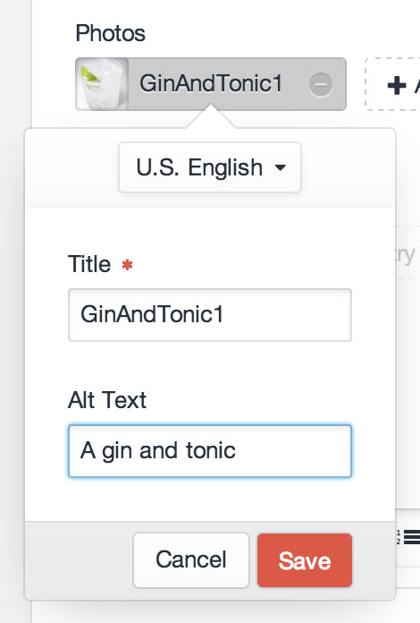

# Assets Fields

Assets fields allow you to select related [assets](assets.md).

## Settings



Assets fields have the following settings:

- **Restrict uploads to a single folder?** – Whether file uploads/selections should be constrained to a single folder
- **Sources** – Which asset sources the field should be able to select/upload files from
- **Default Upload Location** – The default location that files dragged directly onto the field should be saved in
- **Restrict allowed file types?** Whether the field should only be able to select/upload files of a certain type(s)
- **Target Locale** – Which locale assets should be related with (this setting only appears if you’re running Craft Pro with more than one site locale)
- **Limit** – The maximum number of assets that can be related with the field at once. (Default is no limit.)
- **Selection Label** – The label that should be used on the field’s selection button.

### Restricting Uploads to a Single Folder

If the “Restrict uploads to a single folder?” setting is checked, the “Sources” and “Default Upload Location” settings will be replaced with an “Upload Location” setting.



### Restricting Allowed File Types

If the “Restrict allowed file types?” setting is checked, a list of file types will appear below it.



### Dynamic Subfolder Paths

The “Default Upload Location” setting, and the “Upload Location” setting that replaces it if “Restrict uploads to a single folder?” is checked, support dynamic subfolder paths.

After an element is saved, the subfolder path will be parsed for any tags representing properties of the source element. For example, if you intend to use the field with [entries](sections-and-entries.md), then you can use any properties listed in the [EntryModel](templating/entrymodel.md) documentation, such as `{id}`, `{slug}`, or even nested object properties like `{author.username}`.

Normal Twig tags are supported as well, in case you want to include `` conditionals in your path, or access other objects besides the source element, such as `{{ now|date('Y-m-d') }}` or `{{ currentUser.username }}`.

If you are using normal Twig tags, you can still access the source element, via an “object” variable. For example, this would output the source element’s slug if it has one, otherwise its ID:

```twig
{{ object.slug ?: object.id }}
```

Note that if you are creating the Assets field within a [Matrix field](matrix-fields.md), the source element is going to be the actual Matrix block, _not_ the element that the Matrix field is being created on. So if your Matrix field is attached to an entry, and you want to output the entry ID in your dynamic subfolder path, you would type `{owner.id}` not just `{id}`.

## The Field

Assets fields list all of the currently selected assets, with a button to select new ones:



Clicking the “Add an asset” button will bring up a modal window where you can find and select additional assets, as well as upload new ones:



### Editing Asset Content

Double-clicking on a selected asset will open a modal where you can edit the file’s title and any fields you have associated with your assets from Settings → Assets → Fields.



## Templating

If you have an element with an Assets field in your template, you can access its selected assets using your Assets field’s handle:

```twig

```

That will give you an [ElementCriteriaModel](templating/elementcriteriamodel.md) object, prepped to output all of the selected assets for the given field. In other words, the line above is really just a shortcut for this:

```twig

```

(See [Relations](relations.md) for more info on the `relatedTo` param.)

### Examples

To check if your Assets field has any selected assets, you can use the `length` filter:

```twig

    
        {{ asset.url }}
    

```

To loop through the selected assets, you can treat the field like an array:

```twig

    {{ asset.url }}

```

Rather than typing “`entry.assetsFieldHandle`” every time, you can call it once and set it to another variable:

```twig




    <h3>Some great assets</h3>
    
        {{ asset.url }}
    


```

You can add parameters to the ElementCriteriaModel object as well:

```twig

```

If your Assets field is only meant to have a single asset selected, remember that calling your Assets field will still give you the same ElementCriteriaModel, not the selected asset. To get the first (and only) asset selected, use `first()`:

```twig



    {{ asset.url }}

```

### Uploading Files from Front-end Entry Forms

If you want to allow users to upload files to an Assets field from a front-end [entry form](templating/entry-form.md), you just need to do two things.

First, make sure your `<form>` tag has an `enctype="multipart/form-data"` attribute, so that it is capable of uploading files.

Add a file input to the form, in the same way you would add a textarea for a Plain Text field:

```markup
<input type="file" name="fields[assetsFieldHandle]">
```

If you want your form to allow multiple files being uploaded at once, just add the `multiple` attribute, make sure that the input name ends in “`[]`”:

```markup
<input type="file" name="fields[assetsFieldHandle][]" multiple>
```

## See Also

- [craft.assets](templating/craft.assets.md)
- [ElementCriteriaModel](templating/elementcriteriamodel.md)
- [AssetFileModel](templating/assetfilemodel.md)
- [Relations](relations.md)
