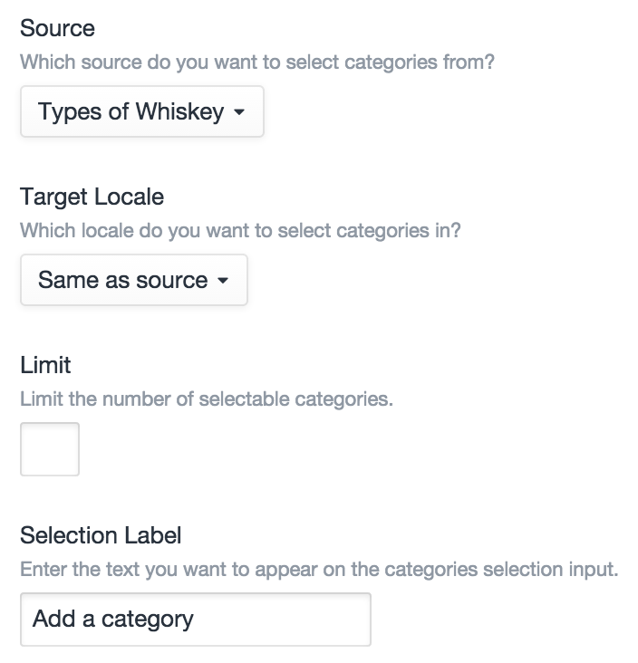
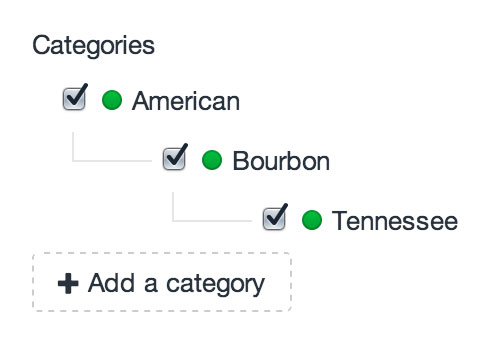
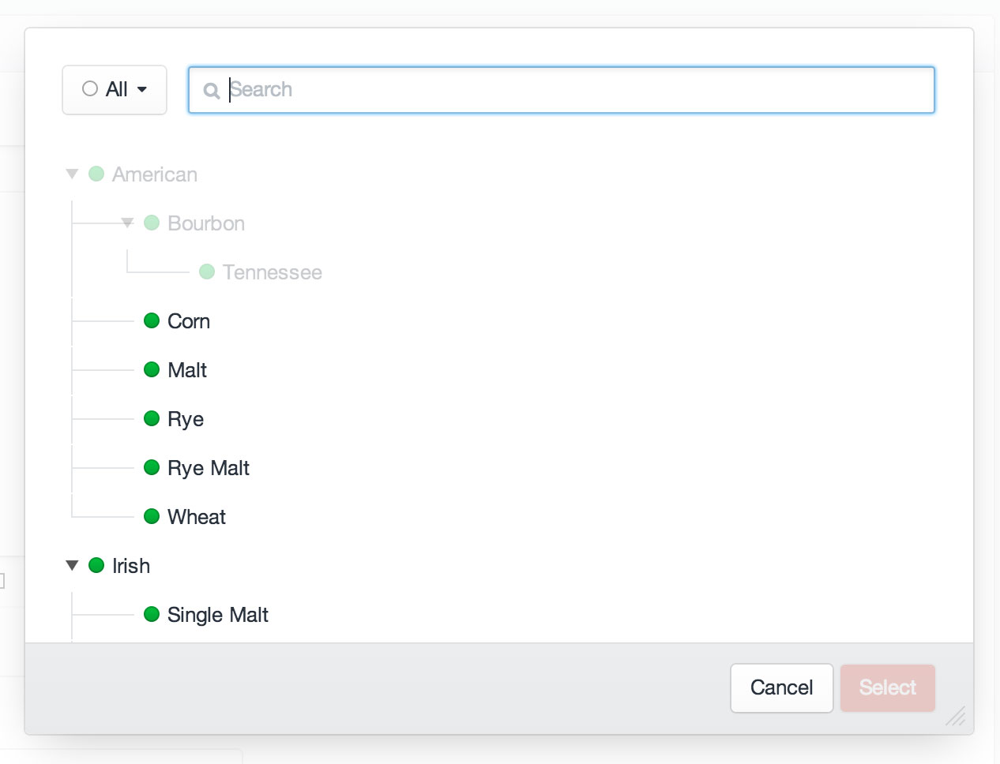

# Categories Fields

Categories fields allow you to relate [categories](categories.md) to the parent element.

## Settings



Categories fields have the following settings:

- **Source** – The category group you want to relate categories from.
- **Target Locale** – Which locale categories should be related with (this setting only appears if you’re running Craft Pro with more than one site locale)
- **Limit** – The maximum number of categories that can be related with the field at once. (Default is no limit.) Note that this does include parent categories, if your category group has multiple levels.
- **Selection Label** – The label that should be used on the field’s selection button.

## The Field

Categories fields list all of the currently selected categories, with a button to select new ones:



Clicking the “Add a category” button will bring up a modal window where you can find and select additional categories:



When you select a nested category, all of the ancestors leading up to that category will also automatically be selected. Likewise, when you deselect a category from within the main field input, any of its descendants will also become deselected.

## Templating

If you have an element with a Categories field in your template, you can access its selected categories using your Category field’s handle:

```twig

```

That will give you an [ElementCriteriaModel](templating/elementcriteriamodel.md) object, prepped to output all of the selected categories for the given field. In other words, the line above is really just a shortcut for this:

```twig

```

(See [Relations](relations.md) for more info on the `relatedTo` param.)

### Examples

To check if your Categories field has any selected tags, you can use the `length` filter:

```twig

    ...

```

To loop through the selected categories, you can treat the field like an array:

```twig

    ...

```

Rather than typing “`entry.categoriesFieldHandle`” every time, you can call it once and set it to another variable:

```twig




    <h3>Some great categories</h3>
    
        ...
    


```

You can add parameters to the ElementCriteriaModel object as well:

```twig

```

If your Categories field is only meant to have a single category selected, remember that calling your Categories field will still give you the same ElementCriteriaModel, not the selected category. To get the first (and only) tag selected, use `first()`:

```twig



    ...

```

### See Also

- [craft.categories](templating/craft.categories.md)
- [ElementCriteriaModel](templating/elementcriteriamodel.md)
- [CategoryModel](templating/categorymodel.md)
- [Relations](relations.md)
