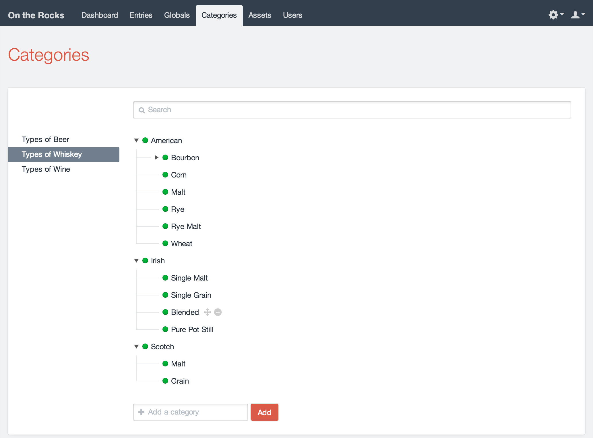
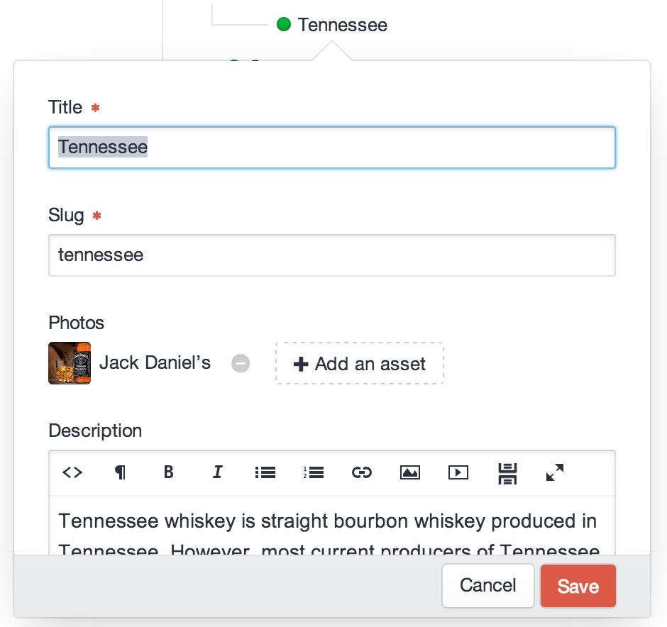

# Categories

You can create taxonomies for your [entries](sections-and-entries.md), [users](users.md), and [assets](assets.md) using Categories.

## Category Groups

Before you can create categories, you must create “category groups” to contain them. Each category group lets you define the following:

* Whether categories in the group have URLs
* What the categories’ URLs should look like
* Which template should load if a category’s URL is accessed
* How many levels categories in the group can be nested
* Which [fields](fields.md) categories in the group should have

To create a new category group, go to Settings → Categories and click the “New Category Group” button.

## Editing Categories

If you have at least one category group, there will be a “Categories” tab in the primary CP nav. Clicking on it will take you to the category index. From there you can choose a category group from the sidebar, and add/reorder/delete categories within it:

Double-clicking on a category will bring up a modal that lets you edit its name, slug, and any fields you’ve assigned to the group:

## Assigning Categories

To assign categories to things, you must also create a [Categories field](categories-fields.md). Each Categories field is connected to a single category group. Whatever you attach the field to (entries, assets, users, etc.) will be able to create [relations](relations.md) to any of the categories within that group.
