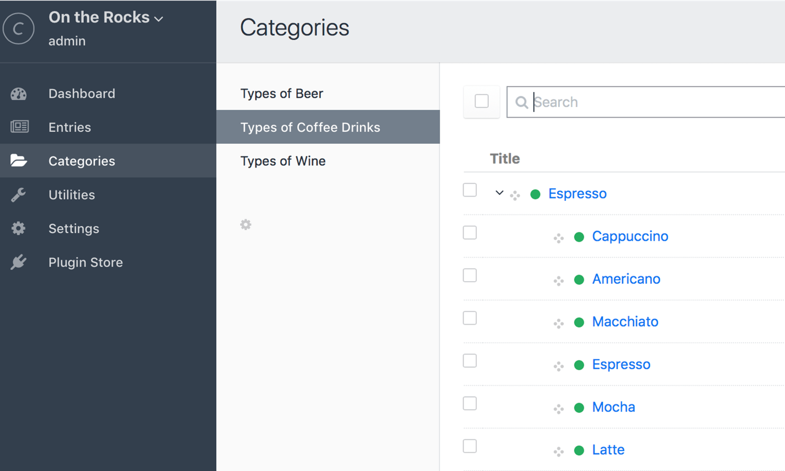
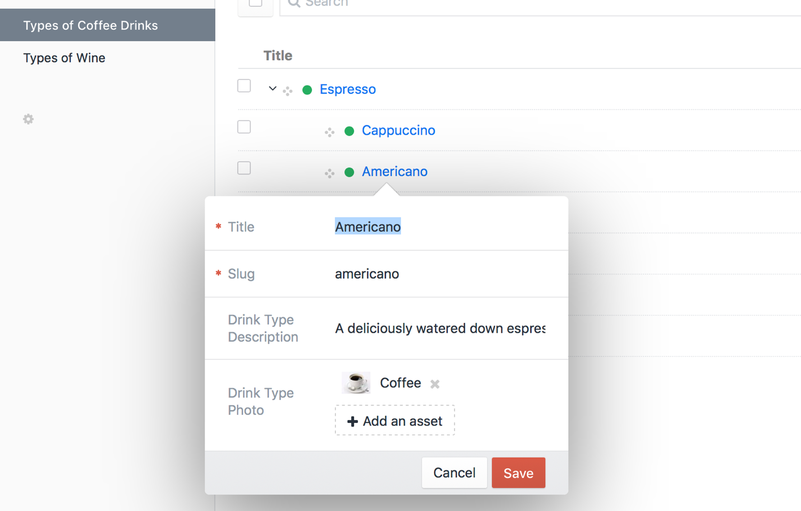

# Categories

You can create taxonomies for your [entries](sections-and-entries.md), [users](users.md), and [assets](assets.md) using Categories.

## Category Groups

Before you can create categories, you must create Category Groups to contain them. Each Category Group lets you define the following:

* Category Group name
* Category Group handle (how you'll refer to the Category Group in your templates)
* Maximum number of levels you can nest categories in the group
* The format of the category URI
* Which template should load if a category’s URL is accessed
* Which [fields](fields.md) categories in the group should have

To create a new category group, go to Settings → Categories and click the “New Category Group” button.

After you create at least one category group, you will be able to create categories for that group.

## Category Field Layout

Each Category Groups can have its own Field Layout, which allows you to customize the data that is associated with each category in the group. By default, every category will have a Title field (the category name).

You can also add additional fields using all of the available field types in Craft. If a field doesn't yet exist, you must first create it via Settings → Fields. The new field will then be available to assign to the Field Layout of your Category Group.

## Creating and Editing Categories

If you have at least one category group, there will be a “Categories” tab in the primary Control Panel navigation. Clicking on it will take you to the category index. From there you can choose a category group from the sidebar, and add/reorder/delete categories within it:

Double-clicking on a category will bring up a modal that lets you edit its name, slug, and any fields you’ve assigned to the group.

When you create a category, you have the following options:

* Fill out the category fields (if you didn't define any then the only field available will be Title)
* Edit the slug (it's automatically populated based on the title).
* Choose a Parent category. The new category will have a hierarchical relationship with its parent. This is helpful for creating taxonomies with multiple levels. You also have the option of creating a new category while assigning the Parent.

::: tip
You can only nest categories up to the level specified in the Max Level field Category Group settings. If no level is specified then the nesting level is unlimited.
:::

## Assigning Categories

To assign categories to things (entries, assets, users, etc.), you must first create a [Categories field](categories-fields.md). 

Each Categories field is connected to a single category group. Whatever you attach the field to will be able to create [relations](relations.md) to any of the categories within that group.
