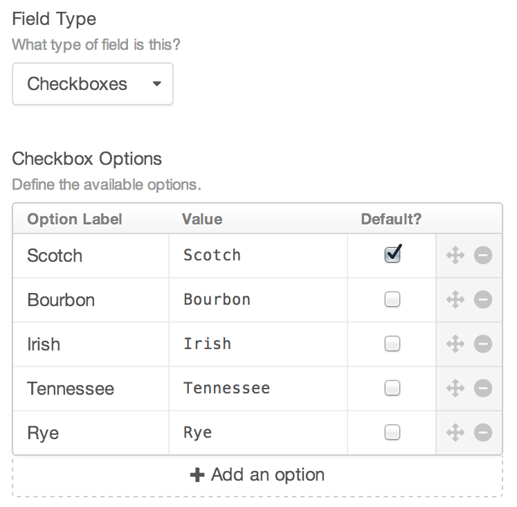
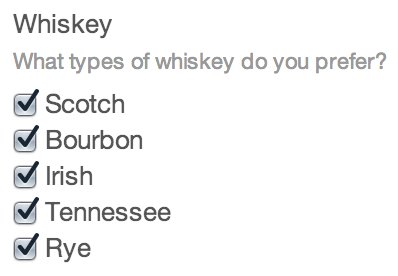

# Checkboxes Fields

Checkboxes fields give you a group of checkboxes.

## Settings



Checkboxes fields have the following settings:

- **Checkbox Options** – Define the checkboxes that will be available in the field. You even get to set the option values and labels separately, and choose which ones should be checked by default.

## The Field

Checkboxes fields will show each of the checkbox options as defined in the field settings:



## Templating

If you only have one checkbox, and you just want to tell if it has been selected, you can do that using the `length` filter:

```twig

```

You can loop through your selected options like so:

```twig
<ul>
    
        <li>{{ option }}</li>
    
</ul>
```

Or you can loop through all of the available options rather than just the selected ones:

```twig
<ul>
    
        <li>{{ option }}</li>
    
</ul>
```

In either case, you can output an option’s label by typing `{{ option.label }}` instead, and you can tell if the option is selected or not via `option.selected`.

You can also tell if a particular option is selected outside the scope of looping through the options like so:

```twig

    <p>Really?</p>

```

If you are including a Checkboxes field on a front-end [entry from](templating/entry-form.md), make sure to include a hidden input before the checkboxes, so that an empty value is submitted if no checkboxes are checked.

```twig
<input type="hidden" name="fields[checkboxFieldhandle]" value="">

<ul>
    <li><input type="checkbox" name="fields[checkboxFieldHandle][]" value="foo">{{ checkboxOption.label }}</li>
    <li><input type="checkbox" name="fields[checkboxFieldHandle][]" value="bar">{{ checkboxOption.label }}</li>
</ul>
```
