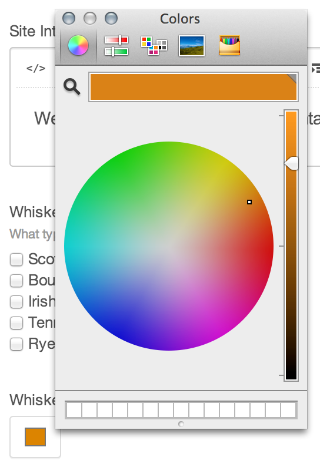

# Color Fields

Color fields give you a color picker, and save a hexadecimal value of the selected color.

## The Field

Color fields will either use your browser’s color picker (if your browser supports `<input type="color">`) or a Javascript-powered color picker.



## Templating

Calling a Color field in your templates will return the hexidecamal value of the selected color, if there is one.

If you don’t manually change a Color field’s color, it will be saved as `#000000`. It’s not possible to save a Color field without a value. So the only time when a Color field won’t have a value is if it hasn’t been saved for the given element yet.

```twig

    {{ parent() }}

    
        <style type="text/css">
            .content a {
                color: {{ entry.linkColor }};
            }
        </style>
    

```
