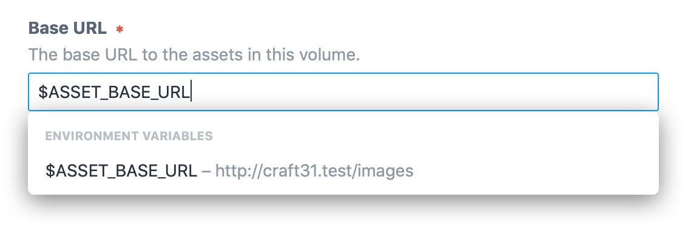

# Environmental Configuration

Some settings should be defined on a per-environment basis. For example, when developing locally, you may want your site’s base URL to be `http://my-project.test`, but on production it should be `https://my-project.com`.

## Control Panel Settings

Some settings in the Control Panel can be set to environment variables (like the ones defined in your `.env` file):

- General Settings
  - **System Name**
- Sites
  - **Base URL**
- Asset Volumes
  - **Base URL**
  - **File System Path** (Local)
- Email
  - **System Email Address**
  - **Sender Name**
  - **HTML Email Template**
  - **Username** (Gmail and SMTP)
  - **Password** (Gmail and SMTP)
  - **Host Name** (SMTP)
  - **Port** (Port)

To set these settings to an environment variable, type `$` followed by the environment variable’s name.



Only the environment variable’s name will be stored in your database or project config, so this is a great way to set setting values that may change per-environment, or contain sensitive information.

::: tip
Plugins can add support for environment variables and aliases in their settings as well. See [Environmental Settings](../extend/environmental-settings.md) to learn how.
:::

### Using Aliases in Control Panel Settings

Some of these settings—the ones that store a URL or a file system path—can also be set to [aliases](README.md#aliases), which is helpful if you just want to store a base URL or path in an environment variable, and append additional segments onto it.

For example, you can define a `ROOT_URL` environment variable that is set to the root URL of your site:

```bash
# -- .env --
ROOT_URL="http://my-project.test"
```
Then create a `@rootUrl` alias that references it:

```php
// -- config/general.php --
'aliases' => [
    '@rootUrl' => getenv('ROOT_URL'),
],
``` 

Then you could go into your User Photos volume’s settings (for example) and set its Base URL to `@rootUrl/images/user-photos`.  

## Config Files

You can set your [general config settings](config-settings.md), [database connection settings](db-settings.md), and other PHP config files to environment variables using PHP’s [getenv()](http://php.net/manual/en/function.getenv.php) function:

```bash
# -- .env --
CP_TRIGGER="secret-word"
```

```php
// -- config/general.php --
'cpTrigger' => getenv('CP_TRIGGER') ?: 'admin',
```

### Multi-Environment Configs

Craft’s PHP config files can optionally define separate config settings for each individual environment.

```php
// -- config/general.php --
return [
    // Global settings
    '*' => [
        'omitScriptNameInUrls' => true,
    ],

    // Dev environment settings
    'dev' => [
        'devMode' => true,
    ],

    // Production environment settings
    'production' => [
        'cpTrigger' => 'secret-word',
    ],
];
```

The `'*'` key is required here so Craft knows to treat it as a multi-environment key, but the other keys are up to you. Craft will look for the key(s) that match the [CRAFT_ENVIRONMENT](php-constants.md#craft-environment) PHP constant, which should be defined by your `web/index.php` file. (Your server’s hostname will be used as a fallback.)

By default, new Craft 3 projects will define the [CRAFT_ENVIRONMENT](php-constants.md#craft-environment) constant using an environment variable called `ENVIRONMENT`, which is defined in the `.env` file:

```bash
# -- .env --
ENVIRONMENT="dev"
```

```php
// -- web/index.php --
define('CRAFT_ENVIRONMENT', getenv('ENVIRONMENT') ?: 'production');
```
