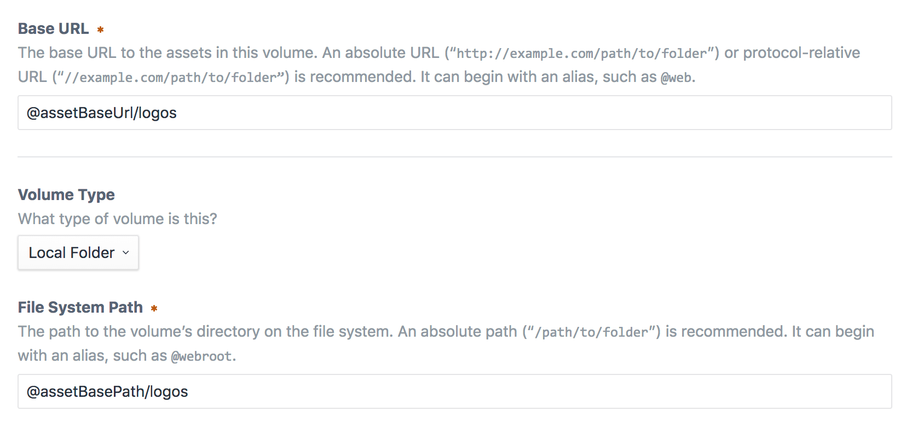

# Environmental Configuration

If your Craft project lives across more than one environment (e.g. Development, Staging, and Production), there are going to be things that should be configured differently for each environment.

For example, each environment will likely need its own unique [database connection settings](db-settings.md), and [Dev Mode](config:devMode) should be enabled for your local Development environment, but not for Production.

There are two ways to achieve that in Craft: [environment variables](#environment-variables) and [multi-environment configs](#multi-environment-configs).

::: tip
These aren’t mutually exclusive. Most Craft projects will use both approaches for different things.
:::

## Environment Variables

Environment variables are values that are set on the server that Craft is running on, which can be loaded with PHP’s [getenv()](http://php.net/manual/en/function.getenv.php) function.

They can be set in multiple ways – for example some hosts provide a UI for defining environment variables – but in general we recommend you set them in the `.env` file that comes with new Craft 3 projects. `.env` files are special because they don’t get committed to Git like the rest of your project’s files. So it’s a good place to put information that is sensitive or likely to change for each environment.

To set a new environment variable, open up your `.env` file and add it like this:

```bash
# -- .env --
SITE_URL="http://my-project.test"
```

::: tip
See the [PHP Dotenv documentation](https://github.com/vlucas/phpdotenv/blob/master/README.md) for more info on supported `.env` syntaxes.
:::

Whenever you add a new variable to `.env`, you should add it to `.env.example` as well, probably without a value. `.env.example` is the starting point that new environments should base their  `.env` file on.

```bash
# -- .env.example --
SITE_URL=""
```

Once you’ve defined an environment variable, you can pull it into an actual [config setting](config-settings.md) or [database connection setting](db-settings.md) like so:

```php
// -- config/general.php --
'siteUrl' => getenv('SITE_URL'),
```

If there’s a chance that some environments won’t have the environment variable defined, use a [ternary operator](http://php.net/manual/en/language.operators.comparison.php#language.operators.comparison.ternary) (`?:`) to define a fallback value:

```php
// -- config/general.php --
'siteUrl' => getenv('SITE_URL') ?: '/',
```

## Multi-Environment Configs

All of Craft’s config files (the `.php` files in your `config/` folder) can optionally define separate config settings for each individual environment.

Take this simple single-environment config:

```php
// -- config/general.php --
return [
    'omitScriptNameInUrls' => true,
    'siteUrl' => 'https://examle.com',
];
```

Let’s say you want to give your Development environment a different `siteUrl` value. To do that, first make this a **multi-environment config** by moving all of your config settings into a nested array, with a `'*'` key:

```php{4,7}
// -- config/general.php --
return [
    // Global settings
    '*' => [
        'omitScriptNameInUrls' => true,
        'siteUrl' => 'https://examle.com',
    ],
];
```

Now Craft knows to treat this as a multi-environment config. All that’s left is to override the `siteUrl` setting for Development:

```php{10-12}
// -- config/general.php --
return [
    // Global settings
    '*' => [
        'omitScriptNameInUrls' => true,
        'siteUrl' => 'https://my-project.com',
    ],

    // Dev environment settings
    'dev' => [
        'siteUrl' => 'http://my-project.test',
    ],   
];
```

The actual environment names you go with are up to you. Craft will look for the key(s) with the same name as the [CRAFT_ENVIRONMENT](php-constants.md#craft-environment) PHP constant, which should be defined by your `web/index.php` file.

By default, new Craft 3 projects will define the [CRAFT_ENVIRONMENT](php-constants.md#craft-environment) constant using an environment variable called `ENVIRONMENT`, which is defined in the `.env` file:

```php
// -- web/index.php --
// Load and run Craft
define('CRAFT_ENVIRONMENT', getenv('ENVIRONMENT') ?: 'production');
```

```bash
# -- .env --
# The environment Craft is currently running in ('dev', 'staging', 'production', etc.)
ENVIRONMENT="dev"
```

::: tip
If the [CRAFT_ENVIRONMENT](php-constants.md#craft-environment) constant isn’t defined, Craft will define it for you based on the current server name (e.g. `my-project.test`), for backwards compatibility with configs created for Craft 2. We recommend you explicitly define it yourself, though.
:::

::: warning
The `'*'` array is required to enable Craft’s multi-environment config support, even if it’s blank. Craft checks for it when determining whether a config is multi-environment or not.
:::

## Aliases

[Aliases](README.md#aliases) provide a way to define paths and URLs on a per-environment basis.

For example, you might want to define `ASSET_BASE_PATH` and `ASSET_BASE_URL` environment variables that store the base path and URL to a `web/assets/` folder, where your asset volumes will live:

```bash
# -- .env --
# Path to web/assets/ relative to index.php
ASSET_BASE_PATH="./assets"

# URL to web/assets/
ASSET_BASE_URL="/assets"
```

You can pull these environment variables into custom aliases from your `config/general.php` file like so:

```php
'aliases' => [
    '@assetBasePath' => getenv('ASSET_BASE_PATH'),
    '@assetBaseUrl' => getenv('ASSET_BASE_URL'),
],
```

With that in place, you can start referencing your new aliases from your asset volume settings:


