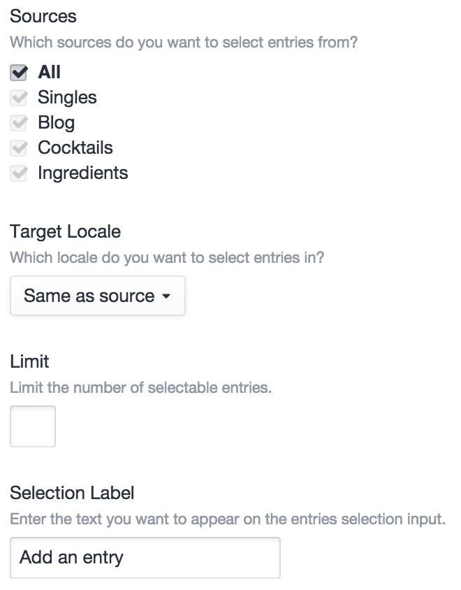
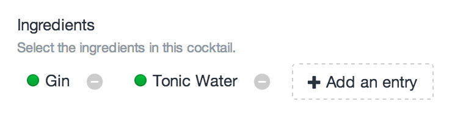
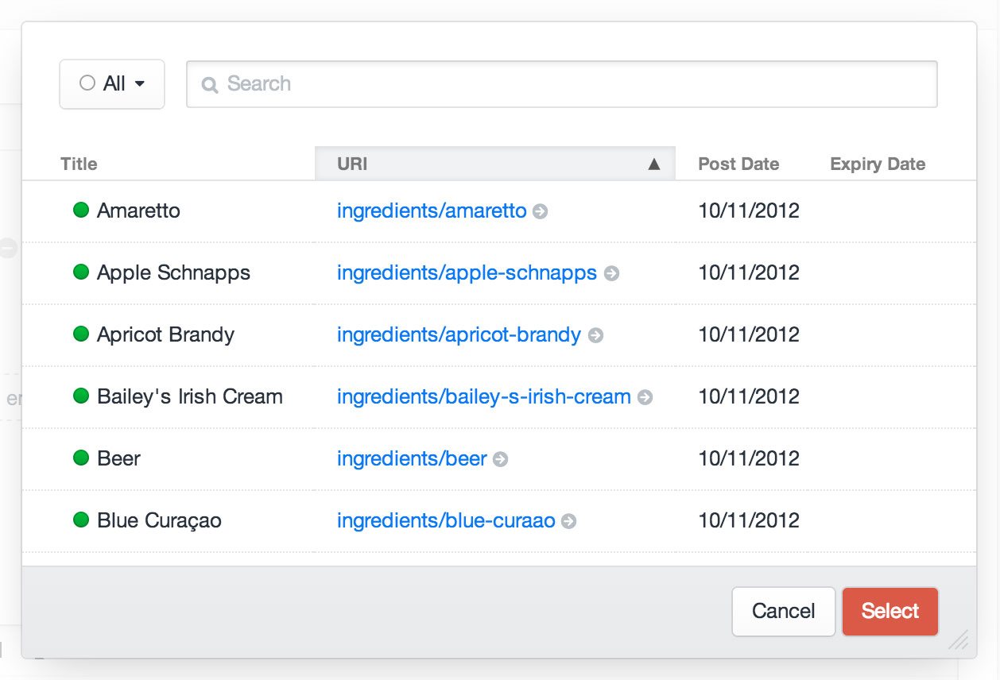
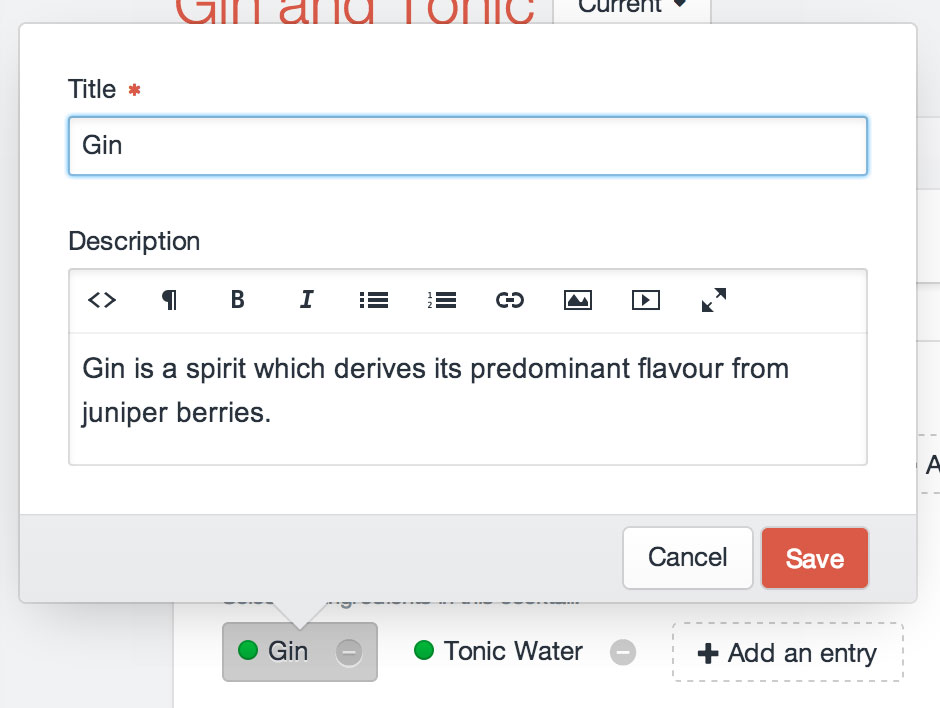

# Entries Fields

Entries fields allow you to relate [entries](sections-and-entries.md) to the parent element.

## Settings



Entries fields have the following settings:

- **Sources** – The sections you want to relate entries from. (Default is “All”.)
- **Target Locale** – Which locale entries should be related with (this setting only appears if you’re running Craft Pro with more than one site locale)
- **Limit** – The maximum number of entries that can be related with the field at once. (Default is no limit.)
- **Selection Label** – The label that should be used on the field’s selection button.

## The Field

Entries fields list all of the currently selected entries, with a button to select new ones:



Clicking the “Add an entry” button will bring up a modal window where you can find and select additional entries:



### Editing Entry Content

Double-clicking on a selected entry will open a modal where you can edit the entry’s title and custom fields.



## Templating

If you have an element with an Entries field in your template, you can access its selected entries using your Entries field’s handle:

```twig

```

That will give you an [ElementCriteriaModel](templating/elementcriteriamodel.md) object, prepped to output all of the selected entries for the given field. In other words, the line above is really just a shortcut for this:

```twig

```

(See [Relations](relations.md) for more info on the `relatedTo` param.)

### Examples

To check if your Entries field has any selected entries, you can use the `length` filter:

```twig

    ...

```

To loop through the selected entries, you can treat the field like an array:

```twig

    ...

```

Rather than typing “`entry.entriesFieldHandle`” every time, you can call it once and set it to another variable:

```twig




    <h3>Some great entries</h3>
    
        ...
    


```

You can add parameters to the ElementCriteriaModel object as well:

```twig

```

If your Entries field is only meant to have a single entry selected, remember that calling your Entries field will still give you the same ElementCriteriaModel, not the selected entry. To get the first (and only) entry selected, use `first()`:

```twig



    ...

```

### See Also

- [craft.entries](templating/craft.entries.md)
- [ElementCriteriaModel](templating/elementcriteriamodel.md)
- [EntryModel](templating/entrymodel.md)
- [Relations](relations.md)
