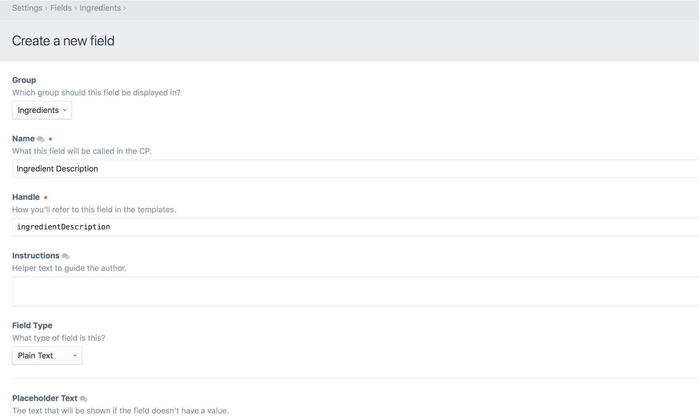

# Fields

All of the content on your site will get entered into fields.

Fields are defined globally from Settings → Fields. They are organized into Field Groups for convenience, but Field Groups have very little relevance anywhere else in the system.

All fields share a few common settings:

- **Group** – The field group that the field should be shown in
- **Name** – How the field will be referenced throughout the Control Panel
- **Handle** – How the field will be referenced from your templates
- **Instructions** – Instruction text to guide the authors
- **Field Type** – What type of field it is

## Field Types

Choosing a field type determines what the field’s input UI is going to look like, what type of data it can store, and how you’ll be able to interact with that data from your templates.

Craft comes with the following built-in field types:

* [Assets](assets-fields.md)
* [Categories](categories-fields.md)
* [Checkboxes](checkboxes-fields.md)
* [Color](color-fields.md)
* [Date/Time](date-time-fields.md)
* [Dropdown](dropdown-fields.md)
* Email
* [Entries](entries-fields.md)
* [Lightswitch](lightswitch-fields.md)
* [Matrix](matrix-fields.md)
* [Multi-select](multi-select-fields.md)
* [Number](number-fields.md)
* [Plain Text](plain-text-fields.md)
* [Radio Buttons](radio-buttons-fields.md)
* [Table](table-fields.md)
* [Tags](tags-fields.md)
* URL
* [Users](users-fields.md)

## Translation Methods

If you’re running a multi-site Craft installation, most of your fields will have a “Translation Method” setting (depending on their type).

Fields can have the following translation method:
	
- **Not translatable** – The field will have the same value across all sites.
- **Translate for each site** – The field can have a different value for each site.
- **Translate for each site group** – The field can have a different value for each site group.
- **Translate for each language** – The field can have a different value for each unique language associated with your sites.
- **Custom…** – The field can have different values based on a custom differentiator.

If you choose “Custom…”, a “Translation Key Format” setting will appear below, where you can define a template that will help Craft which sites to copy the field value over to. When a new field value is saved, Craft will render this template for all sites, and the field value will be copied to all sites where the translation key matches the original site’s.

For example, if a field’s translation key format were `{site.handle[0:2]}`, then new field values would be copied over to any other sites where the first two characters of the site handle matches the first to characters of the original site’s handle.

## Field Layouts

Once you’ve created your fields, you can get it to show up in your edit forms by adding them to a “field layouts”.

Everything in Craft that has content associated with it will provide a field layout for selecting fields:

* [Entries](sections-and-entries.md) use the field layout defined by their entry type in Settings → Sections → Edit Entry Types → [Entry Type name] → Field Layout.
* [Global sets](globals.md) each get their own field layout, defined in Settings → Globals → [Global Set name] → Field Layout.
* [Assets](assets.md) use the field layout defined by their asset volume in Settings → Assets → [Asset Volume name] → Field Layout.
* [Categories](categories.md) use the field layout defined by their Category Group in Settings → Categories → [Category Group name] → Field Layout.
* [Tags](tags.md) use the field layout defined by their Tag Group in Settings → Tags → [Tag Group name] → Field Layout.
* [Users](users.md) all share a single field layout defined in Settings → Users → Fields.

When editing a field layout, you will find a “Content” tab at the top, and a list of all of your site’s fields, grouped into their field groups, at the bottom. Selecting a field is as simple as dragging it from the bottom area to the top, positioning it wherever you want alongside the other selected fields. You can also drag selected fields around to change their order.

Once a field is selected, a gear icon will appear beside it. Clicking on it will reveal a context menu with two options:

* Make required
* Remove

Clicking “Make required” will add an asterisk (`*`) beside the field’s name, indicating that it’s now required. Subsequent gear icon clicks will reveal a new “Make not required” option which does as you’d expect.

Field layouts for entry types have another feature: they let you define the  content tabs that contain the fields. You can create as many content tabs as you want, and use them to organize similar fields together. Each content tab will get its own gear icon allowing you to rename or delete it.
