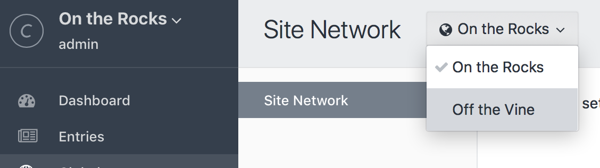

# Globals

Globals store content that is available globally throughout your templates. They're a convenient way to make non-Entry content easily editable via the Control Panel.

Craft organizes Globals into Global Sets. Each Global Set has its own [field layout](fields.md#field-layouts) using any of the existing fields or new fields.

To create a Global Set, go to Settings → Globals.

If you have at least one Global Set, Craft will add a new “Globals” item added to the Control Panel primary navigation. Clicking on this will take you to a page that lists all of your Global Sets in a sidebar, as well as all of the fields associated with the selected Global Set in the main content area.

::: tip
Unlike [entries](sections-and-entries.md#entries), Global Sets don’t have the Live Preview feature, since they aren’t associated with any one particular URL.
:::

## Global Sets in Templates

You can access your Global Sets from any template via their handles.

If you have a Global Set with the handle `companyInfo` and it has a field with the handle `yearEstablished`, you can access that field anywhere using this code:

```twig
{{ companyInfo.yearEstablished }}
```

For additional Global Set properties you can use besides your custom fields see <api:craft\elements\GlobalSet> for a full reference.

## Global Sets with Multiple Sites

If you run multiple sites with Craft, Global Sets are available in all sites. However, you can set the values in those sets on a per site basis, even leaving some fields blank, if desired.

To do that, edit the global set’s fields, and make sure that their “Translation Method” settings are set to “Translate for each site”.

To toggle between sites while viewing Global Sets, use the drop-down menu at the top left of the Global Sets page in the Control Panel.


