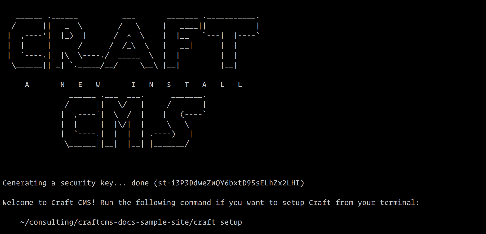
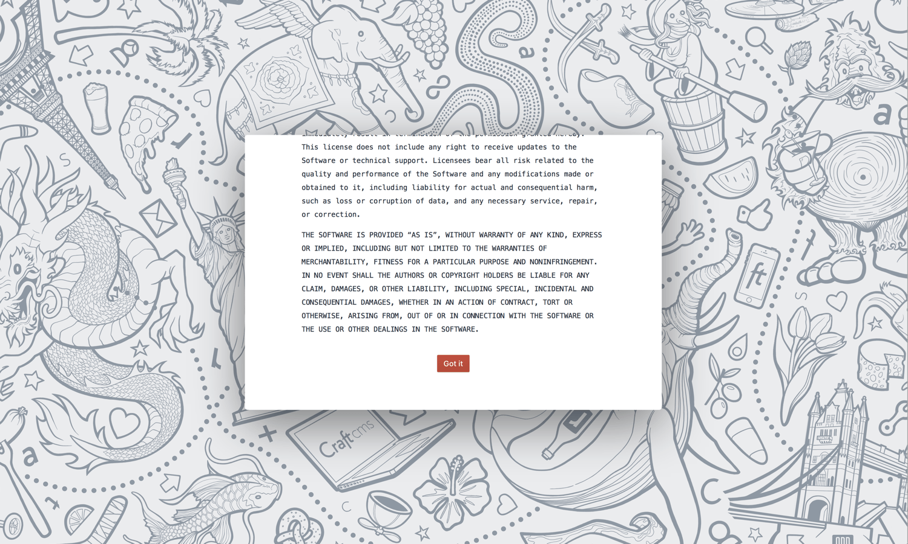
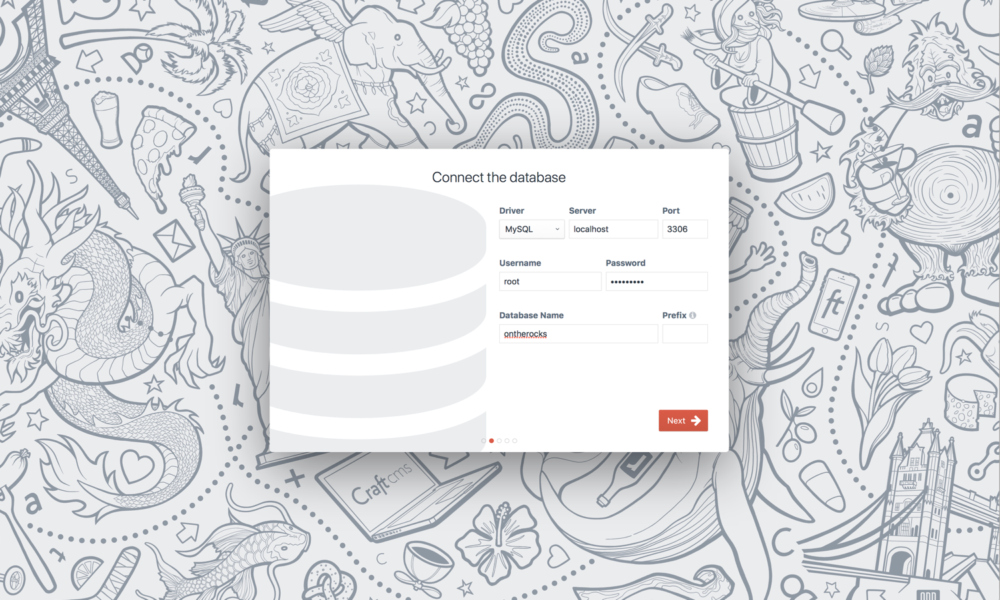
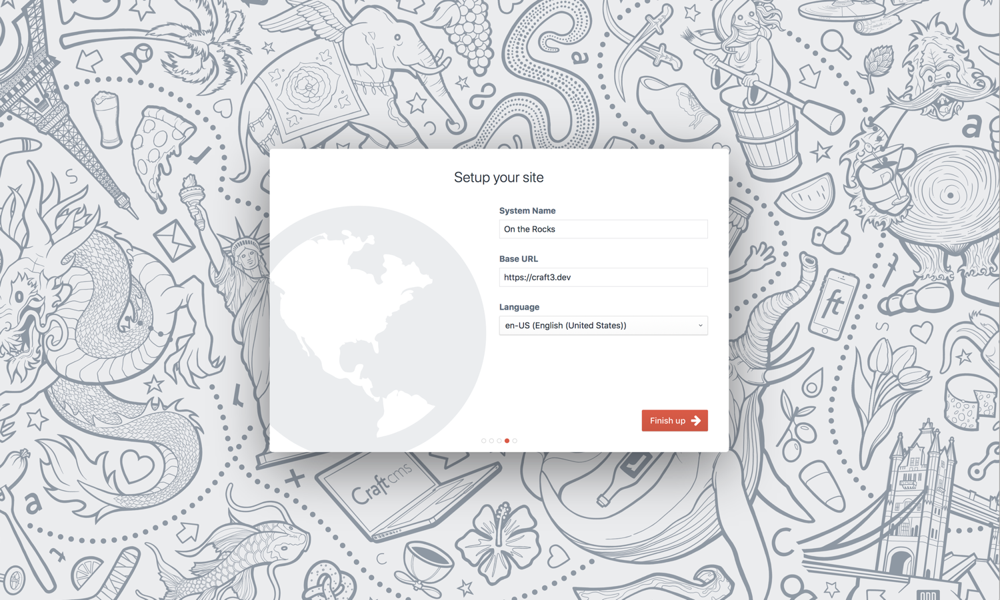
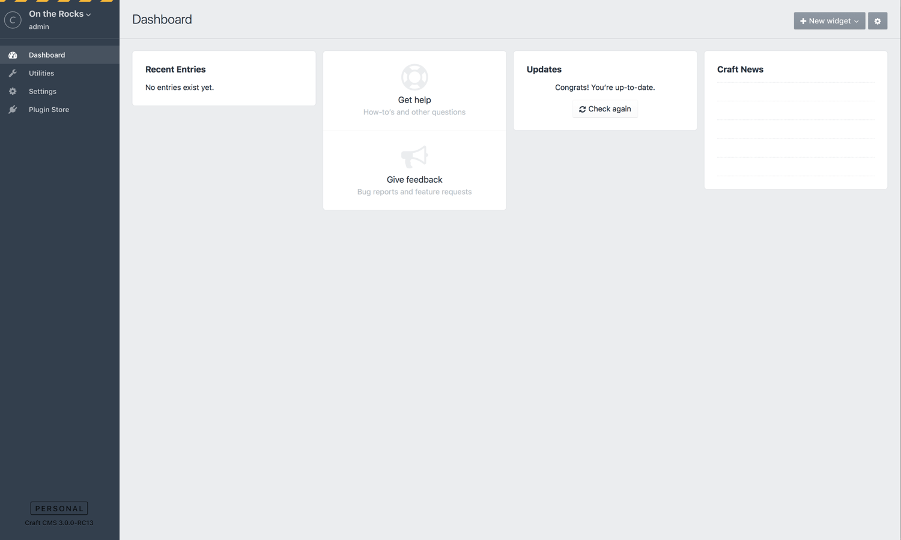

# Installation Instructions

- [Step 1: Download Craft](#step-1-download-craft)
  - [Downloading with Composer](#downloading-with-composer)
  - [Downloading an Archive File Manually](#downloading-an-archive-file-manually)
- [Step 2: Set the File Permissions](#step-2-set-the-file-permissions)
- [Step 3: Set a Security Key](#step-3-set-a-security-key)
  - [Set the Key Manually](#set-the-key-manually)
  - [Set the Key from Your Terminal](#set-the-key-from-your-terminal)
- [Step 4: Create a Database](#step-4-create-a-database)
- [Step 5: Set up the Web Server](#step-5-set-up-the-web-server)
- [Step 6: Run the Setup Wizard](#step-6-run-the-setup-wizard)
  - [Terminal Setup](#terminal-setup)
  - [Web Browser Setup](#web-browser-setup)

## Step 1: Download Craft

Craft can be downloaded with [Composer](#downloading-with-composer) or by [manually downloading](#downloading-an-archive-file-manually) a zip or tar.gz archive. The end result will be the same, so go with whichever route you feel more comfortable with.

### Downloading with Composer

> {note} You should be running Composer 1.3.0 or later. You can find out your installed version of Composer by running `composer -V` from your terminal. If that outputs something lower than 1.3.0, run `composer self-update` to update your Composer installation.

To create a new Craft project, run this command (substituting `<PATH>` with the path where Composer should create the project):

    composer create-project craftcms/craft <PATH>

Composer will take a couple minutes to load everything. Once it’s done you will be shown a success message:



### Downloading an Archive File Manually

Download the archive format you prefer to work with:

- **zip:** <https://craftcms.com/latest-v3.zip>
- **tar.gz:** <https://craftcms.com/latest-v3.tar.gz>

Extract the archive wherever you want your new Craft project to live.

> {note} If you’re on macOS, be careful not to lose the hidden files in there (`.env`, `.env.example`, `.gitignore`, and `web/.htaccess`). Press `CMD + SHIFT + .` (command + shift + period) to see them before moving them to another folder.

### Directory Structure

Once Craft’s files are in place, your project directory should have a file structure like this:

```
config/...
storage/
templates/
vendor/...
web/...
.env
.env.example
composer.json
craft
craft.bat
LICENSE.md
README.md
```

See [Directory Structure](directory-structure.md) for information on these directories and files.

## Step 2: Set the File Permissions

> {tip} If you used Composer to download Craft, you can probably safely skip this step. 

For Craft to run properly, PHP needs to be able to write to the following places:

- `.env`
- `composer.json`
- `composer.lock`
- `config/license.key`
- `storage/*`
- `vendor/*`

The exact permissions you should be setting depends on the relationship between the system user that PHP is running as, and who owns the actual folders/files.

- If they are the same user, use `744`.
- If they’re in the same group, then use `774`.
- If you’re not sure and like to live life on the edge, use `777`.

> {note} **IIS fans:** Make sure your site’s AppPool account has write permissions to these folders/files as well.

## Step 3: Set a Security Key

> {tip} If you used Composer to download Craft, you can probably safely skip this step. 

Each Craft project should have a unique security key, which is shared between each of the environments that the project in installed on.

You can generate and assign the key [manually](#set-the-key-manually), or have Craft do it for you with a [terminal command](#set-the-key-from-your-terminal).

### Set the Key Manually

First generate a cryptographically secure key, preferably using a password generator like [1Password](https://1password.com). (There’s no length limit.)

Then open up your `.env` file (you may need to use an app like [Transmit](https://panic.com/transmit/) to do this if you’re running macOS), and find this line:

    SECURITY_KEY=""

Paste your security key inside the quotes and save the file.

### Set the Key from Your Terminal 

In your terminal, go to your project’s root directory and run the following command:

    ./craft setup/security-key 

## Step 4: Create a Database

Next up, you need to create a database for your Craft project. Craft 3 supports both MySQL 5.5+ and PostgreSQL 9.5+.

If you’re given a choice, we recommend the following database settings in most cases:

- **MySQL**
  - Default Character Set: `utf8`
  - Default Collation: `utf8_unicode_ci`

- **PostgreSQL**
  - Character Set: `UTF8`

## Step 5: Set up the Web Server

Create a new web server to host your Craft project. Its document root should point to your `web/` directory (or whatever you’ve renamed it to).

If you’re not using [MAMP](https://mamp.info) or another localhosting tool, you will probably need to update your `hosts` file, so your computer knows to route requests to your chosen host name to the local computer.

- **macOS/Linux/Unix:** `/etc/hosts`
- **Windows:** `\Windows\System32\drivers\etc\hosts`

You can test whether you set everything up correctly by pointing your web browser to `http://<HOSTNAME>/index.php?p=admin` (substituting `<HOSTNAME>` with your web server’s host name). If Craft’s Setup Wizard is shown, the host name is correctly resolving to your Craft installation.

## Step 6: Run the Setup Wizard

Finally, it’s time to run Craft’s Setup Wizard. You can either run that from your [terminal](#terminal-setup) or your [web browser](#web-browser-setup).

### Terminal Setup

In your terminal, go to your project’s root directory and run the following command to kick off the Setup Wizard:

    ./craft setup

The command will ask you a few questions to learn how to connect to your database, and then kick off Craft’s installer. Once it’s done, you should be able to access your new Craft site from your web browser.

### Web Browser Setup

In your web browser, go to `http://<HOSTNAME>/index.php?p=admin` (substituting `<HOSTNAME>` with your web server’s host name). If you’ve done everything right so far, you should be greeted by Craft’s Setup Wizard.


The first step of the installer is to accept the [license agreement](https://craftcms.com/license). Scroll down through the agreement (reading it all, of course) and click the “Got it” button to accept.



The second step is to enter your database connection information.

> {note} If the Setup Wizard skips this step, it’s because Craft is already able to connect to your database. 



The third step of the installer is to create an admin account. Don’t be one of _those people_ and be sure to pick a strong password.


The final step is to define your System Name, Base URL, and Language.



Click “Finish up” to complete the setup process. A few seconds later, you should have a working Craft install!

If it was successful, Craft will redirect your browser to the Control Panel.



Congratulations, you’ve just installed Craft!

Now build something incredible.
