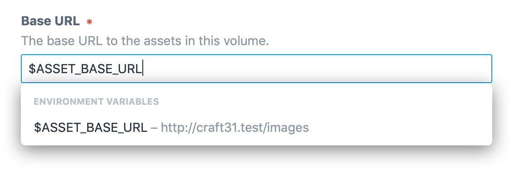

# 環境設定

いくつかの設定は、それぞれの環境ごとに定義する必要があります。例えば、ローカル環境での開発時はサイトのベース URL を `http://my-project.test`、本番環境では `https://my-project.com`にしたいかもしれません。

## コントロールパネルの設定

コントロールパネル内のいくつかの設定は、（`.env` ファイルで定義されているような）環境変数にセットできます。

- 一般
   - **システム名**
- サイト
   - **ベース URL**
- アセットボリューム
   - **ベース URL**
   - **ファイルシステムのパス**（ローカル）
- メール
   - **システムのメールアドレス**
   - **差出人の名前**
   - **HTML メールのテンプレート**
   - **ユーザー名**（Gmail、および、SMTP）
   - **パスワード**（Gmail、および、SMTP）
   - **ホストネーム**（SMTP）
   - **ポート**（SMTP）

これらの設定を環境変数にセットするには、環境変数の名前を `$` に続けて入力してください。



環境変数の名前だけがデータベース、または、プロジェクトコンフィグ内に保存さるため、環境ごとに変更したり機密性の高い情報を含む設定値をセットするのにとても良い方法です。

::: tip
プラグインも同様に、それぞれの設定内で環境設定やエイリアスのためのサポートを追加できます。どのようにするかを知るには、[環境設定](../extend/environmental-settings.md)を参照してください。
:::

### コントロールパネルの設定内でのエイリアスの利用

（URL やファイルステムのパスを保存する）これらの設定のいくつかは[エイリアス](README.md#aliases)に設定することもできます。ベース URL やパスを環境変数内に保存し、追加のセグメントを付加したい場合に役立ちます。

例えば、サイトのルート URL にセットされる環境変数 `ROOT_URL` を定義できます。

```bash
# -- .env --
ROOT_URL="http://my-project.test"
```

次に、それを参照するエイリアス `@rootUrl` を作成します。

```php
// -- config/general.php --
'aliases' => [
    '@rootUrl' => getenv('ROOT_URL'),
],
```

これで（例として）ユーザーフォトのボリュームの設定画面に移動し、ベース URL に `@rootUrl/images/user-photos` をセットできます。

## コンフィグファイル

PHP の [getenv()](http://php.net/manual/en/function.getenv.php) ファンクションを使用して、環境変数を[一般設定](config-settings.md)、[データベース設定](db-settings.md)、および、他の PHP 設定ファイルにセットできます。

```bash
# -- .env --
CP_TRIGGER="secret-word"
```

```php
// -- config/general.php --
'cpTrigger' => getenv('CP_TRIGGER') ?: 'admin',
```

### マルチ環境設定

Craft の PHP 設定ファイルは、オプションでそれぞれの環境ごとに別々の設定を定義できます。

```php
// -- config/general.php --
return [
    // Global settings
    '*' => [
        'omitScriptNameInUrls' => true,
    ],

    // Dev environment settings
    'dev' => [
        'devMode' => true,
    ],

    // Production environment settings
    'production' => [
        'cpTrigger' => 'secret-word',
    ],
];
```

Craft がマルチ環境のキーとしてそれを取り扱うことを知るために、ここでは `'*'` キーが必須となりますが、他のキーはあなた次第です。Craft は `web/index.php` ファイルに定義されている PHP 定数 [CRAFT_ENVIRONMENT](php-constants.md#craft-environment) とマッチするキーを探します。（フォールバックとして、サーバーのホスト名が使用されます。）

デフォルトでは、新しい Craft 3 プロジェクトは `.env` ファイルに定義された `ENVIRONMENT` 環境変数を使用して[CRAFT_ENVIRONMENT](php-constants.md#craft-environment) 定数を定義します。

```bash
# -- .env --
ENVIRONMENT="dev"
```

```php
// -- web/index.php --
define('CRAFT_ENVIRONMENT', getenv('ENVIRONMENT') ?: 'production');
```

