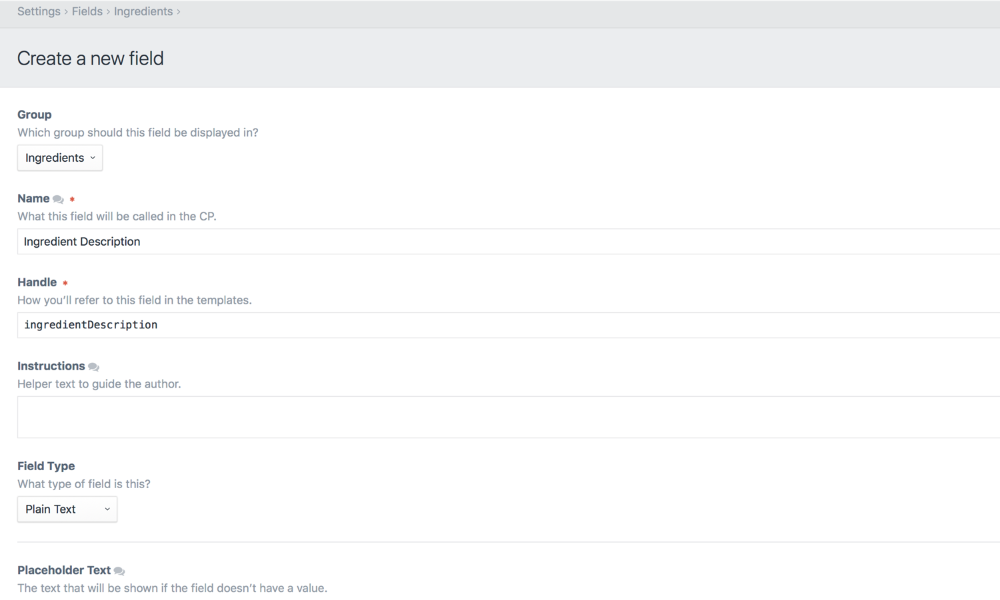

# フィールド

サイトのすべてのコンテンツはフィールドに入力されます。

フィールドは「設定 > フィールド」からグローバルに定義されます。それらは、便宜上フィールドグループ内に整理されていますが、フィールドグループはシステムの他の場所との関連性をほとんど持ちません。

すべてのフィールドはいくつかの共通の設定があります。

* 所属するフィールドグループ
* 名前
* ハンドル
* 説明

## 翻訳可能なフィールド

Craft で多言語サイトを運用している場合、フィールドを翻訳可能にするオプションがあります。

この設定がチェックされている場合、フィールドの値はサイトごとに保存されます。さもなければ、すべてのサイトに常に同一の値がコピーされます。

## フィールドタイプ

すべてのフィールドに設定されるのが「フィールドタイプ」の設定です。これは、フィールドがどんな種類か（入力 UI の外観、保存可能なデータ型、テンプレートからデータをどのようにやりとりできるか）を決定します。

Craft は次の組み込みのフィールドタイプがあります。

* [アセット](assets-fields.md)
* [カテゴリ](categories-fields.md)
* [チェックボックス](checkboxes-fields.md)
* [色](color-fields.md)
* [日/時](date-time-fields.md)
* [セレクトボックス](dropdown-fields.md)
* Email
* [エントリ](entries-fields.md)
* [Lightswitch](lightswitch-fields.md)
* [行列](matrix-fields.md)
* [マルチセレクトボックス](multi-select-fields.md)
* [数字](number-fields.md)
* [プレーンテキスト](plain-text-fields.md)
* [ラジオボタン](radio-buttons-fields.md)
* [テーブル](table-fields.md)
* [タグ](tags-fields.md)
* URL
* [ユーザー](users-fields.md)

## フィールドレイアウト

フィールドを作成すると、「フィールドレイアウト」にそれらを加えることによって編集フォームに表示させることができます。

関連するコンテンツを持つ Craft 内のすべての場所で、フィールドを選択するためのフィールドレイアウトを提供します。

* [エントリ](sections-and-entries.md)は、「設定 > セクション > 入力タイプ > [入力タイプ名] > フィールドレイアウト」の入力タイプごとに定義されたフィールドレイアウトを使用します。 
* [グローバル設定](globals.md)は、「設定 > グローバル > [グローバル設定名] > フィールドレイアウト」で定義されたそれぞれのフィールドレイアウトを使用します。
* [アセット](assets.md)は、「設定 > アセット > [アセットボリューム名] > フィールドレイアウト」のアセットボリュームごとに定義されたフィールドレイアウトを使用します。
* [カテゴリ](categories.md)は、「設定 > カテゴリ → [カテゴリグループ名] > フィールドレイアウト」のカテゴリグループごとに定義されたフィールドレイアウトを使用します。
* [タグ](tags.md)は、 「設定 > タグ > [タググループ名] > フィールドレイアウト」のタググループごとに定義されたフィールドレイアウトを使用します。
* [ユーザー](users.md)は、「設定 > ユーザー > フィールド」で定義された単一のフィールドレイアウトを共有します。

フィールドレイアウトを編集すると、一番上に「コンテンツ」タブが、下段にフィールドグループごとに分類されたすべてのサイトのフィールドのリストが表示されます。フィールドの選択は下のエリアから上にドラッグするだけの簡単な操作で、すでに配置されたフィールドの前後の好きな場所に配置できます。選択されたフィールドをドラッグして、順序を入れ替えることもできます。

フィールドが選択されると、歯車アイコンが横に表示されます。クリックすると2つのオプションを含むコンテキストメニューを表示します。

* 必須にする
* 削除

「必須にする」をクリックすると、フィールド名の横にアスタリスク（`*`）が追加され、必須項目になったことを示します。それ以降、歯車アイコンをクリックすると、期待通り「必須にしない」オプションを表示します。

入力タイプのフィールドレイアウトには別の機能があり、フィールドを含むコンテンツタブを定義できます。必要数のコンテンツタブを作成し、類似するフィールドをまとめて分類するために利用します。各コンテンツタブには歯車アイコンが表示され、リネームや削除ができます。

