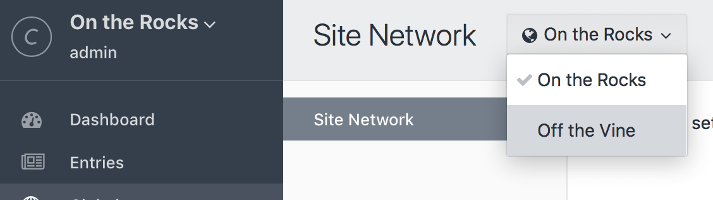

# グローバル

グローバルは、テンプレート全体で包括的に利用可能なコンテンツを保存できます。これは、コントロールパネル経由でエントリではないコンテンツを簡単に編集できるようにする便利な方法です。

Craft はグローバル設定内でグローバルを整理します。それぞれのグローバル設定は、存在するすべてのフィールドや新しいフィールドを利用する独自の[フィールドレイアウト](fields.md#field-layouts)を持ちます。

グローバル設定を作るには、「設定 > グローバル」に移動します。

少なくとも1つのグローバル設定があれば、Craft はコントロールパネルのメインナビゲーションに「グローバル」項目を追加します。これをクリックすると、サイドバーにすべてのグローバル設定のリスト、メインコンテンツエリアに選択されたグローバル設定に関連するすべてのフィールドが表示されたページに移動します。

::: tip
[エントリ](sections-and-entries.md#entries)とは異なり、特定の URL と関連付けられていないグローバル設定では、ライブプレビュー機能がありません。
:::

## テンプレートでのグローバル設定

任意のテンプレートからハンドル経由でグローバル設定にアクセスできます。

`companyInfo` というハンドルのグローバル設定があり、`yearEstablished` というハンドルのフィールドがある場合、次のコードを使用してそのフィールドへどこからでもアクセスすることができます。

```twig
{{ companyInfo.yearEstablished }}
```

カスタムフィールド以外で利用できる追加のグローバル設定のプロパティについては、リファレンスの <api:craft\elements\GlobalSet> を参照してください。

## マルチサイトでのグローバル設定

Craft でマルチサイトを運用している場合、グローバル設定はすべてのサイトで利用可能です。しかしながら、必要に応じていくつかのフィールドを空のままにするなど、それぞれの設定値をサイトごとにセットできます。

そのためには、グローバルセットのフィールドを編集し、それぞれの「翻訳方法」設定で「各サイトに対して翻訳」をセットします。

グローバル設定を表示中にサイトを切り替えるには、コントロールパネルのグローバル設定ページの左上にあるドロップダウンメニューを使用します。



