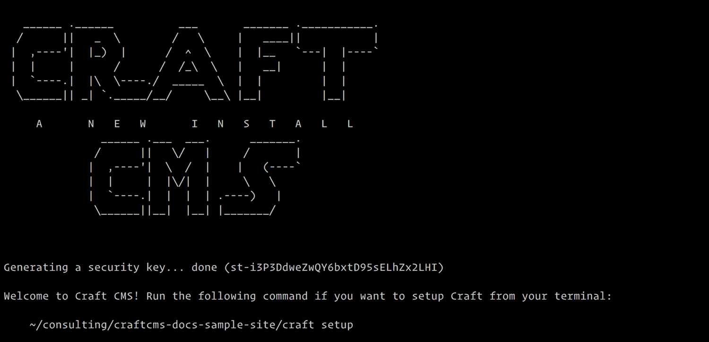
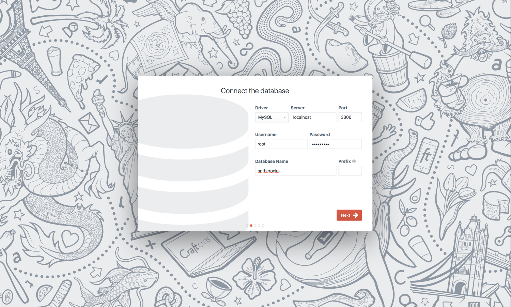
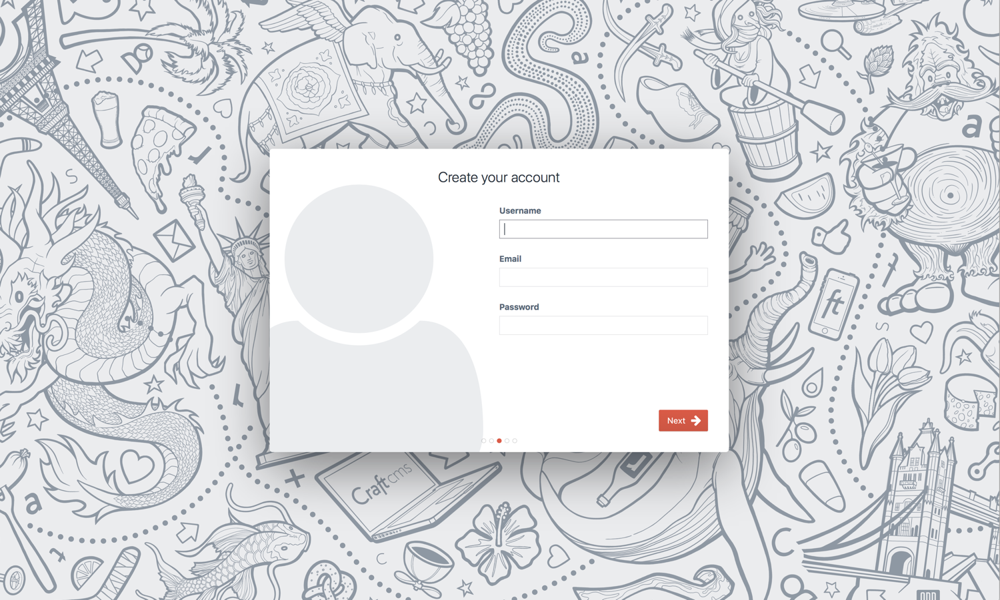
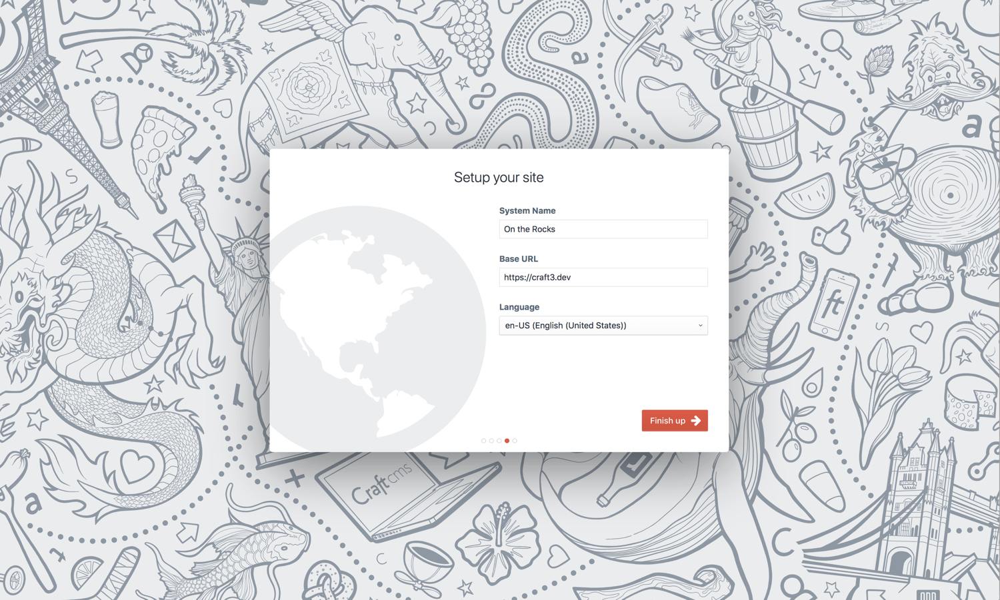
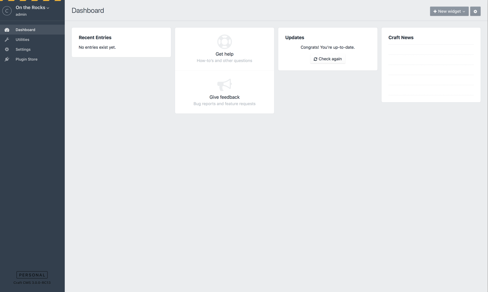

# インストールガイド

[[toc]]

## ステップ 1：Craft のダウンロード

Craft は [Composer](#downloading-with-composer) でダウンロードするか、zip または tar.gz アーカイブを[手動でダウンロード](#downloading-an-archive-file-manually)できます。最終的な結果は同じになるため、あなたにとってより快適な方法を選んでください。

### Composer でダウンロード

::: tip
Composer 1.3.0 以降を稼働させるべきです。起動しているターミナル上で `composer -V` を実行することによって、インストールされている Composer のバージョンを確認できます。1.3.0 より前のバージョンであれば、Composer をアップデートするために `composer self-update` を実行します。
:::

新しい Craft プロジェクトを作成するため、次のコマンドを実行してください。（Composer が作成するプロジェクトのパスの代わりに`<Path>` と記載しています。）

```bash
composer create-project craftcms/craft <Path>
```

Composer がすべてをロードするのに、数分かかるでしょう。完了すると、成功メッセージが表示されます。



### アーカイブファイルを手動でダウンロード

作業に適したアーカイブ形式をダウンロードします。

- **zip**: <https://craftcms.com/latest-v3.zip>
- **tar.gz**: <https://craftcms.com/latest-v3.tar.gz>

新しい Craft プロジェクトを稼働したい場所でアーカイブを展開します。

::: tip
macOS を使用している場合、そこにある不可視ファイル（`.env`、`.env.example`、`.gitignore`、および、`web/.htaccess`）を失わないよう注意してください。Finder で <kbd>Command</kbd> + <kbd>Shift</kbd> + <kbd>.</kbd> を押すことで、不可視ファイルの表示を切り替えることができます。
:::

### ディレクトリ構造

Craft のファイルが適切な場所にあれば、プロジェクトディレクトリは次のようなディレクトリ構造になっているはずです。

```
my-project.test/
├── config/
│   └── ...
├── storage/
│   └── ...
├── templates/
│   └── ...
├── vendor/
│   └── ...
├── web/
│   └── ...
├── .env
├── .env.example
├── composer.json
├── craft
└── craft.bat
```

::: tip
これらすべてのフォルダやファイルが何のためにあり、どのようにカスタマイズするかを知りたければ、[Directory Structure](directory-structure.md) ページを参照してください。
:::

## ステップ 2：ファイルパーミッションの設定

::: tip
Craft のダウンロードに Composer を利用した場合、おそらく安全にこのステップをスキップできます。
:::

Craft が正しく動作するためには、PHP が次の場所への書き込み権限が必要です。

- `.env`
- `composer.json`
- `composer.lock`
- `config/license.key`
- `storage/*`
- `vendor/*`
- `web/cpresources/*`

設定されるべき正確なパーミッションは、PHP を実行しているシステムユーザーと実際にフォルダやファイルを所有しているユーザーとの関係性に依存します。

- 同じユーザーであれば、`744` を利用します。
- 同じグループであれば、`774` を利用します。
- 確信が持てず、緊張感がある生活を好むなら、`777` を利用します。

::: warning IS ファンへ
サイトの AppPool アカウントがこれらのフォルダやファイルに書き込み権限を持っていることを確認してください。
:::

## ステップ 3：セキュリティキーの設定

::: tip
Craft のダウンロードに Composer を利用した場合、おそらく安全にこのステップをスキップできます。
:::

それぞれの Craft プロジェクトでは、そのプロジェクトがインストールされている各環境で共有されるユニークなセキュリティキーが必要です。

[手動](#set-the-key-manually)でキーの生成と割り当てを行うか、[ターミナルコマンド](#set-the-key-from-your-terminal)で Craft に任せることもできます。

### キーを手動で設定

はじめに、なるべく [1Password](https://1password.com) のようなパスワードジェネレーターを使って、暗号化された安全なキーを生成してください。（長さに制限はありません。）

そして、（macOS であれば、[Transmit](https://panic.com/transmit/) のようなアプリを利用して）`.env` ファイルを開き、次の行を探してください。

    SECURITY_KEY=""

ダブルクォートの内側にセキュリティキーをペーストし、ファイルを保存します。

### キーをターミナルから設定

ターミナル上でプロジェクトのルートディレクトリへ移動し、次のコマンドを実行します。

```bash
./craft setup/security-key
```

## ステップ 4：データベースの作成

次に、Craft プロジェクト向けのデータベースを作成する必要があります。Craft 3 は MySQL 5.5 以上と PostgreSQL 9.5 以上の両方をサポートします。

選択可能であれば、ほとんどの場合に次のデータベース設定を推奨します。

- **MySQL**
   - デフォルトの文字セット： `utf8`
   - デフォルトの照合順： `utf8_unicode_ci`

- **PostgreSQL**
   - 文字セット： `UTF8`

## ステップ 5：ウェブサーバーのセットアップ

Craft プロジェクトをホストするための新しいウェブサーバーを用意してください。ドキュメントルートは `web/` ディレクトリ（または、リネームしたディレクトリ）を指すようにします。

[MAMP](https://mamp.info) や他のローカルホスティングツールを使用していない場合、`hosts` ファイルを更新して、選択したホスト名にローカルコンピュータへ要求をルーティングする必要があるかもしれません。

- **macOS/Linux/Unix**: `/etc/hosts`
- **Windows**: `\Windows\System32\drivers\etc\hosts`

ブラウザで `http://<Hostname>/index.php?p=admin/install`（ウェブサーバーのホスト名で `<Hostname>` を置き換える）にアクセスすることで、すべて正しく設定できたかどうかをテストできます。Craft のセットアップウィザードが表示された場合、そのホスト名は Craft のインストールのために適切に処理されています。

## ステップ 6：セットアップウィザードの実行

ついに、Craft のセットアップウィザードを実行するときがきました。[ターミナル](#terminal-setup) または [ウェブブラウザ](#web-browser-setup) から実行できます。

### ターミナルによるセットアップ

ターミナル上でプロジェクトのルートディレクトリに移動し、次のコマンドを実行してセットアップウィザードを開始します。

```bash
./craft setup
```

このコマンドは、データベースへの接続方法を学んだ上で Craft のインストーラーを開始するために、いくつかの質問をします。それが終われば、ウェブブラウザから新しい Craft サイトにアクセスできるはずです。

### ウェブブラウザによるセットアップ

ウェブブラウザで `http://<Hostname>/index.php?p=admin/install`（ウェブサーバーのホスト名で `<Hostname>` を置き換える）に移動します。ここまでのステップがうまくいっていれば、Craft のセットアップウィザードが迎えてくれるでしょう。


インストーラーの最初のステップは、[ライセンス契約](https://craftcms.com/license)への同意です。（もちろん、すべて目を通した上で）契約をスクロールダウンし、「Got it（了解）」ボタンをクリックして了承してください。


2つ目のステップは、データベース接続情報の入力です。

::: tip
Craft がすでにデータベースに接続可能な状態であれば、このステップはスキップされます。
:::



インストーラーの3つ目のステップは、管理者アカウントの作成です。_特別なアカウント_ として、強力なパスワードを選んでください。



最後のステップは、システム名、ベース URL、および、言語の設定です。



「Finish up（完了）」 ボタンをクリックしてセットアッププロセスを完了します。数秒後、Craft のインストールが実行されるでしょう。

インストールが成功したら、Craft はブラウザをコントロールパネルにリダイレクトします。



おめでとうございます！Craft がインストールされました。

さぁ、素晴らしいものを築きあげましょう。

