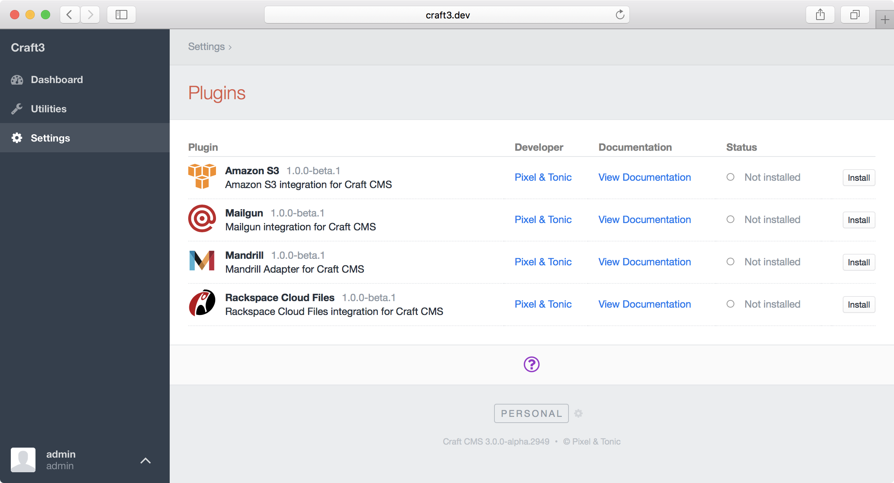

# プラグイン開発の紹介

[[toc]]

## プラグインとは？

プラグインは、Craft のコアコードと一緒に動作する小さなアプリケーションです。それらはシンプルで、新しいダッシュボードウィジェットタイプを提供するようなシンプルな目的を満たすか、 Eコマースアプリケーションのような完全に新しいコンセプトをシステムに導入するような複雑であり得ます。Craft のプラグインアーキテクチャは、何かを構築するための強固な基盤を提供します。

技術的には、プラグインは [Yii Modules] のスーパーセットであり、[models]、[active record classes]、[controllers]、 [application components]、および、その他のことを持つことができます。あなたが Yii を初めて習得するとしても、それらのコンセプトを読み解くために時間をかけることは苦痛にならないでしょう。

Yii モジュール上の Craft プラグインの主なメリットは、次の通りです。

- プラグインのインストール、アンインストールが可能です。
- プラグインは独自のマイグレーショントラックを持つことができます。

## はじめよう

::: tip
数クリックでプラグインの土台を作成できる [pluginfactory.io](https://pluginfactory.io/) を利用してください。
:::

### 準備

プラグイン作成に取り組む前に、いくつかのことを決めておく必要があります。

- **パッケージ名** – Composer パッケージに名前をつけるために利用されます。Composer 経由でプラグインを配布したくない場合でも、必要です。（詳細については、[documentation][package name] を参照してください。）これが Craft のプラグインだと識別する手助けになるため、2番目のセグメント（`/` の後）に接頭辞 `craft-` を付けることをお勧めします。例えば `pixelandtonic/craft-recipes` のような形です。
- **名前空間接頭辞** – あなたのプラグインのクラス名前空間は、これで始まります。（詳細については、[PSR-4] オートローディング仕様を参照してください。）これは `craft\` で始めるべき *ではない* ことに注意してください。あなたやデベロッパーを識別する何かを使用してください。
- **プラグインハンドル** – Craft のエコシステム内でプラグインを一意に識別する何か。（プラグインハンドルは、文字で始まり、小文字の英字、数字、およびダッシュのみでなければなりません。`kebab-cased` にすべきです。）
- **プラグイン名** – コントロールパネル内でプラグインを何と呼ぶか。

名前を決めることは、コンピュータサイエンスの中で [two hardest things] の1つです。それを決めることさえできれば、あとは実際にプラグインの内容を書くだけです。

### 基本ファイル構成の設定

プラグインを作るため、コンピュータのどこかに新しいディレクトリを作成してください。一般的なアプローチは、Craft プロジェクトと並ぶ `~/dev/` フォルダに保管することです。

```
~/dev/
├── my-craft-project.dev/
│   └── ...
└── my-plugin/
    ├── composer.json
    └── src/
        └── Plugin.php
```

::: tip
プラグインのディレクトリ名は重要ではありません。簡単に識別できるものを選んでください。
:::

### composer.json

プラグインで Composer 依存を利用可能（おそらくそうすべきです）にしたいかどうかに関わらず、`composer.json` ファイルを持たなければなりません。Craft はプラグインに関する基本情報を取得するために、このファイルをチェックします。

`composer.json` ファイルの出発点として、このテンプレートを使用してください。

```json
{
 "name": "package/name",
 "description": "Your plugin’s package description",
 "version": "1.0.0",
 "type": "craft-plugin",
 "minimum-stability": "dev",
 "require": {
 "craftcms/cms": "^3.0.0"
 },
 "autoload": {
 "psr-4": {
 "ns\\prefix\\": "src/"
 }
 },
 "support": {
 "email": "you@example.com"
 },
 "extra": {
 "handle": "plugin-handle",
 "name": "Plugin Name",
 "developer": "Developer Name",
 "developerUrl": "https://developer-url.com"
 }
}
```

次の項目を置き換えてください。

- `package/name` をパッケージ名にします。
- `ns\\prefix\\` を名前空間接頭辞にします。（JSON のために二重バックスラッシュを使用し、最後が `\\` でなければならない点に注意してください。）
- `you@example.com` をサポートのメールアドレスにします。
- `plugin-handle` をプラグインハンドルにします。
- `Plugin Name` をプラグイン名にします。
- `Developer Name` をあたなの名前、または、プラグインが帰属する組織名にします。
- `https://developer-url.com` をコントロールパネルの開発者名にリンクするウェブサイトの URL にします。

`extra` オブジェクトにセットできるプロパティの完全なリストは、次の通りです。

- `handle` – プラグインハンドル（必須）。
- `class` – [プライマリプラグインクラス](#primary-plugin-class) の名前。設定されていない場合、インストーラーはそれぞれの `autoload` パスのルートで `Plugin.php` ファイルを探します。
- `basePath` – プラグインのソースファイルへのベースパス。[Yii alias]（例： `@vendorname/foo`） としてフォーマットされた `autoload` 名前空間の1つから始めることができます。設定されてない場合、プライマリプラグインクラスを含むディレクトリが使用されます。
- `name` – プラグイン名。設定されていない場合、（ベンダー接頭辞なしの）パッケージ名が使用されます。
- `version` - プラグインのバージョン。設定されていない場合、現在のパッケージバージョンが使用されます。
- `schemaVersion` – プラグインスキーマのバージョン。
- `description` – プラグインの説明。設定されていない場合、メインの `description` プロパティが使用されます。
- `developer` – 開発者の名前。設定されていない場合、（`authors` プロパティ経由で）最初の作者の `name` が使用されます。
- `developerUrl` – 開発者の URL。設定されていない場合、`homepage` プロパティ、または、（`authors` プロパティ経由で）最初の作者の `homepage` が使用されます。
- `developerEmail` – サポートのメールアドレス。設定されていない場合、`support.email` プロパティが使用されます。
- `documentationUrl` – プラグインのドキュメントの URL。設定されていない場合、`support.docs` プロパティが使用されます。
- `changelogUrl` – プラグインの変更ログの URL（保留中のプラグインアップデートとリリースノートの表示に使用されます）。
- `downloadUrl` – プラグインのダウンロード URL（プラグインのアップデートをマニュアルインストールで使用されます）。
- `sourceLanguage` – プラグインのソース言語（デフォルトは `en-US`）。
- `hasSettings` – プラグインの設定があるかどうか（`true` または `false`）。
- `hasCpSection` – コントロールパネルにプラグイン独自のセクションを持つかどうか（`true` または `false`）。
- `components` – プラグイン上に存在するべき [component configs] を定義するオブジェクト。

::: tip
`composer/installers` を Composer 依存として含めないでください。
:::

::: tip
Composer が厳密に要求しているわけではありませんが、プラグインを開発する際にいくつかのことが簡単に行えるよう、`composer.json` へ明示的に `version` を設定することをお勧めします。そして、アップデートし続けることを忘れないでください！
:::

### プライマリプラグインクラス

`src/Plugin.php` ファイルは、あなたのプラグインのプライマリクラスです。すべてのリクエスト開始時に、インスタンスが作られます。`init()` メソッドはイベントリスナーやそれ自体の初期化を必要とする他のステップを登録するのに最適な場所です。

このテンプレートを `Plugin.php` ファイルの出発点として使用してください。

```php
<?php
namespace ns\prefix;

class Plugin extends \craft\base\Plugin
{
 public function init()
 {
 parent::init();

 // Custom initialization code goes here...
 }
}
```

`ns\prefix` を実際のプラグインの名前空間接頭辞に置き換えてください。

### Craft プロジェクトへのプラグインの読み込み

Craft にプラグインを表示するには、Craft プロジェクトの Composer 依存としてインストールする必要があります。そのためには複数の方法があります。

#### Path Repository

開発中にプラグインを動作させる最も簡単な方法は、他の依存関係と同様に `vendor/` フォルダへシンボリックリンクするよう Composer に伝える [path repository][path] を利用することです。

設定するには、Craft プロジェクトの `composer.json` ファイルを開き、次の変更を加えます。

- [minimum-stability](https://getcomposer.org/doc/04-schema.md#minimum-stability) を `"dev"` に設定します。
- [prefer-stable](https://getcomposer.org/doc/04-schema.md#prefer-stable) を `true` に設定します。
- 新しく [path repository](https://getcomposer.org/doc/05-repositories.md#path) レコードを追加し、プラグインのルートディレクトリを指定します。

```json
{
 "minimum-stability": "dev",
 "prefer-stable": true,
 "repositories": [
 {
 "type": "path",
 "url": "../my-plugin"
 }
 ]
}
```

::: tip
`url` 値にプラグインのソースディレクトリを絶対パスまたは相対パスで設定します。（サンプルの `../my-plugin` は、プロジェクトフォルダーと並んでプラグインのフォルダが存在することを前提としています。）
:::

ターミナル上で Craft プロジェクトへ移動し、Composer にプラグインの追加を伝えてください。（`composer.json` ファイルでプラグインに付けたパッケージ名と同じものを使用してください。）

```bash
# go to the project directory
cd ~/dev/my-craft-project

# require the plugin package
composer require package/name
```

Composer のインストールログは、シンボリックリンク経由でパッケージがインストールされたことを表示するでしょう。

```
- Installing package/name (X.Y.Z): Symlinking from ../my-plugin
```

::: warning
`path` Composer リポジトリの難点の1つは、`composer update` を実行した際に Composer が `path` ベースの依存関係を無視することです。そのため、プラグインの依存要件やプラグインの情報のような `composer.json` 内の何かを変更するときはいつでも、それらの変化が効力を発揮するようプロジェクト内のあなたのプラグインを完全に削除して再要求する必要があります。

```bash
# go to the project directory
cd ~/dev/my/craft-project

# remove the plugin package
composer remove package/name

# re-require the plugin package
composer require package/name
```
:::

#### Packagist

プラグインを一般公開する準備ができたら、新しい Composer パッケージを [Packagist](https://packagist.org/) に登録してください。そうすれば、Composer の `require` コマンドにパッケージ名を渡すだけで、他のパッケージと同様にインストールできます。

```bash
# go to the project directory
cd ~/dev/my-craft-project

# require the plugin package
composer require package/name
```

## プラグインアイコン

プラグインは「設定 > プラグイン」ページに表示されるアイコンを提供できます。



プラグインアイコンは、プラグインのソースディレクトリ（例：`src/`）のルートに `icon.svg` として保存された、正方形の SVG ファイルでなければいけません。

プラグインが [コントロールパネルのセクション](cp-section.md) を持つ場合は、プラグインのソースディレクトリのルートに `icon-mask.svg` ファイルを保存することによって、グローバルナビゲーション項目にカスタムアイコンを付けることもできます。このアイコンにはストロークを含めることができず、常に（アルファ透明度に関して）ソリッドカラーで表示されることに注意してください。

[Yii Modules]: http://www.yiiframework.com/doc-2.0/guide-structure-modules.html
[models]: http://www.yiiframework.com/doc-2.0/guide-structure-models.html
[active record classes]: http://www.yiiframework.com/doc-2.0/guide-db-active-record.html
[controllers]: http://www.yiiframework.com/doc-2.0/guide-structure-controllers.html
[application components]: http://www.yiiframework.com/doc-2.0/guide-structure-application-components.html
[package name]: https://getcomposer.org/doc/04-schema.md#name
[two hardest things]: https://twitter.com/codinghorror/status/506010907021828096
[PSR-4]: http://www.php-fig.org/psr/psr-4/
[Yii alias]: http://www.yiiframework.com/doc-2.0/guide-concept-aliases.html
[component configs]: http://www.yiiframework.com/doc-2.0/guide-structure-application-components.html
[path]: https://getcomposer.org/doc/05-repositories.md#path

