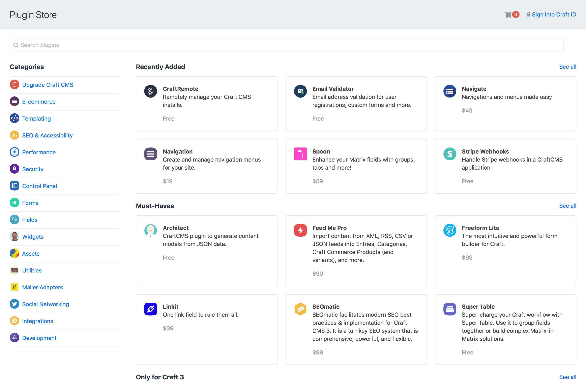
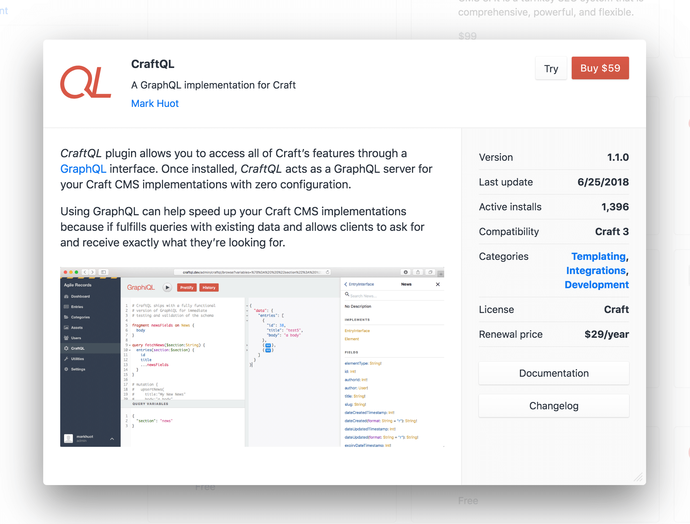

# プラグイン

::: tip
プラグイン _開発_ のためのドキュメントをお探しの場合は、[Craft の拡張](extend/README.md) セクションをチェックしてください。
:::

プラグインは Craft のコア機能を拡張します。新しいダッシュボードウィジェット、フィールドタイプ、コントロールパネルセクション、Twig テンプレート機能、ワークフローアクションなどを導入することができます。

## プラグインストア

Craft のコントロールパネルはプラグインストアを特徴とし、数百の無料プラグインと商用プラグインをブラウズしたり、ワンクリックでインストールしたり、料金を支払うことができます。

プラグインストアにアクセスするためには、Craft のコントロールパネルのナビゲーションにある「プラグインストア」をクリックします。そこから、様々なプラグインカテゴリや選別されたリストをブラウズして、新しいプラグインを発見することができます。

プラグインをクリックすると、長い説明文やスクリーンショットを含むプラグインに関する詳細をモーダルウィンドウで開きます。

## 無料プラグインのインストール

無料プラグインは、「インストール」ボタンをクリックしてインストールできます。インストールと併せて Craft のステータスを更新する、プラグインのインストールページが表示されます。

## 商用プラグインの試用

Craft が開発ドメイン上で実行されている場合、「試用」ボタンをクリックして商用プラグインを試用版としてインストールできます。インストールと併せて Craft のステータスを更新する、プラグインのインストールページが表示されます。

## 商用プラグインの購入

商用プラグインを試して購入する準備ができている場合は、 プラグインストアに戻り、ヘッダーにあるカートアイコンをクリックしてください。カートモーダルの「有効なトライアル」セクションに、プラグインの一覧を確認できます。「カートに追加」ボタンをクリックして、カートにプラグインを追加し、チェックアウトを続行します。

チェックアウトのプロセスが完了すると、インストールしたプラグインは自動的にライセンスを取得します。

## プラグインライセンスの管理

[Craft ID](https://id.craftcms.com/) アカウントの「Licenses → Plugins」から、すべてのプラグインライセンスを管理することができます。

まだ Craft ID アカウントをお持ちでない場合は、[id.craftcms.com/register](https://id.craftcms.com/register) にアクセスしてアカウントを作成することができます。

Craft ID アカウントと同じメールアドレスで購入されたすべてのプラグインライセンスは、自動的にアカウントへ追加されます。

プラグインライセンスが表示されない場合は、「Licenses → Claim License」に移動します。ライセンスキーを手動で入力するか、購入に利用したメールアドレスを知っている場合は “Claim licenses by email address” セクションにそれを入力することができます。メールアドレスの所有者であることを確認後、 メールアドレスに関連付けられている未使用のライセンスがアカウントに追加されます。

## プラグインライセンスの譲渡

プラグインライセンスを他の Craft ID アカウントに譲渡するには、あなたの Craft ID アカウントにログインし、「Licenses → Plugins」で表示されるライセンスを選択し、 “Release License” ボタンをクリックしてアカウントから解放します。それによって、他の人が Craft ID アカウントの「Licenses → Claim License」ページから自分自身のライセンスを要求できるようになります。

## 商用プラグインのライセンス

プラグインストアの商用ライセンスは、Craft のライセンスモデルに従わなければなりません。

- 開発環境で自由に試すことができますが、本番環境での利用には支払いを必要とします。
- 商用ライセンスは Craft へのインストールごとに1回限り支払う料金で、購入後1年間はアップデートにアクセスできます。
- 追加のアップデートは、年ごとのアップデート料金で入手することができます。
- 質問不要で、ライセンスは購入から30日以内に全額返金することができます。

さらに、プラグインストア内のすべてのプラグインは [MIT ライセンス](https://opensource.org/licenses/MIT) または [Craft ライセンス](https://craftcms.github.io/license/) のいずれかを使用する必要があります。（一般的に、無料プラグインは MIT ライセンス、商用プラグインは Craft ライセンスを使用します。）

これらのルールは、カスタマーに対しプラグインのライセンスを安全かつ予測可能にするとともに、プラグインベンダーにとって持続可能なビジネスモデルを提供することにも役立ちます。

## 商用プラグインのサポート

わたしたちは、プラグインベンダーに特定のサポート要件を課すものではありません。サポートポリシーについて知るためには、ベンダーに確認する必要があります。そして、何が期待できるかを知ってください。

プラグインベンダーが商用プラグインライセンスとして妥当なレベルのサポートを提供していないと感じる場合は、<support@craftcms.com> にメールを送ってください。

