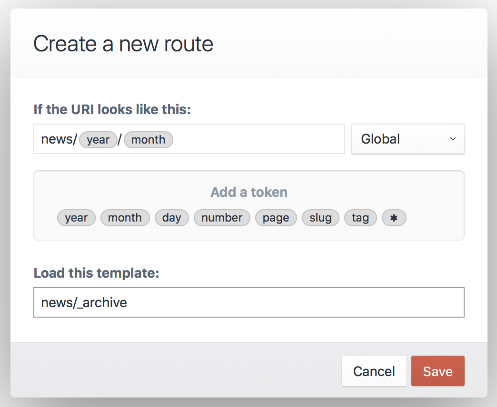

# ルーティング

ルーティングは、Craft がサイトのリクエストをスマートに処理するのに役立ちます。Craft にリクエストが届くと、リクエストの送り先を決定するためにチェックします。

以下に詳述されたチェック項目は、このプロセスの仕組みを説明しています。この情報は、テンプレートの読み込み、プラグインのアクション URL、動的なルート、および、予期しない 404 エラーのトラブルシューティングに役立ちます。

Craft はリクエストを次のように処理します。

0. **このリクエストを Craft が最初に処理するべきか？**

   サーバーに到達する*すべての*リクエストに Craft が実際に関係しているわけではなく、`index.php` ファイルへのリクエストだけであると念頭におくことが重要です。

   [Craft に付属する](https://github.com/craftcms/craft/blob/master/web/.htaccess) `.htaccess` ファイルは、ウェブサーバーのディレクトリやファイルとマッチしないすべてのリクエストを内部で `index.php` にリダイレクトします。しかし、（画像、CSS、または、JavaScript のような）*実際に*存在するファイルをブラウザが直接指し示す場合、ウェブサーバーは Craft をロードせずに直接そのファイルを配信します。

1. **それはアクションリクエストか？**

   アクションリクエストは、 `actions/`（または、コンフィグ設定の <config:actionTrigger> にセットされたもの）ではじまる URL か、POST リクエストやクエリ文字列に `action` パラメータのいずれかを持っています。

   Craft は、アクションを実行するコントローラーアクションに、アクションリクエストをルーティングします。Craft にはコアアクションのためのシステムコントローラーアクションがありますが、プラグインが同様に独自のカスタムアクションを定義したコントローラーを持っている場合があります。

   リクエストが、コントローラーの呼び出し後に必ずしも終了するとは限りません。コントローラーがそれをキープし続けることを許可するかもしれません。

2. **それはエレメントリクエストか？**

   URL がエレメントの URI にマッチする場合、Craft はエレメントにそのリクエストのルーティング方法を決定させます。例えば、ある[エントリの](sections-and-entries.md) URI がリクエストされた場合、エントリはそのセクションの設定で指定されたテンプレートにリクエストをルーティングし、`entry` 変数が事前定義され、リクエストされたエントリをセットします。

    ::: tip
    モジュールとプラグインは、[EVENT_SET_ROUTE](api:craft\base\Element::EVENT_SET_ROUTE) イベントを使用してエレメントルートを上書きできます。
    :::

3. **URI がルート、または、URI ルールにマッチするか？**

   URI がいずれかの [動的ルート](#dynamic-routes)、または、[URI ルール](#advanced-routing-with-url-rules)にマッチする場合、それによって指定されたテンプレートやコントローラーアクションがロードされます。

4. **URI がテンプレートとマッチするか？**

   Craft はその URI が有効な[テンプレートパス](dev/README.md#template-paths)かどうかをチェックします。そうであれば、Craft はマッチしたテンプレートを返します。

    ::: tip
    いずれかの URI セグメントがアンダースコア（例：`blog/_archive/index`）ではじまる場合、Craft はこのステップをスキップします。
    :::

5. **404**

   上記のチェックがいずれも成功しなかった場合、Craft は [NotFoundHttpException](api:yii\web\NotFoundHttpException) を返します。[Dev Mode](config:devMode) が有効な場合、例外についてのエラーレポートが表示されます。そうでなければ、404 エラーが返されます。

    ::: tip
    `404.twig` テンプレートを `templates/` ディレクトリのルートに配置することで、サイトの404ページをカスタマイズできます。`http://my-project.test/404` にアクセスすることで、[Dev Mode](config:devMode) が有効になっている場合でも、このページをテストできます。
    :::

## 動的なルート

テンプレートを読み込むための URL が必要なものの、URI とテンプレートパスをマッチさせたくない場合があります。

年を URL のセグメントの1つ（例：`blog/archive/2018`）にする年別アーカイブページが、よい例です。毎年新しいテンプレートを作成するのは、賢明とは言えません。代わりに、新しい**ルート**を設定しましょう。



### ルートの作成

新しいルートを作成するには、「設定 > ルート」に移動し、「新規ルート」ボタンをクリックします。ルートの設定を定義できるモーダルウィンドウが表示されます。

モーダルの設定は、次の通りです。

* URI がどのように見えるか？
* どのテンプレートを読み込むか？

最初の設定には、特定の文字列ではなく、マッチ可能な範囲を意味する「トークン」を含めることができます。（例えば、`year` トークンは4桁の連続する数字を表します。）トークンをクリックすると、Craft は URI 設定欄のカーソル位置にそれを挿入します。

`blog/archive/2018` のような URI とマッチさせたい場合、URI フィールドに `blog/archive/` と入力し、`year` トークンをクリックします。

::: tip
ルート URI はスラッシュ（`/`）ではじめるべき**ではありません**。
:::

URI パターンを定義しテンプレートパスを入力したら、「保存」ボタンをクリックします。モーダルが閉じ、ページに新しいルートが表示されるでしょう。

ブラウザが `http://my-project.test/blog/archive/2018` を指し示すとき、新しいルートがマッチし、Craft は指定されたテンプレートを読み込みます。

`year` トークンの値は、変数 `year` としてテンプレートで利用可能です。

### 利用可能なトークン

URI 設定では、次のトークンが利用可能です。

* `*` – スラッシュ（/）を除く、任意の文字列
* `day` – 月の特定の日（1-31 または 01-31）
* `month` – 月の数値表現（1-12 または 01-12）
* `number` – 任意の正の整数
* `page` – 任意の正の整数
* `uid` – A v4 compatible UUID (universally unique ID)
* `slug` – スラッシュ（/）を除く、任意の文字列
* `tag` – スラッシュ（/）を除く、任意の文字列
* `year` – 4桁の連続する数字

## URL ルールによる高度なルーティング

ルートに加えて、`config/routes.php` に [URL ルール](https://www.yiiframework.com/doc/guide/2.0/en/runtime-routing#url-rules)を定義できます。

```php
return [
    // Route blog/archive/YYYY to a controller action
    'blog/archive/<year:\d{4}>' => 'controller/action/path',

    // Route blog/archive/YYYY to a template
    'blog/archive/<year:\d{4}>' => ['template' => 'blog/_archive'],
];
```

マルチサイトを持つ Craft のインストールでは、サブ配列に配置してサイト固有の URL ルールを作成し、そのキーをサイトのハンドルに設定できます。

```php
return [
    'siteHandle' => [
        'blog/archive/<year:\d{4}>' => 'controller/action/path',
    ],
];
```

Craft は[名前付けされたパラメータ](https://www.yiiframework.com/doc/guide/2.0/en/runtime-routing#named-parameters)の正規表現内で使用できる、特別なトークンもサポートしています。

- `{handle}` – フィールドハンドル、ボリュームハンドルなどとマッチします。
- `{slug}` – エントリスラグ、カテゴリスラグなどとマッチします。
- `{uid}` – matches a v4 UUID.

```php
return [
    'blog/<entrySlug:{slug}>' => 'controller/action/path',
];
```

### テンプレート内の名前付けされたパラメータへのアクセス

テンプレート（`['template' => '<TemplatePath>']`）にルーティングする URL ルールは、マッッチする名前付けされたパラメータをテンプレートの変数として渡します。

例えば、次の URL ルールの場合

```php
'blog/archive/<year:\d{4}>' => ['template' => 'blog/_archive'],
```

`http://my-project.test/blog/archive/2018` にアクセスすると、`blog/_archive.twig` テンプレートは、変数 `year` に `2018` をセットした状態で読み込まれます。

```twig
<h1>Blog Entries from {{ year }}</h1>
```

