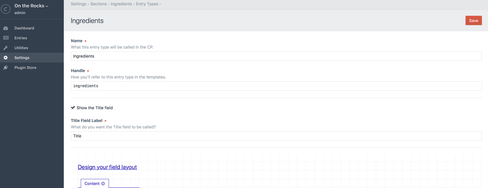

# セクションとエントリ

## エントリ

エントリはウェブページに表示させたいコンテンツを保持します。すべてのエントリは投稿者、投稿日、（もし望むなら）有効期限日、（有効・無効の）ステータスと、もちろん、コンテンツを持っています。

エントリの現在の公開バージョンと並行して、エントリのドラフトを作成することもできます。

一般的に、それぞれのエントリはサイトの独自のプライマリー URL に関わり合いを持ちますが、Craft ではテンプレートが必要とするならば、どこからでもエントリを取得できます。

## セクション

エントリを作成する前に、それらを含めるためのセクションを作成しなければなりません。それぞれのセクションには、次のことを定義できます。

* セクション内のエントリが URL を持つかどうか
* エントリの URL をどのように表示するか
* エントリの URL がリクエストされたとき、どのテンプレートを読み込むか
* セクション内でどのような入力タイプが利用可能か、それらの入力タイプはどのようなフィールドを持つ必要があるか

Craft のマルチサイト機能を利用しているなら、次のこともセクションで定義できます。

* セクション内のどのサイトのエントリをターゲットにするか
* 新しいエントリ向けに、どのサイトをデフォルトで有効にするか

新しいセクションを作るには、「設定 > セクション」に移動し、「新規セクション」ボタンをクリックします。

### セクションタイプ

すべてのセクションが同じように作成されるわけではありません。Craft には3つの異なるタイプのセクションがあります。

#### シングル

シングルは、次のようなユニークなコンテンツを持つ1回限りのページで利用します。

* ホームページ
* 会社概要ページ
* お問い合わせページ

他のセクションタイプと異なり、シングルは1つのエントリしか関連付けられておらず、編集可能な投稿者、スラグ、投稿日、または有効期限日がありません。

#### チャンネル

チャンネルは、次のような類似するコンテンツのストリームに利用します。

* ブログ
* ニュースのセクション
* レシピ

#### ストラクチャー

ストラクチャーは、複数の類似するエントリを蓄積し、かつ、特定の順序で並び替える必要がある場合に適しています。それらは階層構造を持つこともできます。例として次のものを含みます。

* ドキュメント
* サービスの順序が重要なサービスのセクション
* 会社の組織図

### エントリー URI 形式

チャンネルとストラクチャーセクションでは、「エントリー URI 形式」設定を入力することでシステム内のエントリに URL を割り当てるかどうかを選択できます。

エントリー URI 形式は、セクション内のエントリが保存されるごとにレンダリングされる小さな Twig テンプレートです。 レンダリング結果は、システムのエントリ URI として保存されます。

保存されているエントリは、`object` と名付けられた変数としてテンプレートで利用できます。さらに、各エントリのプロパティやカスタムフィールドの値は、それぞれの変数として利用できます。そのため、次のようなことが可能です。

```twig
{{ author.username }}/{{ slug }}
```

ショートカット構文は、エントリのプロパティを参照する出力タグでも利用できます。

```twig
{author.username}/{slug}
```

ストラクチャーセクションでは、子エントリのためのネストされたパスが必要かもしれません。

```twig
{parent.uri}/{slug}
```

上記のエントリー URI 形式では、トップレベルエントリの URI は `templating` で終わるかもしれないのに対して、ネストされているエントリの URI は `templating/tags` で終わるかもしれません。

ストラクチャーセクションでは、ネストされたパスの前にセグメントを含めることもできます。

```twig
{parent.uri ?? 'docs'}/{slug}
```

上記のテンプレートは次の構文で表すこともできます。

```twig
docs{parent.uri}/{slug}
```

上記のエントリー URI 形式では、トップレベルエントリの URI は `docs/templating` で終わるかもしれないのに対して、ネストされているエントリの URI は `docs/templating/tags` で終わるかもしれません。

## 入力タイプ

チャンネルとストラクチャーセクションの両方では、入力タイプを用いて複数のタイプのエントリを定義できます。

「設定 > セクション」のセクション名の横にある「入力タイプを変更してください。」リンクをクリックして、セクションの入力タイプを管理できます。セクションの入力タイプのインデックスに移動します。いずれかの入力タイプの名前をクリックすると、その設定ページへ移動します。



入力タイプの設定は、次の通りです。

* **名前** – 入力タイプの名前
* **ハンドル** – 入力タイプのテンプレートに対応するハンドル
* **タイトルのフィールドの見る** – この入力タイプのエントリでタイトルフィールドを表示するかどうか
* **タイトルフィールドラベル** – 「タイトル」フィールドのラベルをどうするか

### 動的なエントリタイトル

投稿者に入力を求めるのではなく、自動生成されたタイトルにする場合、「タイトルのフィールドを見る。」チェックボックスをオフにします。その際、新たに「タイトル形式」欄が表示され、自動生成されるタイトルの見え方を定義できます。

タイトル形式は本格的な Twig テンプレートで、エントリが保存されるたびに解析されます。

エントリは `object` という名称の変数としてこのテンプレートに渡されます。エントリの [プロパティ](api:craft\elements\Entry#public-properties) は、次の2つの方法で参照できます。

* `{{ object.property }}` _（標準の Twig 構文）_
* `{property}` _（ショートカット構文）_

_ショートカット構文には、中括弧が1つしかないことに注意してください_。

Craft がタイトル形式の中でショートカット構文を見つけた場合、Twig の解析にあたりテンプレートへ渡す前に `{` を `{{object.` 、`}` を `}}` に置換します。

いずれの構文でも Twig フィルタを使えます。

```twig
{{ object.postDate|date('M j, Y') }}
{postDate|date('M j, Y')}
```

Craft の[グローバル変数](dev/global-variables.md)は、これらのテンプレートでも利用できます。

```twig
{{ now|date('Y-m-d') }}
{{ currentUser.username }}
```

条件文もまた、かっこうの標的です。ショートカット構文がないため、エントリプロパティの1つで条件分岐する場合、変数 `object` で参照する必要があります。

```twig
{postDate|date('M j, Y')}{{ now|date('M j, Y') }}
```

## エントリの編集

少なくとも1つのセクションがあれば、CP のメインナビゲーションに「エントリ」タブが表示されます。クリックすると、エントリのインデックスに移動します。そこから、編集したいエントリに移動したり、新しいエントリを作成できます。

エントリの編集ページでは、次のアクションを実行できます。

* （選択候補が2つ以上ある場合）入力タイプの選択
* エントリのタイトルの編集
* エントリのスラグの編集
* エントリのカスタムフィールドコンテンツの編集
* エントリーの投稿者の選択（Pro エディションのみ）
* （ストラクチャーセクションに含まれる場合）エントリの親の選択
* エントリの投稿日の選択
* エントリの有効期限の選択（オプション）
* エントリを有効にするかどうかの選択
* エントリの変更を保存
* エントリの新しいドラフトの保存
* ドラフトの公開
* エントリの過去のバージョンの閲覧

投稿日を空のままにした場合、Craft はエントリが有効な状態で保存された最初のタイミングで自動的にセットします。

