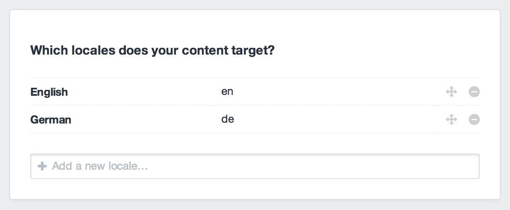
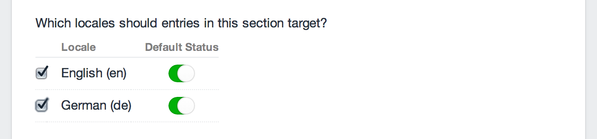
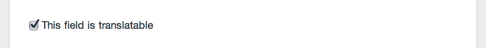
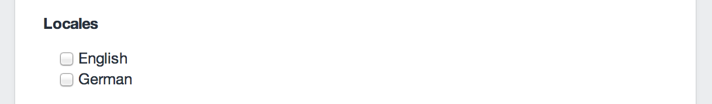

# Setting Up a Localized Site

This guide will walk you through all of the steps that are typically involved in setting up a localized site, using Craft’s deep localization features.

::: tip
This guide requires Craft Pro. You can try Craft Pro before buying it by [running Craft from any non-public domain](https://craftcms.com/support/try-craft-client-pro).
:::

## Step 1: Define your locales

The first step to running a localized site is to establish which locales your site will be targeting. You do that from Settings → Locales.



When you add a new locale, you may notice that a little progress bar shows up in the Control Panel’s header. That’s because Craft has to go through and re-save all of your site’s existing content, accounting for the new locale. Don’t delete any locales while that is running – it may result in unintended data loss.

## Step 2: Update your sections

Each [section](sections-and-entries.md) can be enabled/disabled for each locale. Sections are always disabled for new locales by default, so after you’ve added a new locale, you will need to go into your sections’ settings to enable it.

You will also be able to choose whether entries in the section should be enabled by default for each locale.



If your section is set to give its entries their own URLs, you will also need to give your new locale its own Entry URL Format. Generally this is just a matter of copy/pasting the original locale’s Entry URL Format into the new one, but if you want them to be different for some reason (e.g. it needs to be translated), this is your chance.

::: warning
Do not give your localized Entry URL Formats a locale prefix (e.g. `de/`). That’s a job for your Site URL.
:::

## Step 3: Define your translatable fields

By default, your custom fields will **not** store values on a per-locale basis. When you save an entry in English, all of its custom field values will get copied over to the German version of the entry. (That this is not the case of the Title and Slug fields – those values are always stored on a per-locale basis.)

If you have any fields whose values you’d like to store on a per-locale basis, you need to go into their settings and check their “This field is translatable” checkboxes.



::: tip
When you mark a relational field (Entries, Assets, Users, Categories, or Tags) as translatable, the actual elements you select will be chosen on a per-locale basis. So a translatable Entries field, for example, could have two sets of related entries – one for English, and one for German.
:::

::: tip
When you mark a Matrix field as translatable, all of the blocks will be defined on a per-locale basis. When a Matrix field _isn’t_ translatable, you can set its individual block type fields as translatable instead, so the _contents_ of the blocks can be translatable.
:::

## Step 4: Define your site URLs

You can set Craft’s Site URL setting on a per-locale basis via the [siteUrl](config-settings.md#siteUrl) config setting. So open up `craft/config/general.php` and add that setting to the array:

```php
return array(
    // ...
    'siteUrl' => array(
        'en' => 'http://example.com/en/',
        'de' => 'http://example.com/de/',
    ),
);
```

If you have a [multi-environment config](multi-environment-configs.md) you can define a separate `siteUrl` setting for each environment:

```php
return array(
    '*' => array(
        // ...
    ),
    'example.dev' => array(
        // ...
        'siteUrl' => array(
            'en' => 'http://example.dev/en/',
            'de' => 'http://example.dev/de/',
        ),
    ),
    'example.com' => array(
        // ...
        'siteUrl' => array(
            'en' => 'http://example.com/en/',
            'de' => 'http://example.com/de/',
        ),
    ),
);
```

You can choose whatever URL format you want here. If you’d prefer that each locale gets its own domain name, that’s fine, as long as they both point to the same server.

## Step 5: Set up the files

Each of your localized Site URLs should point to folders on your server with their own index.php and .htaccess files (copied from the `public/` folder in Craft’s zip).

Here are some examples of what that might look like. Note that your actual webroot will not necessarily be called `public_html` – contact your web host if you are unsure what it is.

* **Example 1**: `en/` and `de/` subfolders on the same domain:

        craft/
        public_html/
            en/                 --> example.com/en/
                .htaccess
                index.php
            de/                 --> example.com/de/
                .htaccess
                index.php

* **Example 2**: English at the top level; German from a `de/` subfolder:

        craft/
        public_html/            --> example.com/
            .htaccess
            index.php
            de/                 --> example.com/de/
                .htaccess
                index.php

* **Example 3**: English and German each get their own domain:

        craft/
        public_html/            --> example.com/
            .htaccess
            index.php
        public_de/              --> example.de/
            .htaccess
            index.php

Finally, you will need to open up each of those `index.php` files and make the following changes to them:

1. Make sure that the `$craftPath` variable is set correctly. (By default it’s set to `'../craft'`, which assumes that `index.php` is only one level away from the `craft/` folder. This may not be the case anymore.)
2. Set the [`CRAFT_LOCALE`](php-constants.md#craft-locale) PHP constant, which tells Craft which locale’s content it should serve from this location.

Here’s what your file might look like:

```php
// Path to your craft/ folder
$craftPath = '../../craft';

// Tell Craft to serve the German content
define('CRAFT_LOCALE', 'de');

// Do not edit below this line
// ...
```

## Step 6: Check your asset source settings

If you have any local asset sources, you will need to make sure those assets are available from each of your locales’ sites.

* The **File System Path** settings should be absolute (`/full/path/to/example.com/images/`).
* The **URL** settings should be absolute (`http://example.com/images/`) or protocol-relative (`//example.com/images/`). If each of your locales’ sites are going to exist on the same domain (and subdomain), root-relative will work, too (`/images/`).

::: tip
If these settings are going to need to change between environments, you can use [environment variables](multi-environment-configs.md#environment-specific-variables) to define the parts that will change on a per-environment basis.
:::

## Step 7: Update your templates

If you have any templates that you only want to serve from a specific locale, you can create a new subfolder in your `craft/templates/` folder, named after your locale’s handle, and place locale override templates in there.

For example, if you wanted to give your German site its own homepage template, you might set your `craft/templates/` folder up like this:

    templates/
        index.html      --> default homepage template
        de/
            index.html  --> German homepage template

Each template is aware of the current locale via the `craft.locale` variable, which can be used to toggle specific parts of your templates, depending on the locale:

```twig

    <p>Congrats on the big win!</p>

```

You will also probably want to take advantage of Craft’s [static translation](https://craftcms.com/support/static-translations) support, for various strings throughout your templates.

```twig
{{ "Welcome!"|t }}
```

## Step 8: Give your authors access to the locales

As soon as you add a second locale to your site, Craft will start checking for locale permissions whenever users try to edit content. By default, no users or groups have access to any locales, so you need to go assign them.

When you edit a user group or a user account, you will find a new “Locales” permissions section, which lists all of your site’s locales. Assign them where appropriate.


