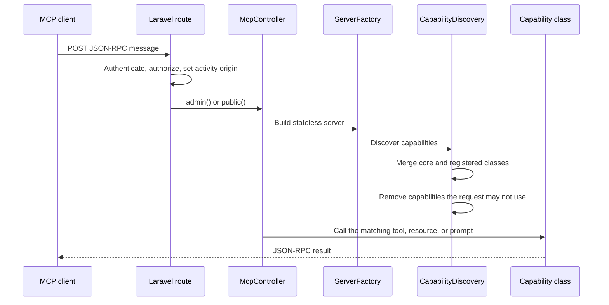

# MCP server

Craft exposes its content and configuration to AI agents and other clients over the [Model Context Protocol](https://modelcontextprotocol.io). The server is built on the official `mcp/sdk` PHP package. Over HTTP, it speaks the stateless transport for protocol version `2026-07-28`. Over stdio, it speaks the session-based protocol that local MCP clients use.

Craft runs three MCP servers:

| Server        | URL                                     | Who can use it                                                     |
| ------------- | --------------------------------------- | ------------------------------------------------------------------ |
| Authenticated | `{cpTrigger}/mcp`, such as `/admin/mcp` | Users with the **Access the control panel** and **Use Craft MCP** permissions, through OAuth |
| Public        | Configurable, `/mcp` by default         | Anyone, but only for capabilities and content an administrator has approved |
| Stdio         | `php craft mcp:serve --user=…`          | Whoever can run Craft's CLI, acting as the named user with the **Use Craft MCP** permission |

The authenticated and stdio servers are always available. The public server is disabled until an administrator enables it under **Settings → MCP**.

## How a request is handled

The HTTP servers are stateless. Every request builds a new server instance, discovers the capabilities the current request may use, and then handles the JSON-RPC message.



Discovery combines two sources:

1. Core capabilities, scanned from `src/Mcp/Capabilities`.
2. Classes registered with `CapabilityRegistry`. Plugin classes are never scanned from disk.

Discovery then filters the result for the current request. A capability the user may not use is absent from `tools/list`, `resources/list`, and `prompts/list`, and calling it directly returns the same `-32602` error as an unknown capability.

Every MCP request and stdio message runs inside an `MCP` activity origin. Activity events recorded during the request, including events recorded by queued jobs it dispatches, are labeled with that origin. See [Activity logging](activity-logging.md).

### Capabilities

An MCP capability is a public method on a class, marked with one of the SDK's attributes:

| Attribute              | MCP concept        | Identity       |
| ---------------------- | ------------------ | -------------- |
| `#[McpTool]`           | Tool               | `name`         |
| `#[McpResource]`       | Resource           | `uri`          |
| `#[McpResourceTemplate]` | Resource template | `uriTemplate`  |
| `#[McpPrompt]`         | Prompt             | `name`         |

Identities must be unique across core and every plugin. Craft throws a `LogicException` when two capabilities share an identity, so a plugin cannot replace a core capability.

Core tools use dotted, resource-oriented names, such as `elements.list`, `sections.create`, and `drafts.apply`. Core resources use the `craft://` scheme, such as `craft://sections` and `craft://sections/{section}`.

### Element tools

One set of tools works with every element type. Each takes a `type`, such as `entries`, `assets`, `users`, or `addresses`:

| Tool                    | Purpose                                                                     |
| ----------------------- | --------------------------------------------------------------------------- |
| `elements.schema`       | Describes what the other tools accept for a type                            |
| `elements.list`         | Queries elements with element query criteria                                |
| `elements.get`          | Gets an element by ID or UID                                                |
| `elements.field-schema` | Gets the custom-field JSON Schema for an existing or new element            |
| `elements.create`       | Creates an element                                                          |
| `elements.update`       | Updates an element                                                          |
| `elements.delete`       | Soft-deletes or hard-deletes an element                                     |
| `elements.restore`      | Restores a soft-deleted element                                             |
| `elements.validate`     | Validates an element, optionally with proposed changes, without saving it   |
| `elements.duplicate`    | Duplicates an element, for types that support it                            |

The tools' own input schemas are kept small, because clients load every tool definition into the agent's context. Each type's full schemas live in its description instead, which `elements.schema` returns. The same description is available as the `craft://element-types/{type}` resource, and `craft://element-types` lists the supported types. A description includes:

- `criteria`, the element query criteria `elements.list` accepts;
- `createAttributes` and `updateAttributes`, the built-in attributes `elements.create`, `elements.update`, and `elements.validate` accept;
- `fieldSchemaContext`, the `context` that selects a new element's field layout in `elements.field-schema`, such as `{"sectionId": 1}` for entries;
- `duplicateModes` and `notes`.

Craft validates `criteria`, `attributes`, and `context` against these schemas and returns a tool error naming each invalid property. Attributes a schema doesn't declare are rejected.

Operations that only make sense for one type keep their own tools, such as `assets.create`, which takes the file to upload, and `users.field-layout.update`.

## Authentication

The authenticated server uses OAuth 2.1 through Laravel Passport. Craft publishes the discovery documents that MCP clients expect, so a client only needs the endpoint URL:

- **Protected resource metadata** at `/.well-known/oauth-protected-resource/{path}`.
- **Authorization server metadata** at `/.well-known/oauth-authorization-server/{path}`.
- **Dynamic client registration** at `{cpTrigger}/mcp/oauth/register`.
- **Authorization** at `{cpTrigger}/mcp/oauth/authorize`, using the authorization code grant with PKCE (`S256`).

Tokens must carry the `mcp:use` scope and are checked by the `craft-mcp` auth guard. An unauthenticated request receives a `401` response with a `WWW-Authenticate` header pointing at the protected resource metadata.

Craft adds its scope and guard alongside the host application's Passport configuration. It does not replace existing scopes, the default scope, or the authorization guard.

After authentication, the user also needs the `accessCp` and `useCraftMcp` permissions. Individual capabilities can require more.

### Configuration

Configure the authenticated server with the `mcp` general config setting:

```php
use CraftCms\Cms\Config\GeneralConfig;

return GeneralConfig::create()
    ->mcp([
        'endpoint' => 'mcp',
        'middleware' => [MyMcpMiddleware::class],
        'instructions' => 'Preserve legal notices when editing content.',
    ]);
```

| Setting       | Description                                                                                       |
| ------------- | ------------------------------------------------------------------------------------------------- |
| `endpoint`    | Path below the control panel trigger. Defaults to `mcp`.                                          |
| `middleware`  | Extra route middleware appended to the authenticated server and its upload routes.                |
| `instructions` | Additional server instructions for authenticated HTTP and stdio clients. Defaults to an empty string. |

To try capabilities locally without completing an OAuth flow, [run the server over stdio](#running-the-server-over-stdio) instead.

The public server is configured in the control panel. Its settings are stored in project config under `mcp`.

### Server instructions

The authenticated HTTP and stdio servers provide instructions explaining type references, identifiers, sites, field selection, pagination, working sequences, and destructive operations. HTTP clients receive them through `server/discover`; stdio clients receive them during `initialize`.

The `mcp.instructions` general config setting appends site guidance to the core instructions. It accepts a string through the array or JSON configuration above, or through `McpConfig::create()->instructions('…')`.

Plugins can append instructions with a Laravel event listener registered in their service provider:

```php
use CraftCms\Cms\Mcp\Events\CollectingAdminInstructions;
use Illuminate\Support\Facades\Event;

public function boot(): void
{
    Event::listen(CollectingAdminInstructions::class, function (CollectingAdminInstructions $event): void {
        $event->instructions[] = 'Use reviews.list before changing a product.';
    });
}
```

Craft combines core instructions, site instructions, and plugin contributions in that order, separated by blank lines. Empty contributions are omitted. The event exposes only plugin contributions, so listeners cannot remove core or site instructions. Instructions guide clients; the server still enforces permissions independently. Avoid secrets in instructions because every user who can connect to the admin server receives them.

The event runs when the server is built, once per HTTP request or once at the start of a stdio session. Restart stdio clients after changing instructions. The public server keeps separate instructions and receives neither `mcp.instructions` nor these plugin contributions.

## Running the server over stdio

MCP clients that launch servers as local processes, such as desktop agents and coding assistants, can run Craft's MCP server through the CLI:

```json
{
  "mcpServers": {
    "craft": {
      "command": "php",
      "args": ["craft", "mcp:serve", "--user=editor@example.com"],
      "cwd": "/path/to/project"
    }
  }
}
```

The command is also available as `php artisan craft:mcp:serve`. `--user` accepts a user ID, username, or email address. The user must be active and have the **Use Craft MCP** permission. The **Access the control panel** permission is not required.

### Authentication

The stdio server does not use OAuth. Following the MCP specification, a stdio server takes its credentials from its environment. Anyone who can run Craft's CLI can already read its environment, database credentials, and application key, so a password or token would not add a security boundary.

The `--user` option identifies whom the server acts as, rather than authenticating them. That identity matters because it drives the same checks as the authenticated HTTP server:

- capability authorization attributes, such as `#[RequiresAdmin]` and `#[RequiresPermission]`;
- per-record gate checks inside capabilities;
- authorship of new content, and the actor on activity events.

Stdio activity events are labeled with the `MCP` origin, as HTTP ones are.

### Differences from the HTTP server

- Capabilities are discovered once, when the session starts. Restart the client's server after changing the user's permissions or admin status.
- Each message is handled in a fresh request scope, as each job in a queue worker is. Singleton services, such as those for fields, entry types, volumes, and project config, keep what they loaded for the life of the process. Restart the client's server after changing the content model elsewhere, such as in the control panel.
- Capabilities marked with `#[RequiresHttp]`, such as `assets.upload.prepare`, are not offered. Use file references with `assets.create` and `assets.replace` instead.
- The server writes only protocol messages to stdout. PHP errors go to stderr. Keep log channels that write to stdout disabled when running it.

## The public server

The public server serves unauthenticated clients, so each piece of access is opt-in:

1. An administrator enables the public server and chooses its route. Craft refuses a route that would conflict with an existing one.
2. A capability must be marked with `#[PublicMcp]`.
3. An administrator must approve that capability by identity under **Public Capabilities**.
4. Content-reading capabilities read only from the approved sites, sections, nested entry fields, volumes, user groups, and element types. Drafts, revisions, and inactive elements are excluded unless allowed.

The public server is rate-limited to 60 requests per minute per IP address.

Core's public tools are `craft-context-get`, which describes the approved content, and `craft-query`, which runs element queries against it. `craft-query` accepts a restricted set of criteria and constrains every query, relation, and eager-loading path to public content.

> [!IMPORTANT]
> `#[PublicMcp]` moves a capability to the public server. It is not also available on the authenticated server. Expose a separate method if both audiences need the same behavior.

## Adding capabilities from a plugin

Write a class with attributed methods, then register it from the plugin's service provider:

```php
use Acme\Reviews\Mcp\ReviewCapabilities;
use CraftCms\Cms\Mcp\CapabilityRegistry;

public function boot(CapabilityRegistry $capabilities): void
{
    $capabilities->register(ReviewCapabilities::class);
}
```

Craft resolves the class from the Laravel container for each call, so constructor injection works. Capability classes should be stateless; `readonly` classes are a good fit.

### Tools

This tool lists reviews for an entry:

```php
<?php

declare(strict_types=1);

namespace Acme\Reviews\Mcp;

use Acme\Reviews\Reviews;
use CraftCms\Cms\Entry\Elements\Entry;
use CraftCms\Cms\Mcp\Attributes\RequiresPermission;
use CraftCms\Cms\Mcp\McpActor;
use Illuminate\Support\Facades\Gate;
use Mcp\Capability\Attribute\McpTool;
use Mcp\Capability\Attribute\Schema;
use Mcp\Exception\ToolCallException;
use Mcp\Schema\ToolAnnotations;

readonly class ReviewCapabilities
{
    public function __construct(
        private McpActor $actor,
        private Reviews $reviews,
    ) {}

    /**
     * @param  int  $entryId  ID of the reviewed entry.
     * @param  int  $limit  Maximum number of reviews to return.
     * @return array{count: int, reviews: list<array{id: int, rating: int, body: string}>}
     */
    #[McpTool(
        name: 'reviews.list',
        description: 'Lists reviews for an entry, newest first.',
        annotations: new ToolAnnotations(readOnlyHint: true),
    )]
    #[RequiresPermission('accessReviews')]
    public function list(
        int $entryId,
        #[Schema(minimum: 1, maximum: 100)]
        int $limit = 25,
    ): array {
        $entry = Entry::find()->id($entryId)->status(null)->one();

        if (! $entry || ! Gate::forUser($this->actor->user())->allows('view', $entry)) {
            throw new ToolCallException('Entry not found.');
        }

        $reviews = $this->reviews->forEntry($entry, $limit);

        return [
            'count' => $reviews->count(),
            'reviews' => $reviews->all(),
        ];
    }
}
```

The SDK builds the tool's schemas from the method:

- The **input schema** comes from parameter types, defaults, and `@param` descriptions. Use `#[Schema]` to add constraints such as `minimum`, `format`, `items`, or a full `definition`. Backed enums become `enum` schemas.
- The **output schema** comes from the `@return` type. Returning an array produces structured content.

To read raw request details, such as which arguments the client actually sent, add a `Mcp\Server\RequestContext $context` parameter. It is injected and does not appear in the input schema.

Throw `Mcp\Exception\ToolCallException` for errors the client should see. The message is returned as a tool error result. Use `Mcp\Exception\ResourceReadException` in resource handlers.

Follow core's conventions where they apply:

- Name tools `{plugin-or-resource}.{action}`, and choose names that will not collide with core.
- Accept exactly one of `id`, `uid`, or `handle` when looking up a record, and reject ambiguous input.
- Return list results as `['count' => ..., '{items}' => [...]]`.
- Set `readOnlyHint` on reads and `destructiveHint` on deletes and replacements.
- Report missing and unauthorized records with the same message, so a tool does not reveal records the user cannot view.

### Resources, resource templates, and prompts

The same registration covers every capability type:

```php
use Mcp\Capability\Attribute\McpPrompt;
use Mcp\Capability\Attribute\McpResource;
use Mcp\Capability\Attribute\McpResourceTemplate;
use Mcp\Schema\Content\PromptMessage;
use Mcp\Schema\Content\TextContent;
use Mcp\Schema\Enum\Role;

/** @return array{count: int, reviews: list<array<string, mixed>>} */
#[McpResource(
    uri: 'acme-reviews://recent',
    name: 'acme-reviews-recent',
    title: 'Recent reviews',
    mimeType: 'application/json',
)]
public function recent(): array
{
    // ...
}

/** @return array{review: array<string, mixed>} */
#[McpResourceTemplate(
    uriTemplate: 'acme-reviews://reviews/{review}',
    name: 'acme-reviews-get',
    title: 'Review',
    mimeType: 'application/json',
)]
public function review(string $review): array
{
    // ...
}

/** @return list<PromptMessage> */
#[McpPrompt(name: 'acme-summarize-reviews', title: 'Summarize reviews')]
public function summarize(int $entryId): array
{
    return [new PromptMessage(Role::User, new TextContent("Summarize the reviews for entry $entryId using reviews.list."))];
}
```

Use a plugin-specific URI scheme. `craft://` is reserved for core.

### Authorization

Every capability on the authenticated server already requires `accessCp` and `useCraftMcp`. Add these attributes to require more:

| Attribute                         | Requirement                                                                         |
| --------------------------------- | ----------------------------------------------------------------------------------- |
| `#[RequiresPermission('handle')]` | The user has the permission. Repeat the attribute to require several permissions.   |
| `#[RequiresAdmin]`                | The user is an administrator.                                                       |
| `#[RequiresAdminChanges]`         | The user is an administrator and `allowAdminChanges` is enabled. Use it for tools that write project config. |
| `#[RequiresHttp]`                 | The request arrived over HTTP. Use it for capabilities that return URLs authenticated by the MCP access token, which a stdio client does not have. |

These attributes decide whether a capability is listed at all. They do not check access to individual records. Inside the method, authorize each element with Laravel's gate, as the `reviews.list` example does. `McpActor::user()` returns the authenticated user and throws a `ToolCallException` when there is none.

Register plugin permissions with `UserPermissions` as usual. The permission handle in `#[RequiresPermission]` is the same handle `$user->can()` checks.

### Public capabilities

Mark a capability with `#[PublicMcp]` to offer it on the public server:

```php
use CraftCms\Cms\Mcp\Attributes\PublicMcp;

/** @return array{averageRating: float|null} */
#[McpTool(
    name: 'reviews.public-rating',
    title: 'Get an entry’s public rating',
    description: 'Returns the average rating for a public entry.',
    annotations: new ToolAnnotations(readOnlyHint: true),
)]
#[PublicMcp]
public function publicRating(int $entryId): array
{
    // ...
}
```

The capability then appears under **Settings → MCP → Public Capabilities**, labeled with its `title`, or with its `name` when it has no title. It stays unavailable until an administrator approves it.

A public capability runs without a user, so `McpActor::user()` throws. It must enforce the public content scopes itself. Inject `CraftCms\Cms\Mcp\Public\Access` to read them:

| Method                         | Returns                                                                      |
| ------------------------------ | ---------------------------------------------------------------------------- |
| `ids($scope)`, `models($scope)` | Approved `sites`, `sections`, `nestedEntryFields`, `volumes`, or `userGroups` |
| `elementTypes()`               | Approved element type names, other than entries and assets                   |
| `elementFlags()`               | Whether drafts, revisions, and inactive elements are allowed                 |

Prefer composing `CraftCms\Cms\Mcp\Public\ElementQuery`, which backs `craft-query`, over writing new public queries. It already applies every scope.

## Extending core capabilities

### Adding an element type to the element tools

To make a plugin's element type available through the `elements.*` tools, extend `BaseElementAdapter` and register the adapter with `ElementAdapterRegistry`:

```php
<?php

declare(strict_types=1);

namespace Acme\Shop\Mcp;

use Acme\Shop\Elements\Product;
use CraftCms\Cms\Mcp\Elements\BaseElementAdapter;

class ProductAdapter extends BaseElementAdapter
{
    public static function handle(): string
    {
        return 'products';
    }

    public static function elementType(): string
    {
        return Product::class;
    }

    protected function createAttributesSchema(): array
    {
        return [
            ...$this->updateAttributesSchema(),
            'required' => ['sku'],
        ];
    }

    protected function updateAttributesSchema(): array
    {
        return [
            'type' => 'object',
            'properties' => [
                'title' => ['type' => 'string', 'description' => 'Product name.'],
                'sku' => ['type' => 'string', 'description' => 'Stock keeping unit.'],
                'price' => ['type' => 'number', 'minimum' => 0, 'description' => 'Price in the store currency.'],
            ],
            'additionalProperties' => false,
        ];
    }

    protected function criteriaProperties(): array
    {
        return [
            'sku' => ['type' => ['string', 'array'], 'description' => 'SKU or SKUs.'],
        ];
    }
}
```

```php
use Acme\Shop\Mcp\ProductAdapter;
use CraftCms\Cms\Mcp\Elements\ElementAdapterRegistry;

public function boot(ElementAdapterRegistry $adapters): void
{
    $adapters->register(ProductAdapter::class);
}
```

The handle is the `type` clients pass, and it must be unique. `BaseElementAdapter` supplies the rest:

- lookup by ID or UID, and list queries ordered by ID;
- `view`, `save`, and `delete` checks through Laravel's gate, using the element's own authorization;
- populating declared attributes and custom field values, then saving the element the same way the control panel does;
- restoring, validating, and serializing.

Without `createAttributesSchema()`, `elements.create` reports that the type can't be created. Override other methods for type-specific behavior. For example, `fieldSchemaContextSchema()` and `fieldSchemaElement()` select the field layout of a new element, `duplicateModes()` and `duplicate()` add duplication, and `notes()` adds guidance to the type's description. Implement `ElementAdapter` directly only if the base class doesn't fit.

### Exposing a custom element type publicly

Registered element types appear under **Public Content → Element Types**. When an administrator approves one, `craft-query` can query it by its `refHandle()`, using the common criteria (`id`, `uid`, `site`, `siteId`, `search`, `status`, `limit`, `offset`, and `orderBy`) plus its custom fields. Entries, assets, and users are controlled by sections, volumes, and user groups instead.

### Changing serialized elements

Tools that return elements serialize them with `ElementSerializer`, which dispatches `CraftCms\Cms\Mcp\Events\ElementSerializing` before returning. Listen for it to add, change, or remove data:

```php
use CraftCms\Cms\Mcp\Events\ElementSerializing;
use Illuminate\Support\Facades\Event;

Event::listen(ElementSerializing::class, function (ElementSerializing $event): void {
    if (! $event->element instanceof Product) {
        return;
    }

    if ($event->public) {
        unset($event->data['costPrice']);

        return;
    }

    $event->data['stock'] = $event->element->getStock();
});
```

`$event->public` is `true` when the public server is serializing. Never add data to public output that unauthenticated clients should not see.

### Describing a custom field's input

Tools such as `elements.create` and `elements.field-schema` describe custom fields with JSON Schema. Craft infers a schema for most field types. Implement `ProvidesInputSchema` on a field type to supply its own:

```php
use CraftCms\Cms\Field\Field;
use CraftCms\Cms\Mcp\Contracts\ProvidesInputSchema;

class Rating extends Field implements ProvidesInputSchema
{
    public function getMcpInputSchema(): array
    {
        return ['type' => 'integer', 'minimum' => 1, 'maximum' => 5];
    }
}
```

Return the schema for a non-null value. Craft adds `null` for optional fields, and sets `title` and `description` from the field's name and instructions.

### Adding a content model check

The `content-model.audit` tool runs checks registered with `CheckRegistry`. A check implements `CraftCms\Cms\Mcp\ContentModel\Check`:

```php
<?php

declare(strict_types=1);

namespace Acme\Reviews\Mcp;

use Acme\Reviews\Reviews;
use CraftCms\Cms\Mcp\ContentModel\Check;

readonly class EntriesWithoutReviews implements Check
{
    public function __construct(private Reviews $reviews) {}

    public static function id(): string
    {
        return 'acme-entries-without-reviews';
    }

    public function run(int $limit): array
    {
        $findings = $this->reviews->unreviewedEntries();

        return [
            'count' => $findings->count(),
            'findings' => $findings->take($limit)->values()->all(),
        ];
    }
}
```

Register it from the service provider:

```php
use CraftCms\Cms\Mcp\ContentModel\CheckRegistry;

public function boot(CheckRegistry $checks): void
{
    $checks->register(EntriesWithoutReviews::class);
}
```

`count` is the total number of findings. `findings` holds at most `$limit` of them. The check ID must be unique, and clients can pass it to `content-model.audit` to run only that check.

## Testing plugin capabilities

Register the capability class in the test, act as a user with the `mcp:use` scope on the `craft-mcp` guard, and post a JSON-RPC message to the authenticated server:

```php
use CraftCms\Cms\Mcp\CapabilityRegistry;
use Laravel\Passport\Passport;

it('lists reviews for an entry', function (): void {
    app(CapabilityRegistry::class)->register(ReviewCapabilities::class);
    Passport::actingAs($user, ['mcp:use'], 'craft-mcp');

    postJson(route('craft.cp.mcp.server'), [
        'jsonrpc' => '2.0',
        'id' => 1,
        'method' => 'tools/call',
        'params' => [
            'name' => 'reviews.list',
            'arguments' => ['entryId' => $entry->id],
            '_meta' => [
                'io.modelcontextprotocol/protocolVersion' => '2026-07-28',
                'io.modelcontextprotocol/clientCapabilities' => (object) [],
            ],
        ],
    ], [
        'MCP-Protocol-Version' => '2026-07-28',
        'Mcp-Method' => 'tools/call',
        'Mcp-Name' => 'reviews.list',
    ])
        ->assertOk()
        ->assertJsonPath('result.structuredContent.count', 1);
});
```

Laravel caches a route's controller instance. When a test sends several MCP requests whose available capabilities differ, call `Route::getRoutes()->getByName('craft.cp.mcp.server')->flushController()` between them.

Cover the authorization boundary as well as the happy path: a user without the required permission should get error `-32602`, and a user who cannot view a record should get the same error message as for a missing record.
