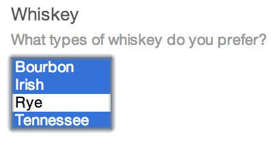

# Multi-select Fields

Multi-select fields give you a multi-select input.

## Settings


Multi-select fields have the following settings:

- **Multi-select Options** – Define the options that will be available in the field. You even get to set the option values and labels separately, and choose which ones should be checked by default.

## The Field

Multi-select fields will show a multi-select input with each of the Multi-select Options as defined in the field settings:



## Templating

You can loop through your selected options like so:

```twig
<ul>
    
        <li>{{ option }}</li>
    
</ul>
```

Or you can loop through all of the available options rather than just the selected ones:

```twig
<ul>
    
        <li>{{ option }}</li>
    
</ul>
```

In either case, you can output an option’s label by typing `{{ option.label }}` instead, and you can tell if the option is selected or not via `option.selected`.

You can also tell if a particular option is selected outside the scope of looping through the options like so:

```twig

    <p>Really?</p>

```
