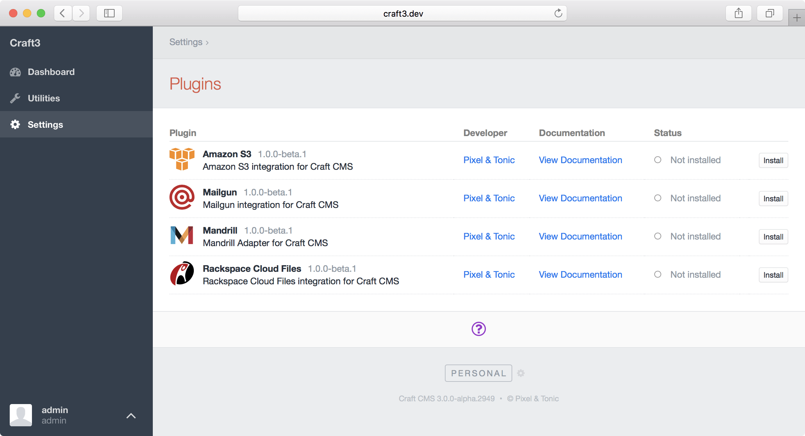

# Intro to Plugin Dev

[[toc]]

## What are Plugins?

Plugins are mini applications that run alongside Craft’s core code. They can be simple, serving a single purpose like providing a new Dashboard widget type, or they can be complex, introducing entirely new concepts to the system, like an e-commerce application. Craft’s plugin architecture provides a solid foundation for building just about anything.

Technically, plugins are a superset of [Yii Modules], which means they can have [models], [active record classes], [controllers], [application components], and other things. It wouldn’t hurt to take some time to read up on those concepts if you are new to Yii.

The main benefits of Craft Plugins over Yii Modules are:

- Plugins can be installed and uninstalled.
- Plugins can have their own migration track.

## Getting Started

::: tip
Use [pluginfactory.io](https://pluginfactory.io/) to create your plugin’s scaffolding with just a few clicks.
:::

### Preparation

Before you begin working on a plugin, you need to decide on a few things:

- **Package name** – Used to name your Composer package. It’s required even if you don’t want to distribute your plugin via Composer. (See Composer’s [documentation][package name] for details.) We recommend prefixing the second segment (after the `/`) with `craft-`, to help identify that this is a Craft plugin. For example, `pixelandtonic/craft-recipes`.
- **Namespace prefix** – Your plugin’s class namespaces will begin with this. (See the [PSR-4] autoloading specification for details.) Note that this should *not* begin with `craft\`; use something that identifies you, the developer.
- **Plugin handle** – Something that uniquely identifies your plugin within the Craft ecosystem. (Plugin handles must begin with a letter and contain only lowercase letters, numbers, and dashes. They should be `kebab-cased`.)
- **Plugin name** – What your plugin will be called within the Control Panel.

Naming things is one of the [two hardest things] in computer science, so if you can make a decision on those things, the rest of the plugin should practically write itself.

### Setting up the basic file structure

To create a plugin, create a new directory for it somewhere on your computer. A common approach is to store them in a `~/dev/` folder alongside your Craft projects:

```
~/dev/
  my-craft-project.dev/
  my-plugin/
    composer.json
    src/
      Plugin.php
```

::: tip
The name of your plugin directory doesn’t matter. Just choose something that is easy to identify.
:::

### composer.json

Whether or not you wish to make your plugin available as a Composer dependency (you probably should), your plugin must have a `composer.json` file. Craft will check this file to get basic information about the plugin.

Use this template as a starting point for your `composer.json` file:

```json
{
  "name": "package/name",
  "description": "Your plugin’s package description",
  "version": "1.0.0",
  "type": "craft-plugin",
  "minimum-stability": "dev",
  "require": {
    "craftcms/cms": "^3.0.0"
  },
  "autoload": {
    "psr-4": {
      "ns\\prefix\\": "src/"
    }
  },
  "support": {
    "email": "you@example.com"
  },
  "extra": {
    "handle": "plugin-handle",
    "name": "Plugin Name",
    "developer": "Developer Name",
    "developerUrl": "https://developer-url.com"
  }
}
```

Replace:

- `package/name` with your package name.
- `ns\\prefix\\` with your namespace prefix. (Use double-backslashes because JSON, and note this must end with `\\`.)
- `you@example.com` with your support email.
- `plugin-handle` with your plugin handle.
- `Plugin Name` with your plugin name.
- `Developer Name` with your name, or the organization name that the plugin should be attributed to.
- `https://developer-url.com` with the URL to the website the developer name should link to in the Control Panel.

Here’s a full list of the properties that can go in that `extra` object:

- `handle` – The plugin handle (required).
- `class` – The [primary Plugin class](#primary-plugin-class) name. If not set, the installer will look for a `Plugin.php` file at each of the `autoload` path roots.
- `basePath` – The base path to your plugin’s source files. This can begin with one of your `autoload` namespaces, formatted as a [Yii alias] (e.g. `@vendorname/foo`). If not set, the directory that contains your primary Plugin class will be used.
- `name` – The plugin name. If not set, the package name (sans vendor prefix) will be used.
- `version` - The plugin version. If not set, the current package version will be used.
- `schemaVersion` – The plugin schema version.
- `description` – The plugin description. If not set, the main `description` property will be used.
- `developer` – The developer name. If not set, the first author’s `name` will be used (via the `authors` property).
- `developerUrl` – The developer URL. If not set, the `homepage` property will be used, or the first author’s `homepage` (via the `authors` property).
- `developerEmail` – The support email. If not set, the `support.email` property will be used.
- `documentationUrl` – The plugin’s documentation URL. If not set, the `support.docs` property will be used.
- `changelogUrl` – The plugin’s changelog URL (used to show pending plugin updates and their release notes).
- `downloadUrl` – The plugin’s download URL (used to update manual installations of the plugin).
- `sourceLanguage` – The plugin’s source language (defaults to `en-US`).
- `hasSettings` – Whether the plugin has settings (should be `true` or `false`).
- `hasCpSection` – Whether the plugin has its own section in the Control Panel (should be `true` or `false`).
- `components` – Object defining any [component configs] that should be present on the plugin.

::: tip
Don’t include `composer/installers` as a Composer dependency.
:::

::: tip
While not strictly required by Composer, we recommend you explicitly set the `version` in your `composer.json` because it makes a couple things easier on your when developing the plugin. Don’t forget to keep it updated though!
:::

### Primary Plugin Class

The `src/Plugin.php` file is your plugin’s primary class. It will get instantiated at the beginning of every request. Its `init()` method is the best place to register event listeners, and any other steps it needs to take to initialize itself.

Use this template as a starting point for your `Plugin.php` file:

```php
<?php
namespace ns\prefix;

class Plugin extends \craft\base\Plugin
{
    public function init()
    {
        parent::init();

        // Custom initialization code goes here...
    }
}
```

Replace `ns\prefix` with your plugin’s namespace prefix.

### Loading your plugin into a Craft project

To get Craft to see your plugin, you will need to install it as a Composer dependency of your Craft project. There are multiple ways to do that:

#### Path Repository

During development, the easiest way to work on your plugin is with a [`path` repository][path], which will tell Composer to symlink your plugin into the `vendor/` folder right alongside other dependencies.

To set it up, open your Craft project’s `composer.json` file and make the following changes:

- Set [`minimum-stability`](https://getcomposer.org/doc/04-schema.md#minimum-stability) to `"dev"`
- Set [`prefer-stable`](https://getcomposer.org/doc/04-schema.md#prefer-stable) to `true`
- Add a new [`path`](https://getcomposer.org/doc/05-repositories.md#path) repository record, pointed at your plugin’s root directory.

```json
{
  "minimum-stability": "dev",
  "prefer-stable": true,
  "repositories": [
    {
      "type": "path",
      "url": "../my-plugin"
    }
  ]
}
```

::: tip
Set the `url` value to the absolute or relative path to your plugin’s source directory. (The `../my-plugin` example value assumes that the plugin lives in a folder alongside the project’s folder.)
:::

In your terminal, go to your Craft project and tell Composer to require your plugin. (Use the same package name you gave your plugin in its `composer.json` file.)

```
> cd ~/dev/my-craft-project
> composer require package/name
```

Composer’s installation log should indicate that the package was installed via a symlink:

```
  - Installing package/name (X.Y.Z): Symlinking from ../my-plugin
```

::: warning
One caveat of `path` Composer repositories is that Composer will ignore `path`-based dependencies when you run `composer update`. So any time you change anything in `composer.json`, such as your plugin’s dependency requirements or its plugin information, you will need to completely remove and re-require your plugin in your project for those changes to take effect.

```
> cd ~/dev/my/craft-project
> composer remove package/name
> composer require package/name
```
:::

#### Packagist

If you’re ready to publicly release your plugin, register it as a new Composer package on [Packagist](https://packagist.org/). Then you can install it like any other package, by just passing its package name to Composer’s `require` command.

```
> cd ~/dev/my-craft-project
> composer require package/name
```

## Plugin Icons

Plugins can provide an icon, which will be visible on the Settings → Plugins page.



Plugin icons must be square SVG files, saved as `icon.svg` at the root of your plugin’s source directory (e.g `src/`).

If your plugin has a [Control Panel section](cp-section.md), you can also give its global nav item a custom icon by saving an `icon-mask.svg` file in the root of your plugin’s source directory. Note that this icon cannot contain strokes, and will always be displayed in a solid color (respecting alpha transparency).

[Yii Modules]: http://www.yiiframework.com/doc-2.0/guide-structure-modules.html
[models]: http://www.yiiframework.com/doc-2.0/guide-structure-models.html
[active record classes]: http://www.yiiframework.com/doc-2.0/guide-db-active-record.html
[controllers]: http://www.yiiframework.com/doc-2.0/guide-structure-controllers.html
[application components]: http://www.yiiframework.com/doc-2.0/guide-structure-application-components.html
[package name]: https://getcomposer.org/doc/04-schema.md#name
[two hardest things]: https://twitter.com/codinghorror/status/506010907021828096
[PSR-4]: http://www.php-fig.org/psr/psr-4/
[Yii alias]: http://www.yiiframework.com/doc-2.0/guide-concept-aliases.html
[component configs]: http://www.yiiframework.com/doc-2.0/guide-structure-application-components.html
[path]: https://getcomposer.org/doc/05-repositories.md#path
