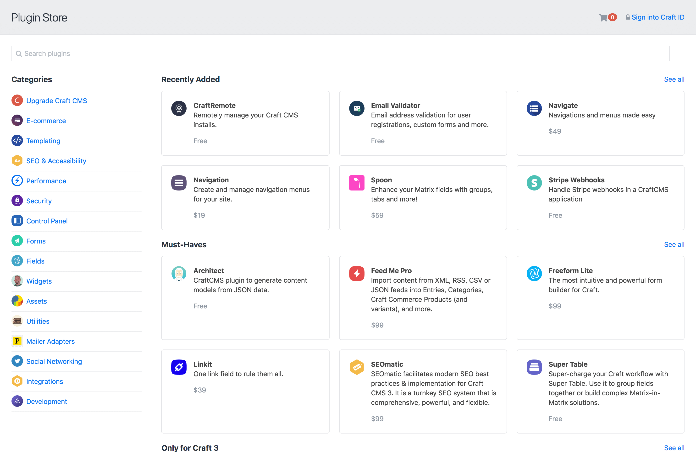
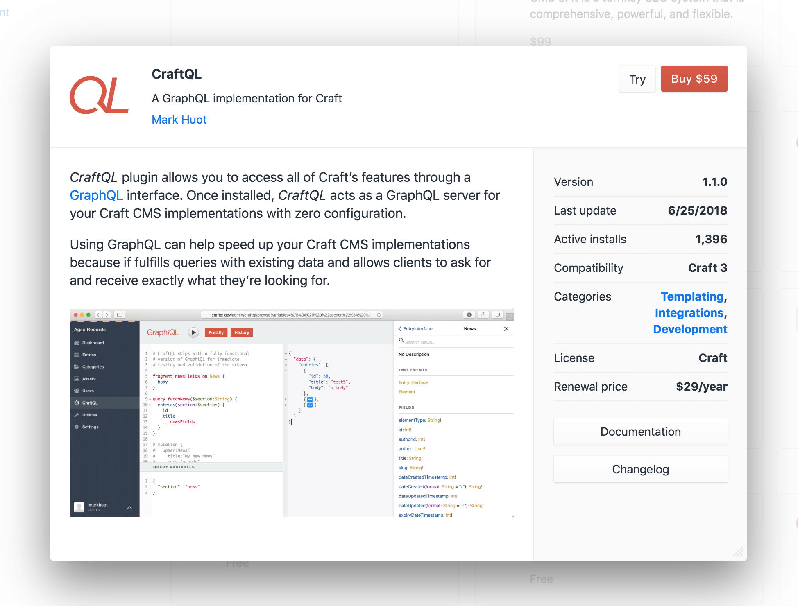

# Plugins

::: tip
If you’re looking for plugin _development_ documentation, check out the [Extending Craft](extend/README.md) section.
:::

Plugins extend Craft’s core functionality. They can introduce new Dashboard widgets, field types, Control Panel sections, Twig templating features, workflow actions, and more.

## The Plugin Store

Craft’s Control Panel features a Plugin Store, where you can browse through hundreds of free and commercial plugins, install them with a single click, and pay for them.

To access the Plugin Store, click on the “Plugin Store” item in Craft’s Control Panel navigation. From there you can browse through the various plugin categories and curated lists to discover new plugins.

When you click on a plugin, a modal window will open with details about the plugin, including a long description and screenshots.

## Installing Free Plugins

Free plugins can be installed by clicking the “Install” button. You’ll then be taken to the plugin installer page, which will keep you updated with Craft’s status as it works through the installation.

## Trialing Commercial Plugins

Commercial plugins can be installed as a trial by clicking the “Try” button, if Craft is running on a development domain. You’ll then be taken to the plugin installer page, which will keep you updated with Craft’s status as it works through the installation.

## Buying Commercial Plugins

If you have tried a commercial plugin and are ready to buy it, return to the Plugin Store and click on the Cart icon in the header area. You should see your plugin listed in the “Active Trials” section of the Cart modal. Click the “Add to cart” button  to add the plugin to your cart, and then proceed with checkout.

Once you’ve completed the checkout process, your plugin installation will automatically become licensed.

## Managing Plugin Licenses

You can managed all of your plugin licenses from your [Craft ID](https://id.craftcms.com/) account, under Licenses → Plugins

If you don’t have a Craft ID account yet, you can create one by going to [id.craftcms.com/register](https://id.craftcms.com/register).

Any plugin licenses that were purchased with the same email address as your Craft ID account will automatically be added to your account.

If you have a plugin license that isn’t showing up, go to Licenses → Claim License. You can enter its license key manually, or if you know the email address that was used for purchase, you can enter it in the “Claim licenses by email address” section. After verifying that you own the email address, any unclaimed licenses associated with that email address will be added to your account.

## Transferring Plugin Licenses

To transfer a plugin license to someone else’s Craft ID account, log into your Craft ID account, and click on the license under Licenses → Plugins, and then click the “Release License” button to release it from your account. Then the other person will be able to claim the license for themselves from the Licenses → Claim License page of their Craft ID account.

## Commercial Plugin Licensing

Commercial plugins in the Plugin Store must follow Craft’s licensing model:

- They are free to try in development environments, but require payment to be used in production environments.
- Commercial licenses are a one-time fee per Craft installation, which comes with access to updates for one year after purchase.
- Additional updates can be available with an annual update fee.
- Licenses can be returned for a full refund within 30 days of purchase, no questions asked.

Additionally, all plugins in the Plugin Store must use either the [MIT License](https://opensource.org/licenses/MIT) or the [Craft License](https://craftcms.github.io/license/). (Generally, free plugins will use the MIT License, and commercial plugins will use the Craft license.)

Together, these rules make plugin licensing safe and predictable for customers, while also helping provide a sustainable business model for plugin vendors.

## Commercial Plugin Support

We don’t impose any specific support requirements on plugin vendors. You will need to check with them to learn about their support policies, so you know what to expect.

If you feel that a plugin vendor isn’t providing a reasonable level of support for a commercial plugin license, please send and email to <support@craftcms.com> about it.
