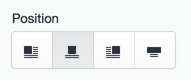

# Position Select Fields

Position Select fields give you a button group with various positioning options, which can be used to define how elements should be positioned in your templates.

## Settings


Position Select fields have the following settings:

- **Options** – Choose which options should be available in the field. Your choices include `left`, `center`, `right`, `full`, `drop-left`, and `drop-right`. (The names are not customizable.)

## The Field

Position Select fields will show a button group with icons representing each of the options you chose in the field’s settings.



## Templating

If you want to output the value directly, such as into a `<div>`’s `class=` attribute, you can do that like so:

```twig
<div class="block {{ entry.positionSelectFieldHandle }}">
```

You can also access the option’s value in conditionals:

```twig

    {# ... #}

    {# ... #}

```

Or you can feed it into a [switch](templating/switch.md) tag:

```twig

    
        {# ... #}
    
        {# ... #}
    
        {# ... #}

```
