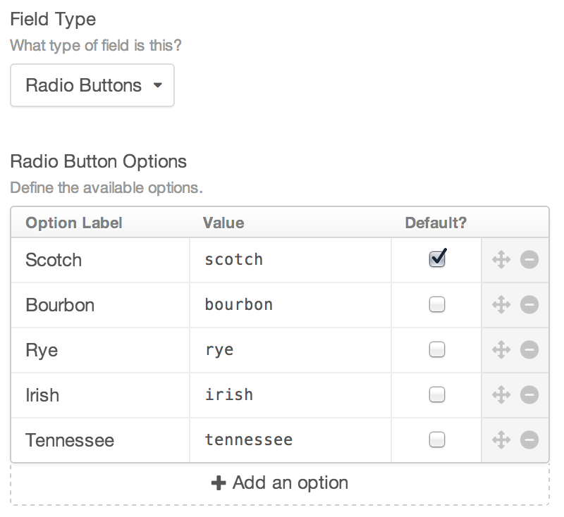
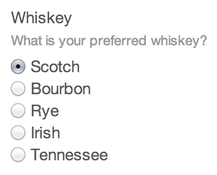

# Radio Buttons Fields

Radio Buttons fields give you a group of radio buttons.

## Settings



Radio Buttons fields have the following settings:

- **Radio Button Options** – Define the radio buttons that will be available in the field. You even get to set the option values and labels separately, and choose which one should be selected by default.

## The Field

Radio Buttons fields will show a radio group with each of the Radio Button Options as defined in the field settings:



## Templating

You can output the selected option’s value like so:

```twig
{{ entry.radioFieldHandle }}
```

You can output the selected option’s label like so:

```twig
{{ entry.radioFieldHandle.label }}
```

Or you can loop through all of the available options rather than just the selected one:

```twig
<ul>
    
        <li>{{ option }}</li>
    
</ul>
```

You can output an option’s label by typing `{{ option.label }}` instead, and you can tell if the option is selected or not via `option.selected`.
