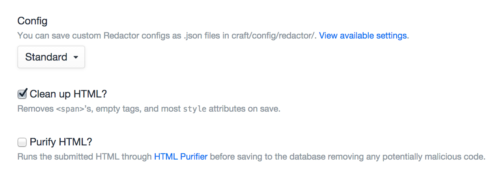

# Rich Text Fields

Rich Text fields give you a Redactor-powered WYSIWYG editor, which stores HTML.

## Settings



Rich Text fields have the following settings:

- **Config** – The config file for Redactor to use (see below). To use the default Redactor settings, just choose “Default”.
- **Clean up HTML?** – Whether Craft should run through some HTML cleanup routines when the field is saved, including removing all `<span>` tags, empty tags, and most `style` attributes.
- **Purify HTML?** – Whether the field should run submitted data through [HTML Purifier](http://htmlpurifier.org/) before getting saved to the database, removing any potentially malicious code. Note that this is meant to be be used when accepting input in a Rich Text field from un-trusted sources.

## Redactor Configs

Redactor configs are .json files stored in craft/config/redactor, which contain Javascript objects that define [Redactor config settings](https://imperavi.com/redactor/docs/settings/). Their contents get passed directly into the `redactor()` jQuery plugin, so you can paste the examples in there verbatim.

Craft comes with two Redactor configs by default:

### Simple.json

```javascript
{
    "buttons": ["bold","italic"]
}
```

### Standard.json

```javascript
{
    "buttons": ["format","bold","italic","lists","link","file","horizontalrule"],
    "plugins": ["source","fullscreen"]
}
```

## The Field

Rich Text fields will show a Redactor field that has been configured with whatever settings are defined in the selected Redactor config:


## Templating

Calling a Rich Text field in your templates will return the value that was entered in the field.

```twig
{{ entry.richTextFieldHandle }}
```

## Paginating

Craft provides a custom Redactor plugin that makes it possible to split your contents into multiple pages.

To enable it, first visit your Rich Text field’s settings and check your field’s “Config” setting value. If it’s set to “Default” you will need to choose a different option and save the field.

Now open up the config’s JSON file, located in `craft/config/redactor/`, and add in the `pagebreak` plugin to it:

```javascript
{
    "buttons": [/* ... */],
    "plugins": ["pagebreak"]
}
```

With the `pagebreak` plugin enabled, your Rich Text fields should now have a new Page Break button. When you click on it, a page break will be added to the content near the current selection.

Rich Text fields have three functions for outputting content based on the page breaks:

### `getPages()`

Returns an array of all pages’ content.

```twig

    <div class="page">
        {{ page }}
    </div>

```

### `getPage($number)`

Returns the contents of a specific page.

```twig

    <article>
        <h1><a href="{{ entry.url }}">{{ entry.title }}</a></h1>

        {{ entry.richTextFieldHandle.getPage(1) }}

        
            <a href="{{ entry.url }}">Continue reading…</a>
        
    </article>

```

### `getTotalPages()`

Returns the total number of pages for the field.

```twig

    <article>
        <h1><a href="{{ entry.url }}">{{ entry.title }}</a></h1>

        {{ entry.richTextFieldHandle.getPage(1) }}

        
            <a href="{{ entry.url }}">Continue reading…</a>
        
    </article>

```
