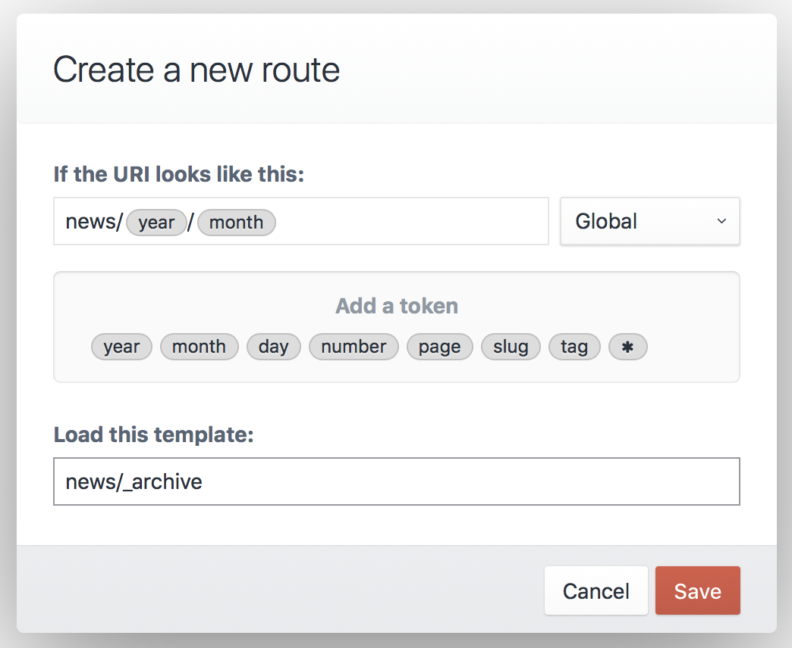

# Routing

Routing helps Craft smartly handle requests to your site. When a request comes in to Craft, it checks to determine where to route the request.

The checks detailed below explain how this process works. This information can helpful to you when troubleshooting template loading, plugin action URLs, dynamic routes, and unexpected 404 errors.

Here is how Craft handles each request:


0. **Should Craft handle this request in the first place?**

   It’s important to keep in mind that Craft doesn’t actually get involved for *every* request that touches your server – only requests that go to your `index.php` file.

   The `.htaccess` file that [comes with Craft](https://craftcms.com/support/remove-index.php) will redirect all would-be 404 requests over to `index.php` behind the scenes. Because of this Craft responds to URLs that don’t point to a valid directory or file in your web root. But if you point your browser directly at a file that *does* exist (such as an image URL), your web server will serve that file directly without Craft intervening.

1. **Is it an action request?**

   Action requests either have a URL that begins with `actions/` (or whatever your <config:actionTrigger> config setting is set to), or an `action` parameter in the POST request or the query string. 

   Craft routes action requests to a controller action that perform actions. Craft has system Controller actions for core actions, but plugins may also have Controllers that define their own custom actions.

  The request doesn’t necessarily end after a controller call. The controller may allow it to keep going.

2. **Is it an entry/category request?**

   If the URI matches an [entry’s](sections-and-entries.md) or [category’s](categories.md) URI, Craft loads the section’s template or category group’s template. Craft makes the matched element available to the template via a pre-populated `entry` or `category` variable.

   (This step is not limited to entries and categories – plugins are also capable of adding their own types of elements, which can opt to have their own dedicated URLs.)

3. **Does the URI match any Dynamic Routes?**

   If the URI matches any [dynamic routes](#dynamic-routes), the template specified by that route will get loaded. If the route contains any tokens, they will be available as variables to that template.

4. **Does the URI match a template?**

   Finally, Craft will check if the URI is a valid [template path](dev/README.md#template-paths). If it is, Craft will return the matched template. Note: if any of the URI segments begin with an underscore (`_`), Craft will return a 404. Craft hides from direct access any template path segments that begin with an underscore.

5. **404**

   If none of the above checks are successful, Craft will return a 404. You can customize your site’s 404 page by placing a `404.html` template at the root of your `templates/` directory.


## Dynamic Routes

In some cases you want a URL to load a template, but you don’t want the URI to match the template path.

A good example of this is a yearly archive page, where you want the year to be one of the segments in the URL (e.g. `blog/archive/2018`). It would be silly to create a new template for every year. Instead, you should set up a new **route**.



### Creating Routes

To create a new Route, go to Settings → Routes and click the “New Route” button. A modal window will appear where you can define the route settings.

The modal has the following settings:

* What should the URI look like?
* Which template should get loaded?

The first setting can contain “tokens”, which represent a range of possible matches, rather than a specific string. (The `year` token, for example, represents four consecutive digits.) When you click on a token, Craft inserts it into the URI setting wherever the cursor is.

If you want to match URIs that look like `blog/archive/2018`, you type `blog/archive/` into the URI field, and then click on the `year` token.

::: tip
Route URIs should **not** begin with a slash (`/`).
:::

After defining your URI pattern and entering a template path, click the “Save” button. The modal will close, revealing your new route on the page.

When you point your browser to `http://my-project.test/blog/archive/2018`, it will match your new route, and Craft will load the specified template.

The value of the `year` token will also be available to the template as a variable called `year`.


### Available Tokens

The following tokens are available to the URI setting:

* `*` – Any string of characters, except for a forward slash (/)
* `day` – Day of a month (1-31 or 01-31)
* `month` – Numeric representation of a month (1-12 or 01-12)
* `number` – Any positive integer
* `page` – Any positive integer
* `slug` – Any string of characters, except for a forward slash (/)
* `tag` – Any string of characters, except for a forward slash (/)
* `year` – Four consecutive digits


## Advanced Routing with URL Rules

In addition to routes, you can define [URL rules](https://www.yiiframework.com/doc/guide/2.0/en/runtime-routing#url-rules) in `config/routes.php`.

```php
return [
    // Route blog/archive/YYYY to a controller action
    'blog/archive/<year:\d{4}>' => 'controller/action/path',

    // Route blog/archive/YYYY to a template
    'blog/archive/<year:\d{4}>' => ['template' => 'blog/_archive'],
];
```

If your Craft installation has multiple sites, you can create site-specific URL rules by placing them in a sub-array, and set the key to the site’s handle. 

```php
return [
    'siteHandle' => [
        'blog/archive/<year:\d{4}>' => 'controller/action/path',
    ],
];
```

Craft also supports special tokens that you can use within the regular expression portion of your [named parameters](https://www.yiiframework.com/doc/guide/2.0/en/runtime-routing#named-parameters):

- `{handle}` – matches a field handle, volume handle, etc.
- `{slug}` – matches an entry slug, category slug, etc.  

```php
return [
    'blog/<entrySlug:{slug}>' => 'controller/action/path',
];
```

### Accessing Named Parameters in your Templates

URL rules that route to a template (`['template' => '<TemplatePath>']`) will pass any matched named parameters to the template as variables.

For example, with this URL rule:

```php
'blog/archive/<year:\d{4}>' => ['template' => 'blog/_archive'],
```

If you access `http://my-project.test/blog/archive/2018`, your `blog/_archive.html` template will get loaded a `year` variable set to `2018`.

```twig
<h1>Blog Entries from {{ year }}</h1>
```
