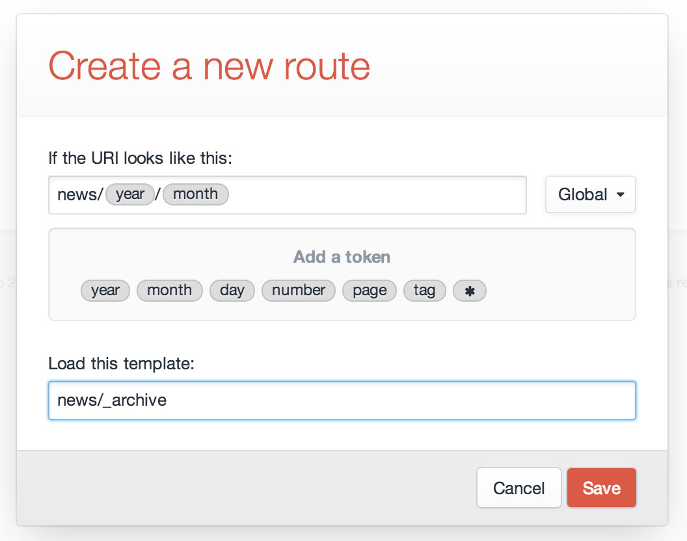

# Routing

When a request comes in, Craft goes through several checks when determining where to route the request.

Here is an outline of what that entails:

0. **Should Craft handle this request in the first place?**

   It’s important to keep in mind that Craft doesn’t actually get involved for *every* request that touches your server – only requests that go to your `index.php` file.

   The .htaccess file that [comes with Craft](https://craftcms.com/support/remove-index.php) will redirect all would-be 404 requests over to `index.php` behind the scenes, which is why Craft is able to respond to URLs that don’t point to any actual folder/file in your web root. But if you point your browser directly at a file that *does* exist (such as a front-end image URL), Apache is going to serve that file directly. Craft won’t be summoned for that.

1. **Is it a resource request?**

   Resource request URIs begin with `cpresources/` (or whatever your <config:resourceTrigger> config setting is set to). They are used to serve CP resources, user photos, etc..

2. **Is it an action request?**

   Action requests either have a URL which begins with `actions/` (or whatever your <config:actionTrigger> config setting is set to), or an “action” param in POST or the query string. Action requests get routed to a controller action, which are used to perform… *actions*. Controller actions are built into the system for core actions, but plugins may also have Controllers that define their own custom actions.

  The request doesn’t necessarily end after a controller has been called. The controller may allow it to keep going.

3. **Is it an entry/category request?**

   If the URI matches an [entry’s](sections-and-entries.md) or [category’s](categories.md) URI, the section’s/category group’s template will get loaded, and the matched element will be made available to the template via a pre-populated `entry` or `category` variable.

   (This step is not actually limited to entries and categories – plugins are also capable of adding their own types of elements, which can opt to have their own dedicated URLs.)

4. **Does the URI match any Dynamic Routes?**

   If the URI matches any [dynamic routes](#dynamic-routes), the template specified by that route will get loaded. If the route contains any tokens, they will be available as variables to that template.

5. **Does the URI match a template?**

   Finally, Craft will see if the URI is a valid [template path](templating-overview.md#template-paths). If it is, it will return the matched template. Note that if any of the URI segments begin with an underscore (`_`), Craft will return a 404, since template path segments that begin with an underscore are considered “hidden” from direct access.

6. **404**

   If none of those checks are successful, Craft will return a 404. You can customize your site’s 404 page by placing a “404.html” template at the root of your `craft/templates/` folder.


## Dynamic Routes

There are times when you want a URL to load a template, but you don’t want the URI to match the template path.

A good example of this is dynamic URLs, such as a yearly archive template, where you want the year to be one of the segments in the URL (e.g. “blog/archive/2012”). It would be silly to create a new template for every year. Instead, your best bet is going to be to set up a new Route.

To create a new Route, go to Settings → Routes and click the “New Route” button. A modal window will appear where you can define the route settings:



The modal has the following settings:

* What should the URI look like?
* Which template should get loaded?

The first setting can contain “tokens”, which represent a range of possible matches, rather than a specific string. (The “year” token, for example, represents four consecutive digits.) When you click on a token, it will get inserted into the URI setting wherever the cursor is.

So if you want to match URIs that look like `blog/archive/2013`, you would type `blog/archive/` into the URI field, and then click on the “year” token.

::: tip
Your URI should **not** begin with a slash (/).
:::

After defining your URI pattern and entering a template path, click the ‘Save’ button. The modal will close, revealing your new route on the page. Now when you point your browser to <http://example.com/blog/archive/2013>, it will match your new route, and the specified template will get loaded. The value of the ‘year’ token will also be available to the template as a variable called “year”.


### Available Tokens

The following tokens are available to the URI setting:

* <strong>*</strong> – Any string of characters, except for a forward slash (/)
* **day** – Day of a month (1-31 or 01-31)
* **month** – Numeric representation of a month (1-12 or 01-12)
* **number** – Any positive integer
* **page** – Any positive integer
* **slug** – Any string of characters, except for a forward slash (/)
* **tag** – Any string of characters, except for a forward slash (/)
* **year** – Four consecutive digits


## Advanced Routing

If you need to match a URL pattern that’s not covered by the available route tokens and you’re comfortable with regular expressions, you can set up your routes in craft/config/routes.php as well. When a request comes in, Craft checks this file first, and then the routes defined in Settings → Routes.

### Basic Syntax

Routes in craft/config/routes.php generally follow this syntax:

```php
'some/uri/pattern' => 'template/path',
```

Note that you don’t need to escape forward slashes; Craft will automatically escape them for you.

If your site is setup with multiple locales, then you can target locale specific routes via:

```php
'global/uri/pattern' => 'global/template/path',

'de' => array(
    'german/only/uri/pattern' => 'german/only/template/path',
),
```

### Accessing Subpatterns in your Templates

If your route contains any subpatterns, a ‘matches’ array will be passed to the matched template containing them. For example, with this route:

```php
'news/(\d{4})/(\d{2})' => 'news/_archive',
```

…if you access `http://example.com/news/2014/04`, your `news/_archive.html` template will get loaded with a `matches` variable set to this:

```php
array(
    0 => 'news/2014/04',
    1 => '2014',
    2 => '04'
)
```

If you specify any named subpatterns, then those matches will also get their own normal variables. For example, with this route:

```php
'news/(?P<year>\d{4})/(?P<month>\d{2})' => 'news/_archive',
```

…if you access `http://example.com/news/2014/04`, your `news/_archive.html` template will get loaded with `year` and `month` variables set to `2014` and `04`.

### Routing to Controller Actions

You can also set your route to point to a controller action, rather than a template:

```php
'some/uri/pattern' => array('action' => 'action/path'),
```
