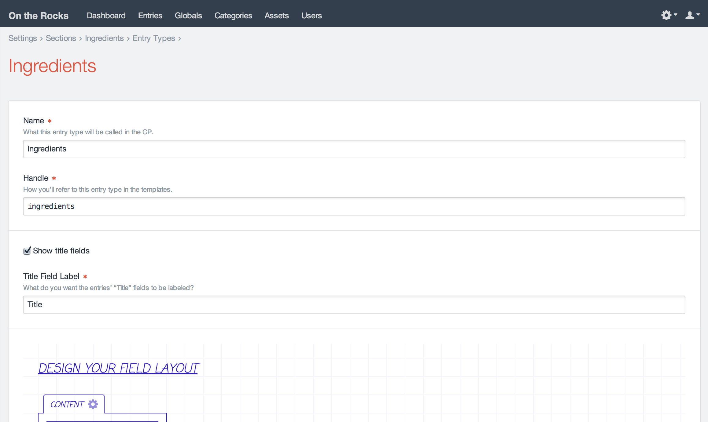

# Sections and Entries

Entries generally hold the content that you want to display on your web pages. Each entry has an Author, a Post Date, an Expiration Date (if desired), a status (enabled or disabled), and of course, content. You can also create drafts of entries that live alongside the current live version of the entry, and you’ll also be able to view and revert to past versions of the entry.

Generally each entry will have a stake in its own primary URL on your site, though any entry can be fetched from anywhere if your template needs it.

## Sections

Before you can create entries, you must create “sections” to contain them. Each section lets you define the following:

* Whether entries in the section have URLs
* What the entries’ URLs should look like
* Which template should get loaded if an entry’s URL is requested
* Which locales entries in the section should target (if you’re using Craft Pro with more than one site locale)
* Which locales should be enabled by default for new entries (if you’re using Craft Pro with more than one site locale)
* What types of entries should be available in the section, and which fields each of those entry types should have

To create a new section, go to Settings → Sections and click the “New Section” button.

### Section Types

Not all sections are created equal. Craft actually has three different types of sections:

#### Singles

Singles are used for one-off pages that have unique content requirements, such as:

* the homepage
* an About Us page
* a Contact Us page

Unlike the other section types, Singles only have one entry associated with them, and they don’t have an editable Author, Slug, Post Date, or Expiration Date.

#### Channels

Channels are used for streams of similar content, such as:

* a Blog
* a News section
* recipes

#### Structures

Structures are good for times when you need to store multiple similar entries, and they need to be sorted into a specific order. They can also be hierarchical. Examples include:

* Documentation _(these very docs are a Structure section!)_
* a Services section, where the order of services matters
* a company organization chart

## Entry Types

Both Channel and Structure sections let you define multiple types of entries to be contained within them.

You can manage your sections’ entry types by clicking the “Edit Entry Types” link beside the section’s name in Settings → Sections. That’ll take you to the section’s entry type index. Clicking on an entry type’s name takes you to its settings page:



Entry types have the following settings:

* **Name** – The entry type’s name
* **Handle** – The entry type’s template-facing handle
* **Show the Title field?** – Whether a Title field should be displayed for entries of this type
* **Title Field Label** – What the “Title” field should be labeled as.

### Dynamic Entry Titles

If you want your entries to have auto-generated titles rather than requiring authors to enter them, you can uncheck the “Show the Title field?” checkbox. When you do, a new “Title Format” setting will appear, where you can define what the auto-generated titles should look like.


The Title Format is a full-blown Twig template, and it will get parsed whenever your entries are saved.

The entry will be passed to this template as a variable named `object`. You can reference the entry’s [properties](templating/entrymodel.md#properties) in two ways:

* `{{ object.property }}` _(normal Twig syntax)_
* `{property}` _(shortcut syntax)_

Note that the shortcut syntax only has one set of curly braces. If Craft finds any of these in your Title Format, it will replace the `{` with `{{object.` and the `}` with `}}`, before passing the template off to Twig to be parsed.

You can use Twig filters in both syntaxes:

```twig
{{ object.postDate|date('M j, Y') }}
{postDate|date('M j, Y')}
```

Craft’s [global variables](templating/global-variables.md) are available to these templates as well:

```twig
{{ now|date('Y-m-d') }}
{{ currentUser.username }}
```

Conditionals are also fair game. There’s no shortcut syntax for those, so if you want to use a conditional on one of the entry’s properties, you will need to reference it with the `object` variable:

```twig
{postDate|date('M j, Y')}{{ now|date('M j, Y') }}
```

## Editing Entries

If you have at least one section, there will be an “Entries” tab in the primary CP nav. Clicking on it will take you to the entry index. From there you can navigate to the entry you wish to edit, or create a new one.

You can perform the following actions from the Edit Entry page:

* Choose the entry type (if there’s at least two to choose from)
* Edit the entry’s title
* Edit the entry’s slug
* Edit the entry’s custom field content
* Choose the entry’s author (Pro edition only)
* Choose the entry’s parent (if it’s within a Structure section)
* Choose the entry’s Post Date
* Choose the entry’s Expiration Date (optional)
* Choose whether the entry is enabled or not
* Save changes to the entry
* Save a new draft of the entry
* Publish a draft
* View past versions of the entry

If you leave the Post Date blank, Craft will automatically set it the first time an entry is saved as enabled.
