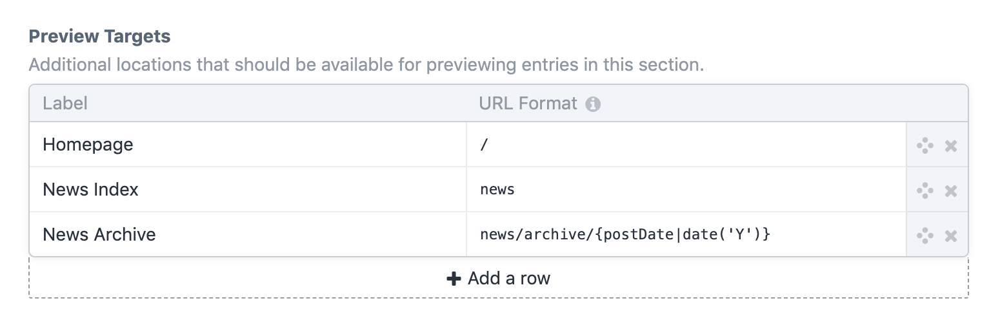
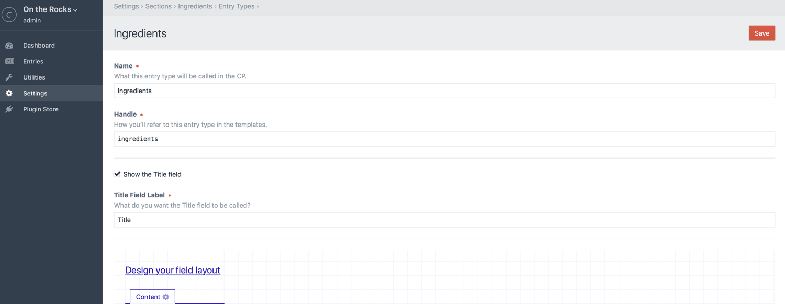

# Sections and Entries

## Entries

Entries hold the content that you want to display on your web pages. Each entry has an Author, a Post Date, an Expiration Date (if desired), a status (enabled or disabled), and of course, content.

You can also create drafts of entries that live alongside the current live version of the entry.

Typically each entry will have a stake in its own primary URL on your site, though Craft can fetch any entry from anywhere if your template needs it.

## Sections

Before you can create entries, you must create Sections to contain them. In each Section you can define the following:

* Whether entries in the section have URLs
* What the entries’ URLs should look like
* Which template should get loaded if an entry’s URL is requested
* What types of entries should be available in the section, and which fields each of those entry types should have

If you're using Craft with multiple sites then you can also define in your Section:

* Which sites entries in the section should target
* Which sites are enabled by default for new entries

To create a new section, go to Settings → Sections and click the “New Section” button.

### Section Types

Not all sections are created equal. Craft has three different types of sections:

#### Singles

Singles are used for one-off pages that have unique content requirements, such as:

* the homepage
* an About Us page
* a Contact Us page

Unlike the other section types, Singles only have one entry associated with them, and they don’t have an editable Author, Slug, Post Date, or Expiration Date.

#### Channels

Channels are used for streams of similar content, such as:

* a Blog
* a News section
* recipes

#### Structures

Structures are good for times when you need to store multiple similar entries, and sort them into a specific order. They can also be hierarchical. Examples include:

* Documentation
* a Services section, where the order of services matters
* a company organization chart

### Entry URI Formats

Channel and Structure sections can choose whether their entries should be assigned URLs in the system, by filling in the “Entry URI Format” setting.

Entry URI Formats are mini Twig templates, which will be rendered each time an entry in the section is saved. The rendering result will be saved as the entry’s URI in the system.

The entry being saved will be available to the template as a variable named `object`, and each of the entry’s properties and custom field values will also be available as their own variables. So something like this is possible:

```twig
{{ author.username }}/{{ slug }}
```

A shortcut syntax is also available for output tags that reference a property on the entry:

```twig
{author.username}/{slug}
```

Structure sections may want to have nested paths for child entries:

```twig
{parent.uri}/{slug}
```

With the above Entry URI Format, a top-level entry’s URI might end up as `templating`, whereas a nested entry’s URI might end up as `templating/tags`.

Structure sections might also want to include a segment before the nested path:

```twig
{parent.uri ?? 'docs'}/{slug}
```

The above template could also be expressed with this syntax:

```twig
docs{parent.uri}/{slug}
```

With the above Entry URI Format, a top-level entry’s URI might end up as `docs/templating`, whereas a nested entry’s URI might end up as `docs/templating/tags`.

### Preview Targets

Your entry content will likely show up in places other than just their main URLs. For example, the Blog index page will show excerpts of recent blog posts.

With Craft Pro, your sections will have a “Preview Targets” setting, where you can list additional places your entries will show up on your site, so that authors can quickly preview entries everywhere they appear.

Each preview target has Name and a URI. Give each of your targets a clear name that authors will understand, such as “Homepage” or “Blog Index”. Set the URI to the actual URI you want to load when the target is selected.

The URI is a mini Twig template (just like Entry URI Formats), so you can make it dynamic if you need to. For example, if you are creating an “Archive” preview target, where the URI needs to include the year the entry was published, you can enter `archive/{postDate|date('Y')}`.  



When an author is editing an entry from a section with custom preview targets, the “Share” button will be replaced with a menu that lists the “Primary entry page” (if the section has an Entry URI Format), plus the names of each preview target.


The targets will also be available within Live Preview.


## Entry Types

Both Channel and Structure sections let you define multiple types of entries using Entry Types.

You can manage your sections’ Entry Types by clicking the “Edit Entry Types” link beside the section’s name in Settings → Sections. That’ll take you to the section’s entry type index. Clicking on an entry type’s name takes you to its settings page:



Entry types have the following settings:

* **Name** – The entry type’s name
* **Handle** – The entry type’s template-facing handle
* **Show the Title field?** – Whether a Title field is displayed for entries of this type
* **Title Field Label** – What the “Title” field label should be.

### Dynamic Entry Titles

If you want your entries to have auto-generated titles rather than requiring authors to enter them, you can uncheck the “Show the Title field?” checkbox. When you do, a new “Title Format” setting will appear, where you can define what the auto-generated titles should look like.

The Title Format is a full-blown Twig template, and it will get parsed whenever your entries are saved.

The entry is passed to this template as a variable named `object`. You can reference the entry’s [properties](api:craft\elements\Entry#public-properties) in two ways:

* `{{ object.property }}` _(normal Twig syntax)_
* `{property}` _(shortcut syntax)_

_Note that the shortcut syntax only has one set of curly braces_.

If Craft finds any of these in your Title Format, it will replace the `{` with `{{object.` and the `}` with `}}`, before passing the template off to Twig for parsing.

You can use Twig filters in both syntaxes:

```twig
{{ object.postDate|date('M j, Y') }}
{postDate|date('M j, Y')}
```

Craft’s [global variables](dev/global-variables.md) are available to these templates as well:

```twig
{{ now|date('Y-m-d') }}
{{ currentUser.username }}
```

Conditionals are also fair game. There’s no shortcut syntax for those, so if you want to use a conditional on one of the entry’s properties, you will need to reference it with the `object` variable:

```twig
{postDate|date('M j, Y')}{{ now|date('M j, Y') }}
```

## Editing Entries

If you have at least one section, there will be an “Entries” tab in the primary CP nav. Clicking on it will take you to the entry index. From there you can navigate to the entry you wish to edit, or create a new one.

You can perform the following actions from the Edit Entry page:

* Choose the entry type (if there’s at least two to choose from)
* Edit the entry’s title
* Edit the entry’s slug
* Edit the entry’s custom field content
* Choose the entry’s author (Pro edition only)
* Choose the entry’s parent (if it’s within a Structure section)
* Choose the entry’s Post Date
* Choose the entry’s Expiration Date (optional)
* Choose whether the entry is enabled or not
* Save changes to the entry
* Save a new draft of the entry
* Publish a draft
* View past versions of the entry

If you leave the Post Date blank, Craft will automatically set it the first time an entry is saved as enabled.
