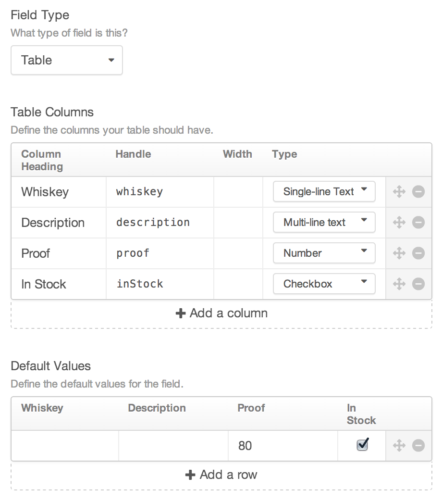
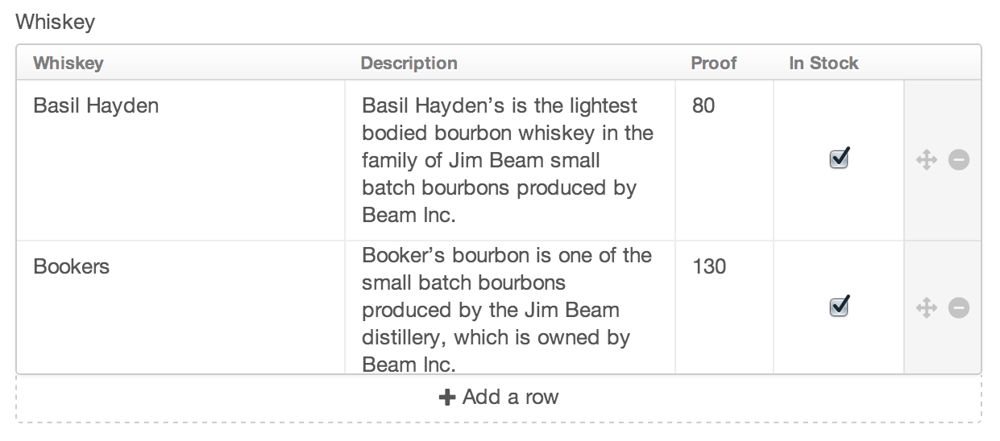

# Table Fields

Table fields give you a customizable table, where you can create multiple rows of content.

## Settings



Table fields have the following settings:

- **Table Columns** – Define the columns that will be available to your Table field.

    Each column has the following properties:

    - _Column Heading_ – The name that will appear in the head of the table
    - _Handle_ – How you’ll refer to this column from your templates
    - _Width_ – The width for this column specified in either pixels or a percentage
    - _Type_ – The type of content allowed in the column. Choose from Single-line text, Multi-line text, Number, and Checkbox.

- **Default Values** – Define the default row and column values for new instances of the field.

## The Field

Table fields will show the table as configured based on the field settings. You can reorder, delete, and add new rows, and modify their values.



## Templating

Calling a Table field in your templates will return an array of the rows. Each row is a sub-array which holds each of the columns’ values for that row.

```twig

    <h3>Whiskeys</h3>

    <ul>
        
            <li>{{ row.whiskey }} - {{ row.description }} - {{ row.proof }}</li>
        
    </ul>

```
