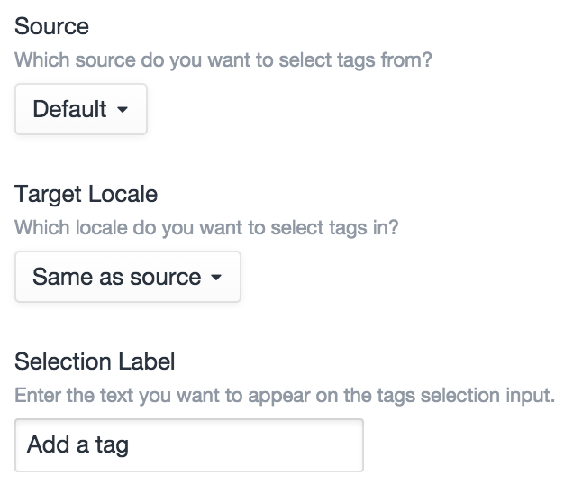
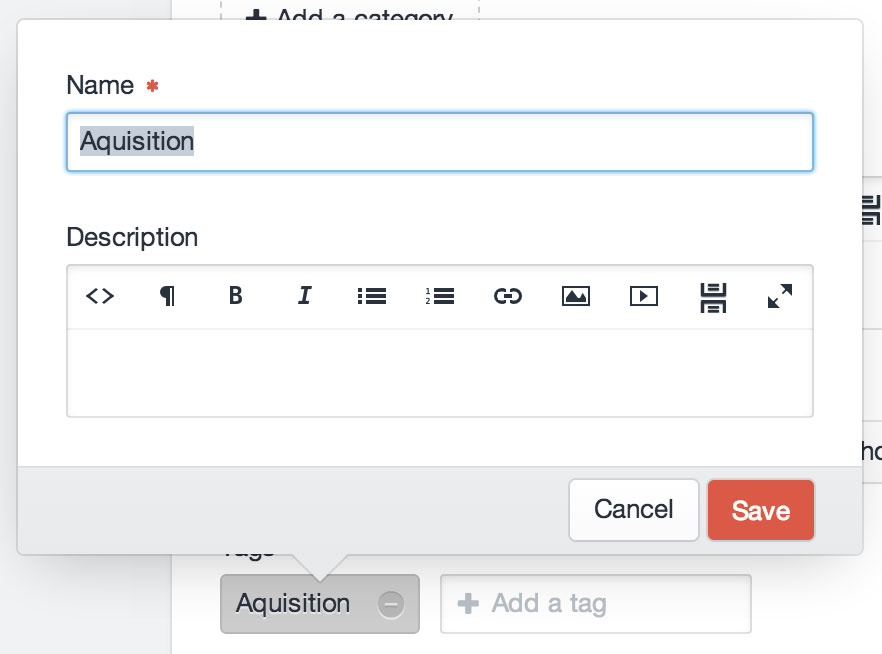

# Tags Fields

Tags fields allow you create [tags](tags.md) and relate them to the parent element.

## Settings



Tags fields have the following settings:

- **Source** – The tag group you want to relate tags from.
- **Target Locale** – Which locale tags should be created/related with (this setting only appears if you’re running Craft Pro with more than one site locale)
- **Selection Label** – The label that should be used on the field’s tag search input.

## The Field


Tags fields list all of the currently selected tags, with a text input to add new ones.

As you type into the text input, the Tags field will search through the existing tags that belong to the field’s tag group, and suggest tags in a menu below the text input. If an exact match is not found, the first option in the menu will actually create a new tag with the title that you typed in.

### Editing Tag Content

Double-clicking on a selected tag will open a modal where you can edit the tag’s title, and any fields you have associated with your tags from Settings → Tags → Fields.



## Templating

If you have an element with a Tags field in your template, you can access its selected tags using your Tags field’s handle:

```twig

```

That will give you an [ElementCriteriaModel](templating/elementcriteriamodel.md) object, prepped to output all of the selected tags for the given field. In other words, the line above is really just a shortcut for this:

```twig

```

(See [Relations](relations.md) for more info on the `relatedTo` param.)

### Examples

To check if your Tags field has any selected tags, you can use the `length` filter:

```twig

    ...

```

To loop through the selected tags, you can treat the field like an array:

```twig

    ...

```

Rather than typing “`entry.tagsFieldHandle`” every time, you can call it once and set it to another variable:

```twig




    <h3>Some great tags</h3>
    
        ...
    


```

You can add parameters to the ElementCriteriaModel object as well:

```twig

```

If your Tags field is only meant to have a single tag selected, remember that calling your Tags field will still give you the same ElementCriteriaModel, not the selected tag. To get the first (and only) tag selected, use `first()`:

```twig



    ...

```

### See Also

- [craft.tags](templating/craft.tags.md)
- [ElementCriteriaModel](templating/elementcriteriamodel.md)
- [TagModel](templating/tagmodel.md)
- [Relations](relations.md)
