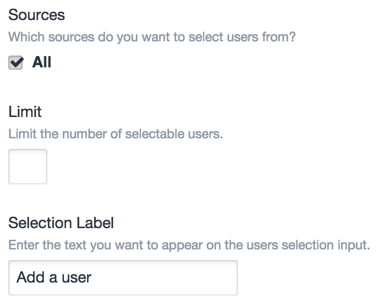
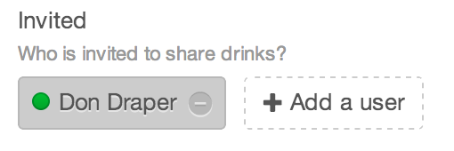
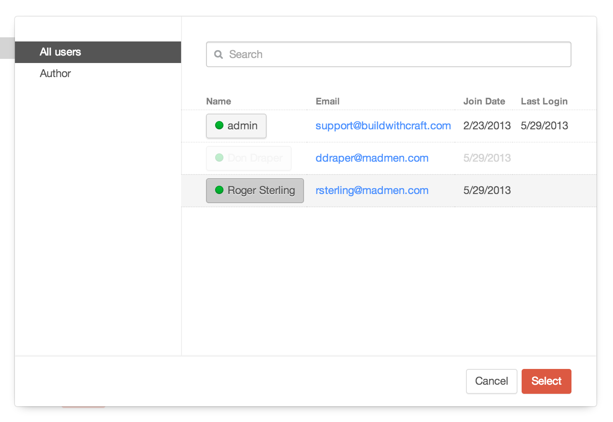

# Users Fields

Users fields type allow you relate [users](users.md) to the parent element.

## Settings



Users fields have the following settings:

- **Sources** – The user groups you want to relate users from. (Default is “All”)
- **Limit** – The maximum number of users that can be related with the field at once. (Default is no limit.)
- **Selection Label** – The label that should be used on the field’s selection button.

## The Field

Users fields list all of the currently selected users, with a button to select new ones:



Clicking the “Add a user button will bring up a modal window where you can find and select additional users:



## Templating

If you have an element with a Users field in your template, you can access its selected users using your Users field’s handle:

```twig

```

That will give you an [ElementCriteriaModel](templating/elementcriteriamodel.md) object, prepped to output all of the selected users for the given field. In other words, the line above is really just a shortcut for this:

```twig

```

(See [Relations](relations.md) for more info on the `relatedTo` param.)

### Examples

To check if your Users field has any selected users, you can use the `length` filter:

```twig

    ...

```

To loop through the selected users, you can treat the field like an array:

```twig

    ...

```

Rather than typing “`entry.usersFieldHandle`” every time, you can call it once and set it to another variable:

```twig




    <h3>Some great users</h3>
    
        ...
    


```

You can add parameters to the ElementCriteriaModel object as well:

```twig

```

If your Users field is only meant to have a single user selected, remember that calling your Users field will still give you the same ElementCriteriaModel, not the selected user. To get the first (and only) user selected, use `first()`:

```twig



    ...

```

### See Also

- [craft.users](templating/craft.users.md)
- [ElementCriteriaModel](templating/elementcriteriamodel.md)
- [UserModel](templating/usermodel.md)
- [Relations](relations.md)
