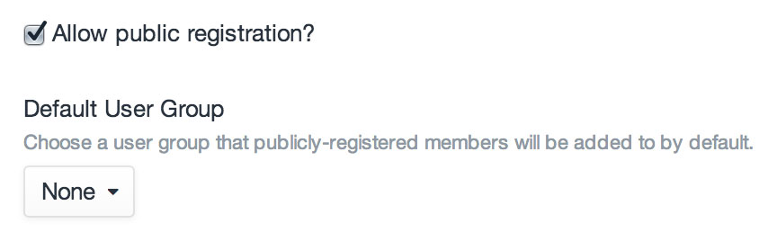

# Users

Craft calls all member accounts of the system “users”.

The first user account is created during [installation](installing.md). If you stick with the Solo edition, this is the only account you will be able to create. If you need more you can upgrade to the Pro edition, which offers additional user accounts.

## Admin Accounts

Admin accounts are special accounts that can do absolutely everything within Craft, including some things that there aren’t even explicit permissions for:

* Everything within the Settings section
* Make other users Admins (Craft Pro only)
* Administrate other Admins (Craft Pro only)

The user account you create during installation is an admin by default.

::: tip
Considering the amount of damage an admin can do, it’s strongly recommended that you be conservative with creating new admin accounts. Only do it if you trust that they know what they’re doing.
:::

## User Groups

If you have Craft Pro, you can create User Groups to help organize your site’s user accounts, as well as batch-set permissions on them.

To create a new User Group, go to Settings → Users and click the “New Group” button. You can give your group a Name and Handle, plus any permissions you want every user within the group to have.

Once your groups have been created, you can assign users to groups by going into their account settings and clicking on the Permissions tab.

## Permissions

Craft Pro allows you to set permissions on users and groups, such as the ability to access the Control Panel, edit content within certain sections, etc. They can be applied directly to user accounts as well as to user groups. When permissions are applied to a user group, all users that belong to that group will inherit them.

The permissions Craft comes with are:

Permission | Handle
-|-
Access the site when the system is off | `accessSiteWhenSystemIsOff`
Access the CP | `accessCp`
↳&nbsp; Access the CP when the system is off | `accessCpWhenSystemIsOff`
↳&nbsp; Perform Craft and plugin updates | `performUpdates`
↳&nbsp; Access _[Plugin Name]_ | `accessPlugin-[PluginHandle]`
Edit users | `editUsers`
↳&nbsp; Register users | `registerUsers`
↳&nbsp; Assign permissions | `assignUserPermissions`
↳&nbsp; Administrate users | `administrateUsers`
Delete users | `deleteUsers`
Edit _[Locale Name]_ | `editLocale:[LocaleID]`
Edit entries | `editEntries:[SectionID]`
↳&nbsp; Create entries | `createEntries:[SectionID]`
↳&nbsp; Publish entries | `publishEntries:[SectionID]`
↳&nbsp; Delete entries | `deleteEntries:[SectionID]`
↳&nbsp; Edit other authors’ entries | `editPeerEntries:[SectionID]`
&nbsp;&nbsp;&nbsp; ↳&nbsp; Publish other authors’ entries | `publishPeerEntries:[SectionID]`
&nbsp;&nbsp;&nbsp; ↳&nbsp; Delete other authors’ entries | `deletePeerEntries:[SectionID]`
↳&nbsp; Edit other authors’ drafts | `editPeerEntryDrafts:[SectionID]`
&nbsp;&nbsp;&nbsp; ↳&nbsp; Publish other authors’ drafts | `publishPeerEntryDrafts:[SectionID]`
&nbsp;&nbsp;&nbsp; ↳&nbsp; Delete other authors’ drafts | `deletePeerEntryDrafts:[SectionID]`
Edit _[Global Set Name]_ | `editGlobalSet:[GlobalSetID]`
Edit _[Category Group Name]_ | `editCategories:[CategoryGroupID]`
View _[Asset Source Name]_ | `viewAssetSource:[SourceID]`
↳&nbsp; Upload files | `uploadToAssetSource:[SourceID]`
↳&nbsp; Create subfolders | `createSubfoldersInAssetSource:[SourceID]`
↳&nbsp; Remove files | `removeFromAssetSource:[SourceID]`

## Public Registration

Craft Pro has the option of allowing public user registration. It is not enabled by default, though. To enable it, you must go to Settings → Users → Settings, and check the “Allow public registration?” setting. With that checked, you will also be given the ability to choose a default user group that publicly-registered users are assigned to.

Once your site is set up to allow public user registration, the last step is to create a [user registration form](templating/user-registration-form.md) on your site’s front end.
