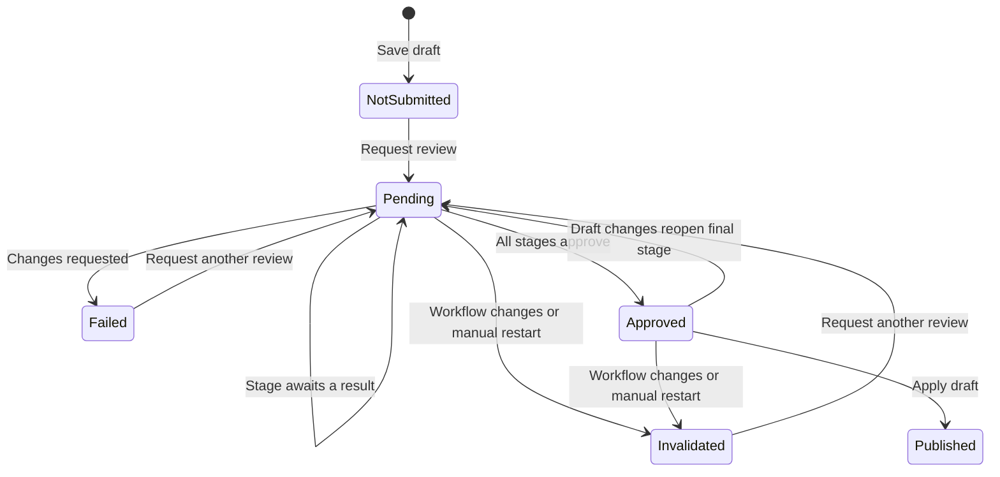

# Approval workflows

Approval workflows control when changes to an entry may be published. A workflow is an ordered list of stages assigned to a section. When an author submits a draft for review, Craft evaluates each stage in sequence and only allows the approved draft to be applied after every stage has approved it.

Workflows require Craft Pro or Enterprise.

## How workflows work

Configure workflows under **Settings → Workflows**, then assign one to a section. Entries in sections without an assigned workflow retain the normal save and publish behavior.

When an enabled entry has a workflow:

1. Saving changes creates or updates a named draft instead of publishing directly to the canonical entry.
2. The author submits the draft for review from its **Workflow** tab.
3. Craft evaluates the first stage.
4. An approved stage advances the run to the next stage. A pending stage waits for a decision. A reviewer who requests changes fails a user-review stage until someone requests another review.
5. After every stage approves, an authorized user can apply the draft to the canonical entry.

Disabled entries can be created and saved canonically without review. Enabling one routes the save into a draft, which can then be submitted for review.



Stages are evaluated in their configured order. Craft evaluates a stage when the run reaches it and whenever the stage reports new state. A stage returns one of three statuses:

| Status     | Result                                                                  |
| ---------- | ----------------------------------------------------------------------- |
| `Pending`  | Stop and wait at the current stage.                                     |
| `Approved` | Continue to the next stage, or approve the run if this is the last one. |
| `Failed`   | Stop the run with changes requested.                                    |

The built-in **User review** stage waits for approval from members of its configured user groups. It can require one or more approvals. The draft author cannot review their own work, and each reviewer can decide only once per stage until another review is requested. Requesting another review clears the current stage’s decisions but preserves approvals from earlier stages.

### Runs use a configuration snapshot

Submitting a draft creates a workflow run and stores a snapshot of the configured stages. The snapshot is retained for the run's execution and history, and is never updated in place.

Editing an assigned workflow invalidates any pending or approved runs whose executable configuration changed. The draft must be submitted again to start a new run with the updated configuration. Names are descriptive and do not affect execution, so renaming a workflow or stage does not invalidate a run.

### Draft changes and resets

Changing publishable content does not restart a pending workflow. It clears approvals from the current user-review stage while preserving completed stages. External stage results can still arrive after the draft changes.

If an approved draft changes, Craft reopens its final stage and clears that stage’s decisions. Earlier stages remain approved. The final stage is evaluated again, so an automated stage may approve immediately while a user-review stage waits for fresh approvals.

An authorized editor can use **Restart workflow** to invalidate the current run and start a new run from the first stage. Workflow runs are also invalidated when:

- the section's workflow assignment changes;
- a stage's type, order, or settings change; or
- the workflow is deleted.

The draft remains available after invalidation. Published and invalidated runs and their activity history are retained.

Drafts are initially locked in the editor while a review is pending or approved. An author can choose **Start editing** to unlock the draft without resetting completed stages.

Applying an approved draft validates the current element state before publishing. If validation fails without changing the draft, the approval remains valid. Correcting publishable content reopens the final stage.

### Permissions and write boundaries

Submitting a draft requires `save` authorization, commenting requires `view` authorization, and applying an approved draft requires both `save` and `saveCanonical` authorization. Approval override is currently restricted to administrators.

The control panel and other user-facing HTTP saves route workflow-controlled canonical changes into drafts. Craft does not globally intercept low-level element writes from plugins, console commands, or other trusted application code. Code that writes elements directly is responsible for choosing whether to create a draft or intentionally update the canonical element.

## Creating a workflow stage type

A plugin can add a stage type by implementing `WorkflowStageInterface`. Extending `WorkflowStage` is recommended because it supplies configurable-component behavior and default review UI behavior.

This stage approves as soon as a workflow reaches it:

```php
<?php

declare(strict_types=1);

namespace Acme\Editorial\Workflow;

use CraftCms\Cms\Workflow\Data\WorkflowStageContext;
use CraftCms\Cms\Workflow\Data\WorkflowStageResult;
use CraftCms\Cms\Workflow\Enums\WorkflowStageStatus;
use CraftCms\Cms\Workflow\Stages\WorkflowStage;

class AutomaticApprovalStage extends WorkflowStage
{
    public static function displayName(): string
    {
        return 'Automatic approval';
    }

    public function evaluate(WorkflowStageContext $context): WorkflowStageResult
    {
        return new WorkflowStageResult(
            status: WorkflowStageStatus::Approved,
            message: 'Automatically approved',
            payload: $context->payload,
        );
    }
}
```

Register it from the plugin's service provider:

```php
use Acme\Editorial\Workflow\AutomaticApprovalStage;
use CraftCms\Cms\Workflow\WorkflowStageTypes;

public function boot(WorkflowStageTypes $workflowStageTypes): void
{
    $workflowStageTypes->register(AutomaticApprovalStage::class);
}
```

Registered types appear in the stage type selector when an administrator configures a workflow. If a configured type becomes unavailable, Craft preserves its settings as a missing stage rather than discarding project config. The stage remains pending until its plugin is restored or the workflow is reconfigured.

### Stage context and results

`WorkflowStageContext` gives a stage the state needed to make its decision:

| Property         | Description                                                           |
| ---------------- | --------------------------------------------------------------------- |
| `draft`          | The named draft under review.                                         |
| `run`            | The current `WorkflowRun` model.                                      |
| `stage`          | The snapshotted `WorkflowStageData` for this stage.                   |
| `payload`        | Stage-owned data persisted from its previous result in the run.       |
| `previousStages` | The preceding snapshotted stages and the payload stored for each one. |

`evaluate()` returns a `WorkflowStageResult` containing a `WorkflowStageStatus`, a human-readable message, and the next payload. Payloads must contain JSON-encodable values. Craft stores each payload under the stage UID, isolating one stage's state from the others.

Use the payload for durable state needed by later evaluations or by the stage's review UI. Do not put secrets in it; workflow state and activity are application data.

### Configurable stages

Stage classes use the same configurable-component conventions as other Craft components. Define public settings properties, validation rules, and an optional settings form:

```php
use CraftCms\Cms\Form\Controls\Text;
use CraftCms\Cms\Form\Form;
use CraftCms\Cms\Form\FormContext;
use CraftCms\Cms\Form\Nodes\Field;
use CraftCms\Cms\Workflow\Stages\WorkflowStage;

class WebhookApprovalStage extends WorkflowStage
{
    public string $endpoint = '';

    public function getRules(): array
    {
        return [
            'endpoint' => ['required', 'url:https'],
        ];
    }

    public function settingsForm(FormContext $context = new FormContext): Form
    {
        return Form::make([
            Field::make('Endpoint', Text::make('endpoint'))->required(),
        ]);
    }

    // ...
}
```

Craft serializes public component settings into project config and validates them when the workflow is saved. Return `null` from `settingsForm()` when the type has no settings UI.

## Waiting for an external result

An integration stage can return `Pending` while it waits for a webhook, queue job, or another external system:

```php
public function evaluate(WorkflowStageContext $context): WorkflowStageResult
{
    $requestId = $context->payload['requestId'] ?? null;

    if ($requestId === null) {
        $requestId = $this->client->requestReview($context->draft);
    }

    return new WorkflowStageResult(
        status: WorkflowStageStatus::Pending,
        message: 'Waiting for external approval',
        payload: ['requestId' => $requestId],
    );
}
```

When the external decision arrives, report it through the `Workflows` facade rather than updating a run directly:

```php
use CraftCms\Cms\Support\Facades\Workflows;
use CraftCms\Cms\Workflow\Data\WorkflowStageContext;
use CraftCms\Cms\Workflow\Data\WorkflowStageResult;
use CraftCms\Cms\Workflow\Enums\WorkflowStageStatus;

$run = Workflows::reportStageResult(
    runId: $runId,
    stageUid: $stageUid,
    result: function (WorkflowStageContext $context) use ($externalRequestId): WorkflowStageResult {
        if (($context->payload['requestId'] ?? null) !== $externalRequestId) {
            return new WorkflowStageResult(
                WorkflowStageStatus::Pending,
                'Ignored a stale response',
                $context->payload,
            );
        }

        return new WorkflowStageResult(
            WorkflowStageStatus::Approved,
            'Approved by the external service',
            $context->payload,
        );
    },
);
```

The callback receives the current run, stage, and payload while Craft holds the workflow lock. This lets the integration compare external identifiers with current payload state without a read-then-write race. `reportStageResult()` only changes a run when the supplied stage is still its current pending stage; stale responses do not advance a newer run or stage.

Authenticate and authorize webhook or control panel endpoints before calling the facade. `reportStageResult()` protects workflow consistency, but it does not establish whether an incoming caller is trusted.

## Adding stage-specific review UI

A stage can optionally provide Vue components for its pending actions and timeline summary:

```php
use CraftCms\Cms\User\Contracts\CraftUser;
use CraftCms\Cms\Workflow\Data\WorkflowStageContext;

public function actionComponent(): ?string
{
    return 'acme:external-approval-actions';
}

public function actionProps(WorkflowStageContext $context, CraftUser $viewer): array
{
    return [
        'requestId' => $context->payload['requestId'] ?? null,
        'canDecide' => $viewer->can('approveExternalReviews'),
    ];
}

public function summaryComponent(): ?string
{
    return 'acme:external-approval-summary';
}

public function summaryProps(WorkflowStageContext $context, CraftUser $viewer): array
{
    return [
        'requestId' => $context->payload['requestId'] ?? null,
    ];
}
```

Register those components from the plugin's control panel JavaScript entry point:

```typescript
import ExternalApprovalActions from "./ExternalApprovalActions.vue";
import ExternalApprovalSummary from "./ExternalApprovalSummary.vue";

Cp.booting((cp) => {
  cp.$components.register(
    "acme:external-approval-actions",
    ExternalApprovalActions,
  );
  cp.$components.register(
    "acme:external-approval-summary",
    ExternalApprovalSummary,
  );
});
```

Register the components before the Inertia application mounts. Use a plugin-prefixed component name to avoid collisions. `actionProps()` and `summaryProps()` must return JSON-safe values because they are sent to the control panel.

Craft passes the action component its configured action props together with `review`, `elementType`, `elementId`, `draftId`, and `siteId`. After a successful action, emit `reviewUpdated` with the updated workflow review data and editor actions returned by the endpoint. Craft passes a summary component its configured summary props together with the containing `run` and `stage`.

The action component is rendered above Craft's default comment and override controls for the current pending stage. The summary component is rendered in that stage's timeline for current and previous runs. To replace rather than supplement the default controls, set the inherited property in the stage class:

```php
protected bool $showDefaultReviewActions = false;
```

Plugin action endpoints remain responsible for authorization and input validation. They should translate a valid decision into a `WorkflowStageResult` through `Workflows::reportStageResult()`.

## Listening for workflow activity

Craft dispatches lifecycle events for plugins that need to enforce policy or react to completed activity. Event coverage depends on the transition:

| Event                   | Timing                                                                                                                                                   |
| ----------------------- | -------------------------------------------------------------------------------------------------------------------------------------------------------- |
| `WorkflowTransitioning` | Synchronously before `Submit`, `Override`, `Approve`, `Reject`, `RequestReview`, or `Restart`; may cancel the transition.                                |
| `WorkflowTransitioned`  | After commit for those transitions, invalidation, and an `Approved` or `Failed` result reported for an asynchronous stage through `reportStageResult()`. |
| `WorkflowCommented`     | After a workflow comment's transaction commits.                                                                                                          |

Set `$event->cancel = true` in a `WorkflowTransitioning` listener to prevent the transition. Keep pre-transition listeners synchronous and side-effect free, because the surrounding transaction can still roll back. Use `WorkflowTransitioned` for notifications and other effects that should happen only after a successful commit.

```php
use CraftCms\Cms\Workflow\Enums\WorkflowTransition;
use CraftCms\Cms\Workflow\Events\WorkflowTransitioning;
use Illuminate\Support\Facades\Event;

Event::listen(function (WorkflowTransitioning $event): void {
    if ($event->transition !== WorkflowTransition::Submit) {
        return;
    }

    if (! $this->reviewWindow->isOpen()) {
        $event->cancel = true;
    }
});
```

Transitions and workflow activity use `WorkflowTransition`: `Submit`, `Override`, `Approve`, `Reject`, `RequestReview`, `Restart`, `StageApproved`, `StageFailed`, `Invalidate`, and `Publish`. Applying an approved draft records `Publish` activity but does not dispatch a workflow lifecycle event. Automatic stage results evaluated synchronously while submitting or advancing a run also record activity without dispatching a separate lifecycle event. Comments are separate because adding a comment does not change workflow state.

## Supporting another element type

Entries provide Craft's built-in workflow assignment UI. A plugin-owned element type can opt into the workflow runtime by implementing `WorkflowableInterface`:

```php
use CraftCms\Cms\Element\Element;
use CraftCms\Cms\Workflow\Contracts\WorkflowableInterface;
use CraftCms\Cms\Workflow\Models\Workflow;

class Release extends Element implements WorkflowableInterface
{
    public static function hasDrafts(): true
    {
        return true;
    }

    public function workflow(): ?Workflow
    {
        return $this->workflowId === null
            ? null
            : Workflow::find($this->workflowId);
    }
}
```

The element type must support drafts, and `workflow()` must return its assigned workflow or `null`. The plugin owns storage and configuration UI for that assignment. Implementing the contract lets Craft resolve review data, workflow-aware editor actions, and approved draft application; it does not add an assignment field to the element type's settings automatically.

## Testing a custom stage

Test the behavior at the stage and workflow boundaries:

- Given representative contexts and payloads, assert that `evaluate()` returns the correct status, message, and payload.
- Test both sides of each approval boundary, including stale or mismatched external response IDs.
- For an asynchronous stage, verify that a result only affects the matching current stage and pending run.
- Test endpoint authentication and authorization separately from stage evaluation.
- If the stage has custom UI, test user-visible choices and submitted results rather than Vue implementation details.

Avoid asserting database implementation details when the public result is what matters. A useful workflow test proves whether a draft remains pending, fails, advances, becomes approved, or can be applied.
